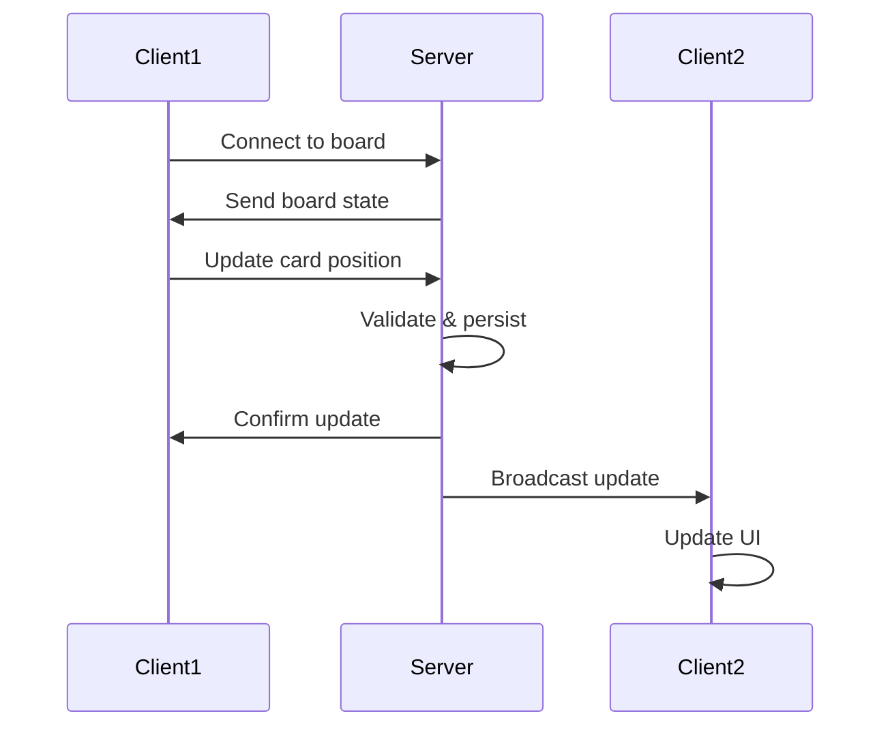

# API Documentation

## Overview

The Katachi API provides endpoints for managing boards, cards, and user data. All API endpoints are prefixed with `/api`.

## State Management

Currently, the application uses client-side state management with Pinia. The following API structure is planned for future implementation.

## Planned API Endpoints

### Boards

#### GET /api/boards
Get all boards for the authenticated user.

**Response**:
```json
{
  "boards": [
    {
      "id": "uuid",
      "name": "My Board",
      "backgroundColor": "#f5f5f5",
      "createdAt": "2024-01-01T00:00:00Z",
      "updatedAt": "2024-01-01T00:00:00Z"
    }
  ]
}
```

#### POST /api/boards
Create a new board.

**Request**:
```json
{
  "name": "New Board",
  "backgroundColor": "#f5f5f5"
}
```

**Response**:
```json
{
  "board": {
    "id": "uuid",
    "name": "New Board",
    "backgroundColor": "#f5f5f5",
    "createdAt": "2024-01-01T00:00:00Z",
    "updatedAt": "2024-01-01T00:00:00Z"
  }
}
```

#### GET /api/boards/:id
Get a specific board with all its cards.

**Response**:
```json
{
  "board": {
    "id": "uuid",
    "name": "My Board",
    "backgroundColor": "#f5f5f5",
    "cards": [...],
    "createdAt": "2024-01-01T00:00:00Z",
    "updatedAt": "2024-01-01T00:00:00Z"
  }
}
```

#### PATCH /api/boards/:id
Update a board.

**Request**:
```json
{
  "name": "Updated Board Name"
}
```

#### DELETE /api/boards/:id
Delete a board and all its cards.

### Cards

#### POST /api/boards/:boardId/cards
Create a new card on a board.

**Request**:
```json
{
  "type": "text",
  "position": { "x": 100, "y": 100 },
  "size": { "width": 200, "height": 150 },
  "content": "Note content",
  "color": "#fef3c7"
}
```

**Response**:
```json
{
  "card": {
    "id": "uuid",
    "type": "text",
    "position": { "x": 100, "y": 100 },
    "size": { "width": 200, "height": 150 },
    "content": "Note content",
    "color": "#fef3c7",
    "zIndex": 1,
    "createdAt": "2024-01-01T00:00:00Z",
    "updatedAt": "2024-01-01T00:00:00Z"
  }
}
```

#### PATCH /api/cards/:id
Update a card.

**Request**:
```json
{
  "position": { "x": 150, "y": 150 },
  "content": "Updated content"
}
```

#### DELETE /api/cards/:id
Delete a card.

## WebSocket Events (Planned)

For real-time collaboration:



### Events

- `board:join` - Join a board room
- `board:leave` - Leave a board room
- `card:create` - Card created
- `card:update` - Card updated
- `card:delete` - Card deleted
- `cursor:move` - User cursor position (for presence)

## Data Types

### Board Type
```typescript
interface Board {
  id: string
  name: string
  cards: NoteCard[]
  backgroundColor: string
  createdAt: Date
  updatedAt: Date
}
```

### NoteCard Type
```typescript
interface NoteCard {
  id: string
  type: 'text' | 'image' | 'link' | 'todo'
  position: Position
  size: Size
  content: string
  color?: string
  isDragging?: boolean
  zIndex: number
  createdAt: Date
  updatedAt: Date
}
```

### Position Type
```typescript
interface Position {
  x: number
  y: number
}
```

### Size Type
```typescript
interface Size {
  width: number
  height: number
}
```

## Error Handling

All API endpoints return errors in the following format:

```json
{
  "error": {
    "code": "ERROR_CODE",
    "message": "Human readable error message",
    "details": {}
  }
}
```

### Common Error Codes

- `BOARD_NOT_FOUND` - Board does not exist
- `CARD_NOT_FOUND` - Card does not exist
- `UNAUTHORIZED` - User not authenticated
- `FORBIDDEN` - User lacks permission
- `VALIDATION_ERROR` - Request data invalid
- `SERVER_ERROR` - Internal server error

## Rate Limiting

- 100 requests per minute per user
- 1000 requests per hour per user
- WebSocket events: 50 per second per connection

## Authentication

Authentication will be implemented using JWT tokens:

```
Authorization: Bearer <token>
```

## CORS

CORS is configured to allow requests from:
- `http://localhost:3000` (development)
- Production domain (to be configured)
