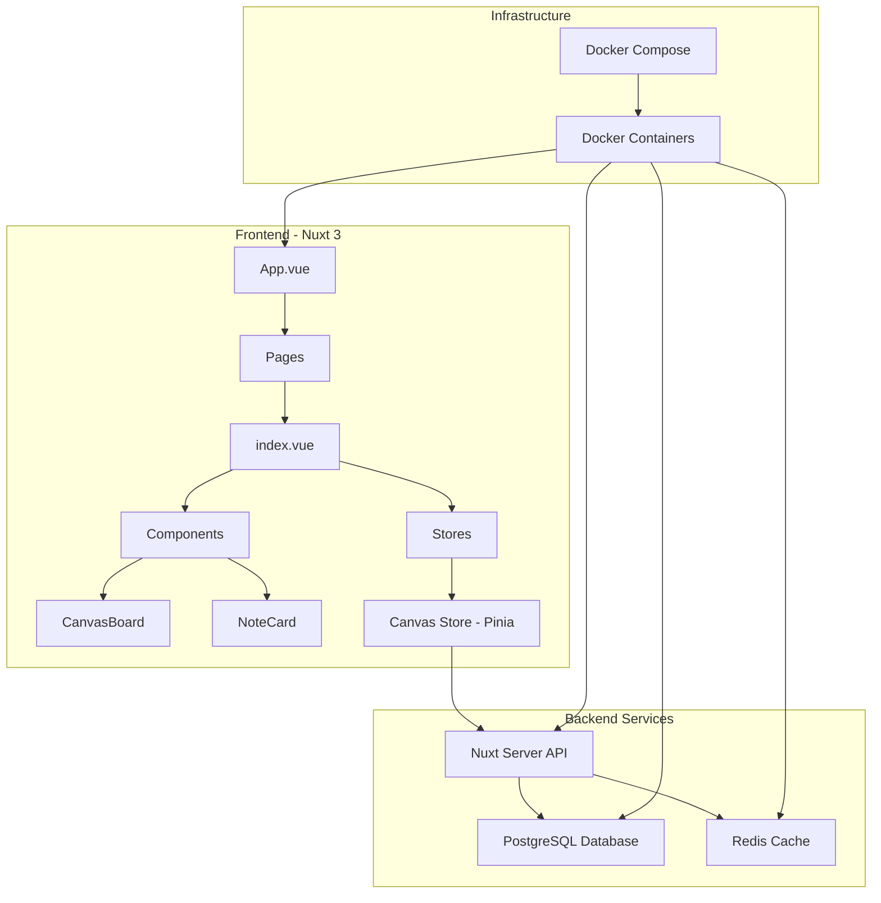
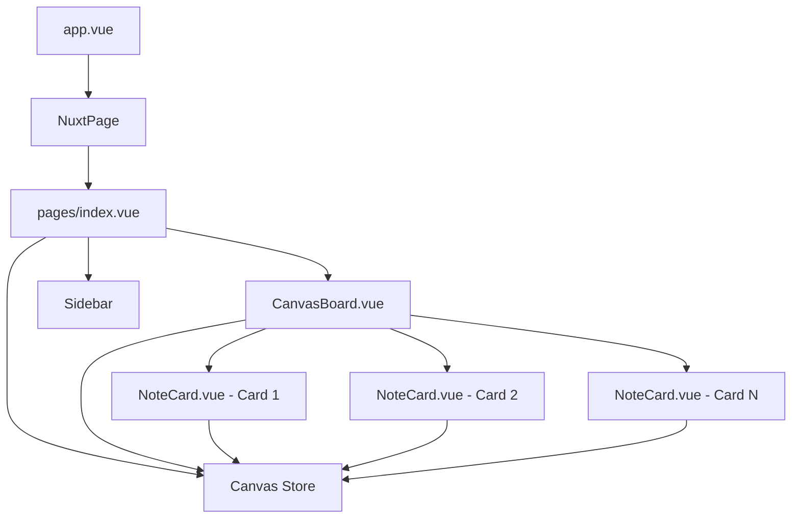
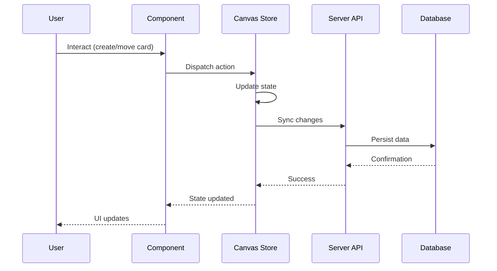
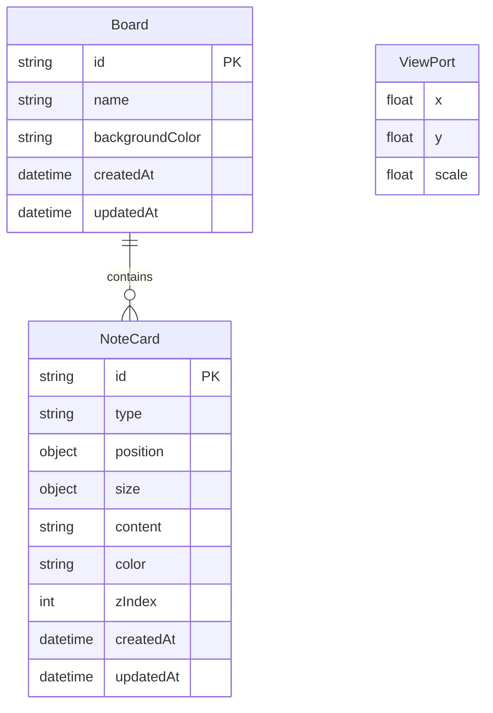
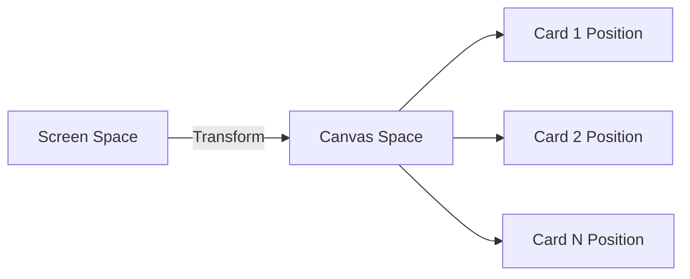

# Katachi - Architecture Documentation

## Overview

Katachi is a visual workspace application inspired by Milanote, built with Nuxt 3, Vue 3, and TypeScript. It provides an infinite canvas where users can create, organize, and connect notes, images, links, and other content types.

## System Architecture

## Core Concepts

### SOLID Principles Application

1. **Single Responsibility Principle (SRP)**
   - Each component has one responsibility (NoteCard handles card display/interaction, CanvasBoard handles canvas management)
   - Store actions are focused on specific operations

2. **Open/Closed Principle (OCP)**
   - Card types are extensible (text, image, link, todo) through the type system
   - New card types can be added without modifying existing code

3. **Liskov Substitution Principle (LSP)**
   - All card types implement the same NoteCard interface
   - Components work with the interface, not specific implementations

4. **Interface Segregation Principle (ISP)**
   - Types are split into focused interfaces (Position, Size, ViewPort)
   - Components only depend on interfaces they use

5. **Dependency Inversion Principle (DIP)**
   - Components depend on store abstractions (Pinia store)
   - High-level canvas logic doesn't depend on low-level card rendering

### DRY (Don't Repeat Yourself)

- Shared types in `/types` directory
- Reusable composables for common functionality
- Centralized state management in Pinia store

### KISS (Keep It Simple, Stupid)

- Simple, focused components
- Clear component hierarchy
- Straightforward state management

### YAGNI (You Aren't Gonna Need It)

- Only implemented essential features
- No premature optimization
- Features added as needed

### POLA (Principle of Least Astonishment)

- Intuitive drag-and-drop interactions
- Familiar UI patterns (sidebars, canvas)
- Expected behaviors (zoom, pan, select)

### SoC (Separation of Concerns)

- UI components separated from business logic
- State management in dedicated store
- Types in separate files
- Styles in dedicated CSS files

## Component Structure

## State Management Flow

## Data Model

## Technology Stack

### Frontend
- **Nuxt 3**: Meta-framework for Vue.js with SSR capabilities
- **Vue 3**: Progressive JavaScript framework
- **TypeScript**: Type-safe development
- **Pinia**: State management
- **Tailwind CSS**: Utility-first CSS framework
- **VueUse**: Collection of Vue composition utilities
- **TipTap**: WYSIWYG rich text editor
- **HTML5 Canvas**: Drawing and image annotation capabilities
- **Fabric.js**: Canvas manipulation library

### Backend
- **Nuxt Server API**: Server-side endpoints
- **PostgreSQL**: Relational database for data persistence
- **Redis**: Caching and real-time features

### Infrastructure
- **Docker**: Containerization
- **Docker Compose**: Multi-container orchestration

## Canvas System

The canvas system uses a viewport transformation approach:

1. **Viewport Transform**: All content is rendered in a transformed container
2. **Pan**: Translates the viewport position (x, y)
3. **Zoom**: Scales the viewport (scale factor)
4. **Cards**: Positioned absolutely within the transformed space

### Coordinate Systems

- **Screen Space**: Browser viewport coordinates
- **Canvas Space**: Transformed coordinates after viewport translation and scaling
- **Card Space**: Local coordinates within each card

## Performance Considerations

1. **Virtual Scrolling**: Cards outside viewport can be culled (future optimization)
2. **Debounced Updates**: Throttle position updates during drag operations
3. **Lazy Loading**: Load board data on demand
4. **Optimistic Updates**: Update UI immediately, sync with server asynchronously

## Security Principles

1. **Input Validation**: All user input sanitized
2. **XSS Prevention**: Content properly escaped
3. **CSRF Protection**: Token-based protection for state-changing operations
4. **Authentication**: User-based access control (to be implemented)
5. **Authorization**: Board-level permissions (to be implemented)
