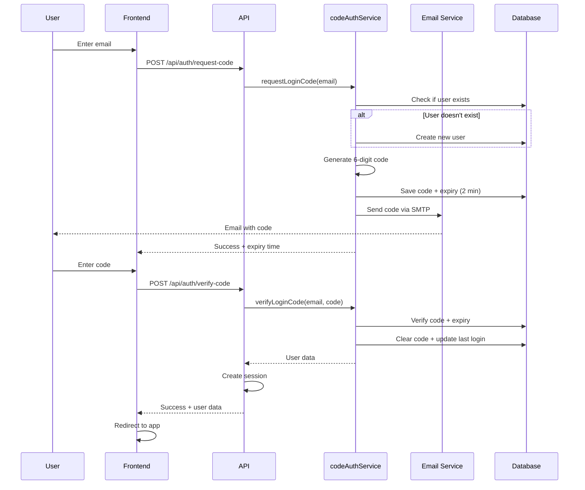

# Authentication System

This document describes the passwordless authentication system in the application.

## Overview

The application uses **passwordless authentication** via email login codes. Users receive a 6-digit code via email to log in—no passwords required.

## Architecture



## User Flow

1. **Enter Email**: User enters their email on register or login page
2. **Generate Code**: System generates a 6-digit code (expires in 2 minutes)
3. **Send Email**: Code is sent via SMTP to user's email
4. **Enter Code**: User enters the code from their email
5. **Verify & Login**: System verifies code and creates session

## API Endpoints

### Request Code

**Endpoint**: `POST /api/auth/request-code`

**Request Body**:
```json
{
  "email": "user@example.com",
  "name": "User Name (optional)"
}
```

**Response**:
```json
{
  "success": true,
  "message": "Login code sent to your email",
  "expiresIn": 120
}
```

**Behavior**:
- If user doesn't exist, creates new user automatically
- If user exists, updates their login code
- Sends email with 6-digit code
- Code expires in 120 seconds (2 minutes)

### Verify Code

**Endpoint**: `POST /api/auth/verify-code`

**Request Body**:
```json
{
  "email": "user@example.com",
  "code": "123456"
}
```

**Response**:
```json
{
  "success": true,
  "user": {
    "id": "uuid",
    "email": "user@example.com",
    "name": "User Name"
  }
}
```

**Behavior**:
- Validates code matches and hasn't expired
- Clears the code after successful verification (one-time use)
- Updates `lastLoginAt` timestamp
- Creates session cookie
- Returns user data

### Get Current User

**Endpoint**: `GET /api/auth/me`

**Response**:
```json
{
  "user": {
    "id": "uuid",
    "email": "user@example.com",
    "name": "User Name"
  }
}
```

**Behavior**:
- Returns current user from session
- Returns `{ user: null }` if not authenticated

### Logout

**Endpoint**: `POST /api/auth/logout`

**Response**:
```json
{
  "success": true
}
```

**Behavior**:
- Clears session cookie
- Removes session from Redis

## Service Layer

### `codeAuthService.ts`

**Functions**:

#### `requestLoginCode(email: string, name?: string)`
- Checks if user exists in database
- Creates new user if they don't exist
- Generates 6-digit random code
- Saves code and 2-minute expiry to database
- Sends code via email
- Returns success response with expiry time

#### `verifyLoginCode(email: string, code: string)`
- Queries database for matching email, code, and valid expiry
- Returns error if code is invalid or expired
- Clears code fields after successful verification
- Updates `lastLoginAt` timestamp
- Returns sanitized user object

#### `getUserById(id: string)`
- Retrieves user by UUID
- Returns sanitized user object or null
- Used by middleware and session management

## Database Schema

### Users Table

```typescript
export const users = pgTable('users', {
  id: uuid('id').primaryKey().defaultRandom(),
  email: varchar('email', { length: 255 }).notNull().unique(),
  name: varchar('name', { length: 255 }),
  emailVerified: boolean('email_verified').default(true),
  loginCode: varchar('login_code', { length: 10 }),
  loginCodeExpiry: timestamp('login_code_expiry'),
  createdAt: timestamp('created_at').defaultNow().notNull(),
  updatedAt: timestamp('updated_at').defaultNow().notNull(),
  lastLoginAt: timestamp('last_login_at')
})
```

**Key Fields**:
- `loginCode`: 6-digit numeric code (nullable)
- `loginCodeExpiry`: Timestamp when code expires (nullable)
- `emailVerified`: Always `true` for passwordless users
- `lastLoginAt`: Tracks most recent successful login

## Session Management

Sessions are managed using `h3-session` with Redis storage.

### Configuration

```env
SESSION_SECRET=your-secret-key-here
SESSION_MAX_AGE=604800000  # 7 days in milliseconds
REDIS_URL=redis://localhost:6379
```

### Session Functions

Located in `/server/utils/session.ts`:

```typescript
// Create session after authentication
await createUserSession(event, userId)

// Get current user from session
const session = await getUserSession(event)

// Clear session on logout
await clearUserSession(event)
```

### Session Cookie

- **Name**: `katachi-session`
- **Storage**: Redis
- **Max Age**: 7 days (configurable)
- **HTTP Only**: Yes
- **Secure**: Production only
- **SameSite**: Lax

## Email Configuration

Emails are sent via SMTP using `nodemailer`.

### Environment Variables

```env
SMTP_HOST=mail.example.com
SMTP_PORT=465
SMTP_SECURE=true
SMTP_USER=service@example.com
SMTP_PASS=your-password
SMTP_FROM=service@example.com
NUXT_PUBLIC_APP_URL=https://your-app.com
```

### Email Template

**Subject**: "Your Katachi Login Code"

**Body**:
```
Hello,

Your login code is: 123456

This code will expire in 2 minutes.

If you didn't request this code, please ignore this email.

Best regards,
The Katachi Team
```

## Security Considerations

### Code Security

- **Format**: 6-digit numeric (100,000 to 999,999)
- **Expiry**: 2 minutes from generation
- **One-time Use**: Code is cleared after successful verification
- **No Reuse**: Expired codes cannot be reused
- **Unique per User**: Each user can only have one active code

### Recommendations

1. **Rate Limiting**: Implement rate limiting on `/api/auth/request-code`
   - Limit: 3 codes per email per 10 minutes
   - Prevent code request spam

2. **IP Blocking**: Track failed verification attempts by IP
   - Limit: 10 failed attempts per IP per hour
   - Prevent brute force attacks

3. **Email Verification**: Add optional email verification for new accounts
   - Send verification link for high-security actions
   - Mark accounts as verified

4. **Account Lockout**: Temporary lockout after too many failed codes
   - Lock after 5 failed verifications
   - Unlock after 1 hour or admin intervention

5. **Audit Logging**: Log all authentication attempts
   - Track successful logins
   - Monitor suspicious patterns
   - Alert on anomalies

## Frontend Implementation

### Register Page (`/pages/register.vue`)

- Simple email input field
- Optional name field
- Calls `/api/auth/request-code`
- Redirects to login page with email pre-filled
- Shows error messages if code fails to send

### Login Page (`/pages/login.vue`)

**Two-step process**:

1. **Step 1: Email Entry**
   - User enters email
   - Calls `/api/auth/request-code`
   - Shows success message
   - Starts 2-minute countdown

2. **Step 2: Code Entry**
   - Auto-focuses 6-digit input field
   - Shows countdown timer
   - Calls `/api/auth/verify-code` on submit
   - Redirects to home on success
   - Shows error and resets on failure

**Features**:
- Real-time countdown timer
- Auto-focus on code input
- "Use different email" button
- Clear error messages
- Loading states

### Auth Store (`/stores/auth.ts`)

Manages authentication state on the frontend:

```typescript
export const useAuthStore = defineStore('auth', {
  state: () => ({
    user: null as User | null,
    isAuthenticated: false
  }),

  actions: {
    async checkAuth() {
      // Check if user is authenticated
    },

    async logout() {
      // Clear session and redirect
    }
  }
})
```

## Error Handling

### Request Code Errors

- `400`: Email is required
- `400`: Invalid email format
- `500`: Failed to send login code (email service error)

### Verify Code Errors

- `400`: Email and code are required
- `401`: Invalid or expired code
- `401`: Code doesn't match

### Session Errors

- `401`: Unauthorized (no valid session)
- `401`: Invalid session (user not found)

## Testing

### Manual Testing

1. **Registration Flow**:
   ```
   1. Navigate to /register
   2. Enter email: test@example.com
   3. Enter name: Test User
   4. Click "Get Started"
   5. Check email inbox for 6-digit code
   6. Navigate to /login (auto-redirected)
   7. Enter the 6-digit code
   8. Verify redirect to home page
   ```

2. **Login Flow**:
   ```
   1. Navigate to /login
   2. Enter existing email
   3. Click "Send Login Code"
   4. Check email for code
   5. Enter code within 2 minutes
   6. Verify successful login
   ```

3. **Expired Code**:
   ```
   1. Request login code
   2. Wait 3+ minutes
   3. Try to verify code
   4. Verify error: "Invalid or expired code"
   ```

### Database Verification

**Check user creation**:
```sql
SELECT id, email, name, email_verified, created_at, last_login_at
FROM users
WHERE email = 'test@example.com';
```

**Check active codes**:
```sql
SELECT email, login_code, login_code_expiry
FROM users
WHERE login_code IS NOT NULL
  AND login_code_expiry > NOW();
```

## Migration Notes

### Previous System

The application previously supported both passwordless and password-based authentication. On **2026-01-06**, password-based authentication was removed.

### Changes Made

**Removed Files**:
- `/server/api/auth/register.post.ts` - Password registration endpoint
- `/server/api/auth/login.post.ts` - Password login endpoint
- `/server/api/auth/reset-password.post.ts` - Password reset endpoint
- `/server/api/auth/request-reset.post.ts` - Request password reset
- `/server/api/auth/verify-email.post.ts` - Email verification
- `/server/services/authService.ts` - Password-based auth service

**Removed Database Columns**:
- `password_hash` - Bcrypt hashed passwords
- `verification_token` - Email verification tokens
- `verification_token_expiry` - Token expiration timestamps

**Updated Files**:
- `/server/middleware/auth.ts` - Now uses `codeAuthService`
- `/server/api/auth/me.get.ts` - Now uses `codeAuthService`
- `/server/db/schema.ts` - Removed password fields

### Existing Users

Users created with the old password system before the migration are no longer able to log in with passwords. They should:
1. Navigate to `/login`
2. Request a new login code with their email
3. Use the code to log in

## Future Enhancements

1. **Magic Links**: Add option to send login link instead of code
2. **Remember Device**: Long-lived sessions on trusted devices
3. **MFA**: Optional two-factor authentication
4. **Social Auth**: OAuth integration (Google, GitHub, etc.)
5. **Passkeys**: WebAuthn/FIDO2 support
6. **Biometric Auth**: Face ID / Touch ID on mobile

## Related Files

- `/server/services/codeAuthService.ts` - Main authentication service
- `/server/services/emailService.ts` - Email sending functionality
- `/server/utils/session.ts` - Session management utilities
- `/server/middleware/auth.ts` - Authentication middleware
- `/server/db/schema.ts` - Database schema definitions
- `/pages/register.vue` - Registration page component
- `/pages/login.vue` - Login page component
- `/stores/auth.ts` - Frontend authentication state
