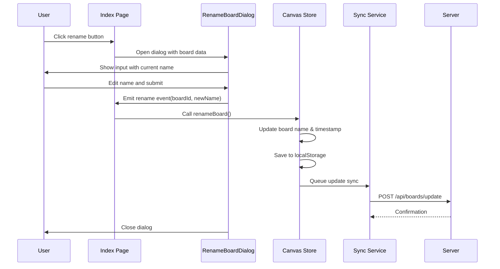
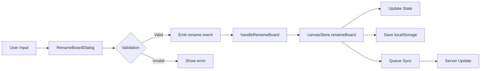

# Board Management

This document describes the board management features in the application, including creation, renaming, and synchronization.

## Overview

Boards are the primary organizational unit in the application. Each board can contain multiple note cards, connections, and shapes. Users can create multiple boards and switch between them.

## Features

### Board Creation

Users can create new boards by clicking the "+" button in the sidebar. New boards are automatically assigned a sequential name like "Board 1", "Board 2", etc.

### Board Renaming

Board renaming allows users to give their boards meaningful names. The feature was redesigned to use a custom dialog instead of the browser's native prompt.

#### User Experience

1. User clicks the rename button (pencil icon) next to the currently selected board in the sidebar
2. A modal dialog appears with the current board name pre-filled
3. User edits the name in the text input
4. User clicks "Rename" or presses Enter to confirm, or "Cancel"/"Esc" to abort

#### Technical Implementation

The rename feature consists of three main components:

1. **RenameBoardDialog Component** (`/components/RenameBoardDialog.vue`)
   - Custom Vue component with Tailwind CSS styling
   - Supports dark mode
   - Auto-focuses and selects text when opened
   - Real-time validation with character count (max 255 chars)
   - Error handling and display

2. **Index Page Integration** (`/pages/index.vue`)
   - Manages dialog visibility state
   - Tracks which board is being renamed
   - Handles user interactions

3. **Canvas Store Action** (`/stores/canvas.ts`)
   - `renameBoard(boardId, newName)` action
   - Updates board name and timestamp
   - Persists to localStorage
   - Queues sync to server

#### Architecture Flow



#### Data Flow



### Validation Rules

The rename feature enforces the following validation rules:

- **Required**: Board name cannot be empty
- **Maximum Length**: 255 characters (matches database schema)
- **Trimming**: Leading and trailing whitespace is automatically removed
- **Change Detection**: Cannot save if name hasn't changed
- **No Duplicates**: Currently not enforced (future enhancement)

### Synchronization

When a board is renamed:

1. The change is immediately applied locally (optimistic update)
2. The board's `updatedAt` timestamp is updated
3. Changes are saved to localStorage for offline persistence
4. A sync operation is queued to update the server
5. The sync service handles retries and conflict resolution

The sync payload includes:
```typescript
{
  id: string,        // Board UUID
  name: string,      // New board name
  updatedAt: string  // ISO timestamp
}
```

### Error Handling

The dialog handles various error scenarios:

- **Empty name**: "Board name cannot be empty"
- **Too long**: "Board name is too long (max 255 characters)"
- **Network errors**: Displayed in red alert box
- **Board not found**: Logged to console

### Keyboard Shortcuts

- **Enter**: Submit rename (same as clicking "Rename" button)
- **Escape**: Cancel and close dialog

### Visual Design

The dialog follows the application's design system:

- Consistent with other dialogs (ShareBoardDialog, VersionHistoryDialog)
- Semi-transparent backdrop (black 50% opacity)
- White card with shadow (dark mode: gray-800)
- Blue primary button for confirmation
- Gray secondary button for cancellation
- Smooth transitions and hover effects
- Responsive and accessible

## Future Enhancements

Potential improvements to board management:

1. **Duplicate Detection**: Prevent or warn about duplicate board names
2. **Inline Editing**: Allow renaming directly in the sidebar
3. **Undo/Redo**: Integrate with version history system
4. **Bulk Operations**: Rename multiple boards at once
5. **Templates**: Create boards from templates
6. **Favorites**: Mark boards as favorites for quick access
7. **Sorting**: Custom sort order for boards
8. **Archive**: Soft delete boards instead of permanent deletion

## Related Files

- `/components/RenameBoardDialog.vue` - Dialog component
- `/pages/index.vue` - Main page with board list
- `/stores/canvas.ts` - Canvas store with renameBoard action
- `/composables/useSync.ts` - Sync service
- `/server/api/boards/` - Board API endpoints
- `/server/db/schema.ts` - Database schema
- `/types/index.ts` - TypeScript type definitions
