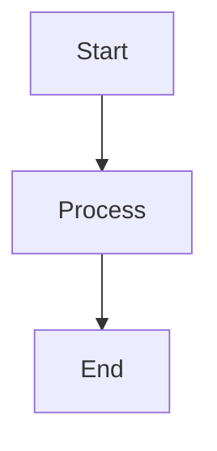

# Contributing to Katachi

## Development Principles

This project adheres to the following software engineering principles:

### SOLID Principles

- **Single Responsibility**: Each component/function has one clear purpose
- **Open/Closed**: Extensible without modifying existing code
- **Liskov Substitution**: Derived types must be substitutable for their base types
- **Interface Segregation**: Clients shouldn't depend on interfaces they don't use
- **Dependency Inversion**: Depend on abstractions, not concretions

### Additional Principles

- **DRY (Don't Repeat Yourself)**: Avoid code duplication
- **KISS (Keep It Simple, Stupid)**: Prefer simple solutions
- **YAGNI (You Aren't Gonna Need It)**: Don't add unnecessary features
- **POLA (Principle of Least Astonishment)**: Code should behave as expected
- **SoC (Separation of Concerns)**: Separate different concerns into distinct sections

## Code Style

### TypeScript

- Use TypeScript for all new files
- Properly type all functions and variables
- Avoid `any` type unless absolutely necessary
- Use interfaces for object shapes

### Vue Components

- Use Composition API with `<script setup>`
- Keep components focused and small (< 200 lines ideally)
- Extract reusable logic into composables
- Use props and emits for component communication

### Naming Conventions

- Components: PascalCase (`NoteCard.vue`)
- Files: kebab-case for utilities, PascalCase for components
- Variables/Functions: camelCase
- Constants: UPPER_SNAKE_CASE
- Types/Interfaces: PascalCase

### File Organization

```
component-name/
├── ComponentName.vue
├── ComponentName.test.ts
└── types.ts
```

## Git Workflow

### Branch Naming

- `feature/description` - New features
- `fix/description` - Bug fixes
- `refactor/description` - Code refactoring
- `docs/description` - Documentation updates

### Commit Messages

Follow conventional commits:

```
<type>(<scope>): <subject>

<body>

<footer>
```

Types:
- `feat`: New feature
- `fix`: Bug fix
- `docs`: Documentation
- `style`: Formatting
- `refactor`: Code restructuring
- `test`: Tests
- `chore`: Maintenance

Example:
```
feat(canvas): add card resize functionality

Implemented resizable cards with drag handle in bottom-right corner.
Cards maintain minimum size constraints.

Closes #123
```

## Component Development

### Creating a New Component

1. Create component file in `/components`
2. Define TypeScript interfaces for props
3. Implement component using Composition API
4. Add component to documentation

Example structure:
```vue
<template>
  <div class="component-name">
    <!-- Template -->
  </div>
</template>

<script setup lang="ts">
import { ref, computed } from 'vue'

interface Props {
  // Define props
}

const props = defineProps<Props>()
const emit = defineEmits<{
  // Define emits
}>()

// Component logic
</script>

<style scoped>
/* Component styles */
</style>
```

## Store Development

### Creating a New Store

1. Create store file in `/stores`
2. Define state interface
3. Implement getters and actions
4. Document store usage

Example:
```typescript
import { defineStore } from 'pinia'

interface State {
  // Define state
}

export const useMyStore = defineStore('myStore', {
  state: (): State => ({
    // Initial state
  }),

  getters: {
    // Computed values
  },

  actions: {
    // Mutations and actions
  }
})
```

## Testing

### Unit Tests

```bash
npm run test
```

### E2E Tests

```bash
npm run test:e2e
```

## Documentation

When adding new features:

1. Update relevant documentation in `/docs`
2. Add code comments for complex logic
3. Update README if necessary
4. Create diagrams using Mermaid when helpful

### Diagram Example

````markdown

````

## Pull Request Process

1. Create a feature branch
2. Make your changes
3. Update documentation
4. Ensure tests pass
5. Create pull request with description
6. Address review feedback
7. Merge after approval

### PR Template

```markdown
## Description
Brief description of changes

## Type of Change
- [ ] Bug fix
- [ ] New feature
- [ ] Breaking change
- [ ] Documentation update

## Testing
How has this been tested?

## Checklist
- [ ] Code follows style guidelines
- [ ] Self-review completed
- [ ] Documentation updated
- [ ] Tests added/updated
- [ ] No new warnings
```

## Development Checklist

Before submitting code:

- [ ] Code follows SOLID principles
- [ ] No code duplication (DRY)
- [ ] Simple solution chosen (KISS)
- [ ] No unnecessary features (YAGNI)
- [ ] Proper TypeScript types
- [ ] Components are focused and small
- [ ] Documentation updated
- [ ] Tests written/updated
- [ ] Commit messages follow convention
- [ ] No console.log or debug code
- [ ] Proper error handling

## Questions?

If you have questions or need help:
1. Check existing documentation
2. Search existing issues
3. Create a new issue with details
