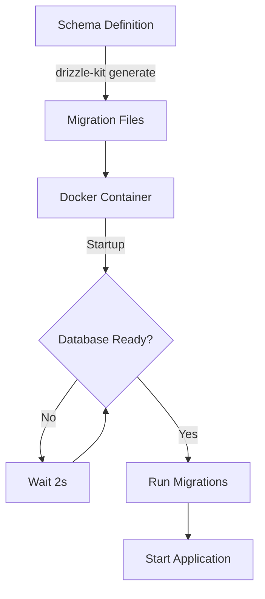

# Database Migrations

## Overview

Katachi uses Drizzle ORM for database schema management and migrations. The database schema is defined in `server/db/schema.ts`, and migrations are automatically applied when the Docker container starts.

## Architecture



## Schema Definition

The database schema is defined using Drizzle ORM in `server/db/schema.ts`:

### Tables

1. **users** - User accounts and authentication
   - Passwordless authentication via email codes
   - Stores login codes and expiry timestamps
   - Tracks last login time

2. **boards** - Whiteboard/canvas instances
   - Belongs to a user
   - Contains drawing paths, background color
   - Supports soft deletes via `deleted_at`

3. **cards** - Content cards on boards
   - Multiple types: text, image, video, audio, markdown, etc.
   - Positioned absolutely (x, y coordinates)
   - Version controlled for sync

4. **shapes** - Drawing shapes on boards
   - Geometric shapes (rectangle, circle, line, etc.)
   - Configurable stroke, fill, and color

5. **connections** - Links between cards
   - Visual connections with customizable style

6. **board_shares** - Board collaboration and permissions
   - Share boards with other users
   - Granular permissions (view, edit, admin)

7. **presence** - Real-time user presence tracking
   - Tracks cursor position and user activity
   - Used for collaborative features

8. **card_history** & **board_history** - Version history
   - Full snapshots for undo/redo functionality
   - Tracks user actions

9. **board_templates** - Reusable board templates
   - System and user-created templates

## Migration Workflow

### Local Development

```bash
# 1. Modify schema in server/db/schema.ts
# 2. Generate migration files
npm run db:generate

# 3. Apply migrations to local database
npm run db:push

# 4. Verify in Drizzle Studio (optional)
npm run db:studio
```

### Production Deployment

Migrations are **automatically applied** when the Docker container starts.

#### Automatic Migration Process

1. Container starts
2. `docker-entrypoint.sh` executes
3. Script waits for database to be ready
4. Runs `npm run db:push` to apply migrations
5. Starts the application

#### Manual Migration (if needed)

```bash
# SSH into production server
ssh root@46.101.138.222

# Navigate to app directory
cd /var/www/katachi

# Run migrations manually inside container
docker-compose exec app npm run db:push

# Or run SQL directly against the database
docker-compose exec -T db psql -U katachi -d katachi_db < migration.sql
```

## Configuration

### Database Connection

Connection string is configured via environment variables:

```env
DATABASE_URL=postgresql://katachi:password@db:5432/katachi_db
POSTGRES_USER=katachi
POSTGRES_PASSWORD=password
POSTGRES_DB=katachi_db
```

### Drizzle Configuration

`drizzle.config.ts`:

```typescript
export default defineConfig({
  schema: './server/db/schema.ts',
  out: './server/db/migrations',
  dialect: 'postgresql',
  dbCredentials: {
    url: process.env.DATABASE_URL || 'postgresql://...'
  }
})
```

## Docker Integration

### Dockerfile Changes

The production Dockerfile includes:

1. **PostgreSQL Client** - For running migrations
   ```dockerfile
   RUN apk add --no-cache postgresql-client
   ```

2. **Migration Tools** - Drizzle Kit and dependencies
   ```dockerfile
   RUN npm install drizzle-kit drizzle-orm postgres
   ```

3. **Schema Files** - Database schema and config
   ```dockerfile
   COPY --from=builder /app/server/db /app/server/db
   COPY --from=builder /app/drizzle.config.ts /app/drizzle.config.ts
   ```

4. **Entrypoint Script** - Runs migrations on startup
   ```dockerfile
   COPY docker-entrypoint.sh /app/docker-entrypoint.sh
   ENTRYPOINT ["/app/docker-entrypoint.sh"]
   ```

### Entrypoint Script

`docker-entrypoint.sh` handles:

- Database connection waiting
- Migration execution
- Graceful error handling
- Application startup

```bash
#!/bin/sh
set -e

echo "🔄 Running database migrations..."

# Wait for database to be ready
until PGPASSWORD="${POSTGRES_PASSWORD}" psql -h "..." -c '\q' 2>/dev/null; do
  echo "⏳ Waiting for database to be ready..."
  sleep 2
done

# Run migrations
npm run db:push || echo "⚠️ Migration failed, but continuing..."

# Start app
exec node .output/server/index.mjs
```

## Best Practices

### Schema Changes

1. **Always generate migrations** - Don't modify the database directly
2. **Test locally first** - Verify migrations work before deploying
3. **Review migration SQL** - Check generated SQL in `server/db/migrations/`
4. **Commit migrations** - Include migration files in version control

### Production Deployments

1. **Backup before major changes** - Create database backup
   ```bash
   docker-compose exec db pg_dump -U katachi katachi_db > backup.sql
   ```

2. **Test in staging** - If possible, test migrations in staging environment first

3. **Monitor logs** - Watch container logs during deployment
   ```bash
   docker-compose logs -f app
   ```

4. **Rollback plan** - Know how to revert if migrations fail

### Breaking Changes

For schema changes that could break existing data:

1. **Use multi-step migrations**:
   - Step 1: Add new column (nullable)
   - Step 2: Migrate data
   - Step 3: Make column required
   - Step 4: Remove old column

2. **Maintain backwards compatibility** when possible

3. **Coordinate with frontend deployments** for API changes

## Troubleshooting

### Migration Fails on Startup

```bash
# Check container logs
docker-compose logs app

# Try running migration manually
docker-compose exec app npm run db:push

# Check database connectivity
docker-compose exec app nc -zv db 5432
```

### Database Schema Out of Sync

```bash
# Generate new migration from current schema
npm run db:generate

# Apply to production
# (Copy migration file to server and apply)
```

### Migration SQL Errors

```bash
# Connect to database directly
docker-compose exec db psql -U katachi -d katachi_db

# Check table structure
\d table_name

# Check existing migrations (if using migration tracking)
SELECT * FROM drizzle_migrations;
```

## Migration History

Drizzle ORM tracks applied migrations automatically. Migration files are stored in:

```
server/db/migrations/
├── 0000_perfect_richard_fisk.sql   # Initial schema
└── meta/
    └── _journal.json                # Migration metadata
```

## References

- [Drizzle ORM Documentation](https://orm.drizzle.team/)
- [Drizzle Kit CLI](https://orm.drizzle.team/kit-docs/overview)
- [PostgreSQL Documentation](https://www.postgresql.org/docs/)
