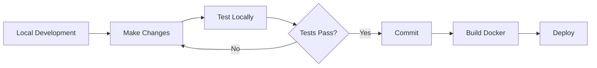

# Getting Started with Katachi

## Prerequisites

- Node.js 20 or higher
- npm or yarn
- Docker and Docker Compose (for containerized deployment)

## Development Setup

### Local Development (without Docker)

1. **Install dependencies**:
   ```bash
   npm install
   ```

2. **Start the development server**:
   ```bash
   npm run dev
   ```

3. **Open your browser**:
   Navigate to `http://localhost:3000`

### Docker Development Setup

1. **Build and start all services**:
   ```bash
   docker-compose -f docker-compose.dev.yml up --build
   ```

2. **Stop services**:
   ```bash
   docker-compose -f docker-compose.dev.yml down
   ```

The development setup includes:
- Nuxt app on port 3000
- PostgreSQL on port 5432
- Redis on port 6379

## Production Deployment

### Using Docker Compose

1. **Build the production images**:
   ```bash
   docker-compose build
   ```

2. **Start the production stack**:
   ```bash
   docker-compose up -d
   ```

3. **View logs**:
   ```bash
   docker-compose logs -f
   ```

4. **Stop the stack**:
   ```bash
   docker-compose down
   ```

### Environment Variables

Create a `.env` file in the project root:

```env
# Database
POSTGRES_USER=mila_note
POSTGRES_PASSWORD=your_secure_password
POSTGRES_DB=mila_note_db

# Redis
REDIS_URL=redis://redis:6379

# Application
NODE_ENV=production
NUXT_PUBLIC_API_BASE=/api
```

## Project Structure

```
mila_note/
├── assets/          # Static assets (CSS, images)
├── components/      # Vue components
│   ├── CanvasBoard.vue
│   └── NoteCard.vue
├── composables/     # Vue composables (reusable logic)
├── docs/           # Project documentation
├── layouts/        # Nuxt layouts
├── pages/          # Nuxt pages (routes)
│   └── index.vue
├── public/         # Public static files
├── server/         # Server-side code
│   └── api/        # API endpoints
├── stores/         # Pinia stores
│   └── canvas.ts
├── types/          # TypeScript type definitions
│   └── index.ts
├── utils/          # Utility functions
├── app.vue         # Root component
├── nuxt.config.ts  # Nuxt configuration
└── package.json    # Dependencies and scripts
```

## Available Scripts

- `npm run dev` - Start development server
- `npm run build` - Build for production
- `npm run generate` - Generate static site
- `npm run preview` - Preview production build locally

## Features

### Current Features

1. **Infinite Canvas**: Pan and zoom across an infinite workspace
2. **Multiple Card Types**:
   - **Text Notes**: Simple text cards for quick notes
   - **Rich Text**: WYSIWYG editor with formatting (bold, italic, lists, headings)
   - **Columns**: Kanban-style columns for organizing tasks
   - **Drawing Canvas**: Freehand drawing with pen, eraser, colors, and thickness options
   - **Images**: Upload and display images with scaling
3. **Drawing on Images**: Select an image card and click "Draw" to draw directly on top of images
4. **Board Management**: Multiple boards for organizing content
5. **Card Manipulation**: Drag, resize, and delete all card types
6. **Visual Feedback**: Selected cards, hover states, shadows

### Planned Features

1. **Additional Card Types**:
   - Link preview cards
   - Todo list cards with checkboxes
   - File attachments
   - Video embeds

2. **Collaboration**:
   - Real-time multi-user editing
   - User presence indicators
   - Change history

3. **Organization**:
   - Card grouping
   - Connections/arrows between cards
   - Tags and labels

4. **Persistence**:
   - Database integration
   - Auto-save
   - Version history

5. **Authentication**:
   - User accounts
   - Board sharing
   - Permissions

## Development Workflow



## Browser Support

- Chrome/Edge (latest)
- Firefox (latest)
- Safari (latest)

## Troubleshooting

### Port Already in Use

If port 3000 is already in use:
```bash
# Change the port in package.json scripts
"dev": "nuxt dev --port 3001"
```

### Docker Issues

If Docker containers fail to start:
```bash
# Remove old containers and volumes
docker-compose down -v

# Rebuild from scratch
docker-compose build --no-cache
docker-compose up
```

### Node Modules Issues

If you encounter module resolution issues:
```bash
# Clear node_modules and reinstall
rm -rf node_modules package-lock.json
npm install
```

## Next Steps

1. Read the [Architecture Documentation](./architecture.md)
2. Review the [API Documentation](./api.md)
3. Check out the [Contributing Guide](./contributing.md)
