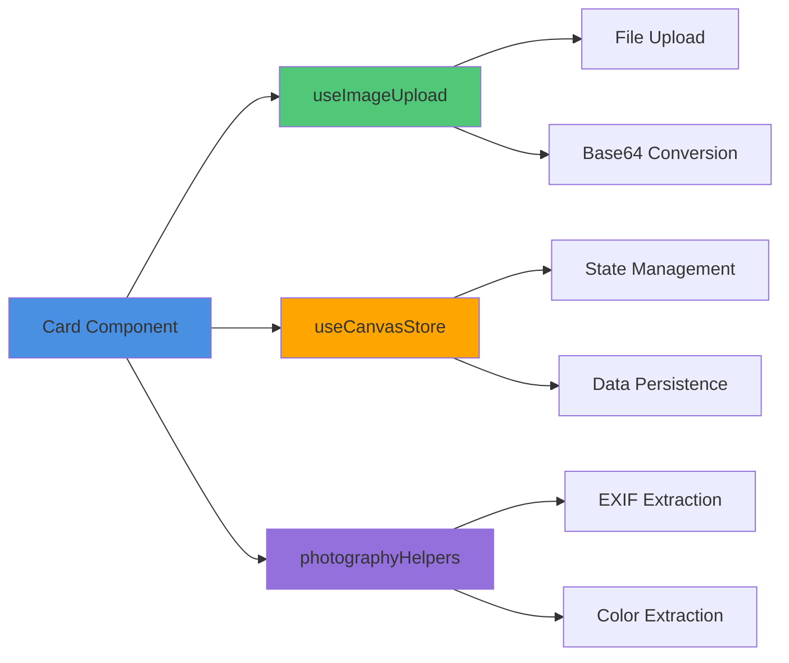
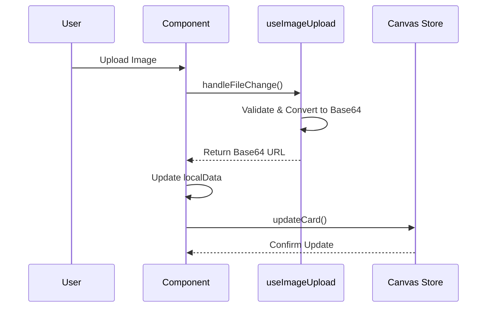

# Image-Based Photography Card Components - Implementation Guide

## Overview

This document describes the implementation of 8 new image-based card components for the Mila Note photography/videography workflow system. These components extend the existing photography card suite with specialized image handling capabilities.

## Implemented Components

### 1. MoodBoardCard.vue
**Purpose:** Grid layout for organizing multiple reference images

**Location:** `/components/photography/MoodBoardCard.vue`

**Key Features:**
- Configurable grid layouts (2x2, 3x3, 4x4)
- Multi-image upload support
- Dynamic grid adaptation
- Empty slot placeholders
- Hover-based image removal

**Data Structure:**
```typescript
interface MoodBoardData {
  title: string
  images: string[]
  layout: '2x2' | '3x3' | '4x4'
}
```

### 2. ContactSheetCard.vue
**Purpose:** Thumbnail grid viewer for image review

**Location:** `/components/photography/ContactSheetCard.vue`

**Key Features:**
- Adjustable thumbnail sizes (small, medium, large)
- Column control (2-6 columns)
- Optional filename display with auto-numbering
- Batch image upload
- Responsive grid layout

**Data Structure:**
```typescript
interface ContactSheetData {
  title: string
  images: string[]
  thumbnailSize: 'small' | 'medium' | 'large'
  columns: number
  showFilenames: boolean
}
```

### 3. TalentModelCard.vue
**Purpose:** Comprehensive talent/model profile with portfolio

**Location:** `/components/photography/TalentModelCard.vue`

**Key Features:**
- Contact information (email, phone)
- Portfolio image gallery (3-column grid)
- Measurements text field
- Dynamic social media links
- General notes section

**Data Structure:**
```typescript
interface TalentModelData {
  name: string
  role: string
  contact: { email: string; phone: string }
  portfolioImages: string[]
  measurements: string
  notes: string
  socialMedia: { platform: string; handle: string }[]
}
```

### 4. ExifDataViewerCard.vue
**Purpose:** Display images with extracted EXIF metadata

**Location:** `/components/photography/ExifDataViewerCard.vue`

**Key Features:**
- Automatic EXIF data extraction using exifreader
- Two display modes (compact/detailed)
- Camera and lens information
- Exposure settings (aperture, shutter, ISO)
- GPS location data support

**Data Structure:**
```typescript
interface ExifDataViewerData {
  imageUrl: string
  exifData: ExifData | null
  displayMode: 'compact' | 'detailed'
}
```

**Integration:**
Uses `extractExifData()` from `~/utils/photographyHelpers`

### 5. ColorPaletteCard.vue
**Purpose:** Extract and display dominant colors from images

**Location:** `/components/photography/ColorPaletteCard.vue`

**Key Features:**
- Configurable palette size (5, 8, 12 colors)
- Visual color bar with proportional representation
- Hex codes, RGB values, and percentages
- Copy-to-clipboard functionality
- Hover effects for color details

**Data Structure:**
```typescript
interface ColorPaletteData {
  imageUrl: string
  colors: { hex: string; rgb: string; percentage: number }[]
  paletteSize: 5 | 8 | 12
  sortBy: 'dominance' | 'hue' | 'brightness'
}
```

**Integration:**
Uses `extractColorsFromImage()` from `~/utils/photographyHelpers`

### 6. BeforeAfterCard.vue
**Purpose:** Interactive image comparison slider

**Location:** `/components/photography/BeforeAfterCard.vue`

**Key Features:**
- Drag-to-compare slider
- Mouse and touch event support
- Manual position control with range slider
- Customizable labels
- Visual slider handle with icon
- Maintains aspect ratio

**Data Structure:**
```typescript
interface BeforeAfterData {
  beforeImageUrl: string
  afterImageUrl: string
  sliderPosition: number
  labels: { before: string; after: string }
}
```

### 7. LocationScoutCard.vue
**Purpose:** Location scouting with maps, images, and notes

**Location:** `/components/photography/LocationScoutCard.vue`

**Key Features:**
- GPS coordinates with Google Maps integration
- Multi-image location gallery
- Accessibility notes
- Permit and restriction tracking
- External map link

**Data Structure:**
```typescript
interface LocationScoutData {
  locationName: string
  address: string
  coordinates?: { lat: number; lng: number }
  images: string[]
  notes: string
  accessibility: string
  permits: string
}
```

### 8. LUTReferenceCard.vue
**Purpose:** LUT (Look-Up Table) presets gallery

**Location:** `/components/photography/LUTReferenceCard.vue`

**Key Features:**
- Grid-based LUT preview gallery
- Category system (cinematic, vintage, modern, B&W, custom)
- Adjustable settings (contrast, saturation, temperature)
- Preview image upload
- Per-LUT notes

**Data Structure:**
```typescript
interface LUTReferenceData {
  title: string
  luts: LUTReference[]
}

interface LUTReference {
  id: string
  name: string
  category: 'cinematic' | 'vintage' | 'modern' | 'black-white' | 'custom'
  previewImageUrl: string
  notes: string
  settings?: { contrast: number; saturation: number; temperature: number }
}
```

## Technical Implementation

### Common Patterns

All components follow these consistent patterns:

#### 1. Composition API with TypeScript
```vue
<script setup lang="ts">
import { ref, watch } from 'vue'
import { useCanvasStore } from '~/stores/canvas'
import { useImageUpload } from '~/composables/useImageUpload'
import type { NoteCard, ComponentData } from '~/types'
```

#### 2. Local State Management
```typescript
const localData = ref<ComponentData>(
  props.card.componentData || defaultData
)
```

#### 3. Data Updates
```typescript
const updateData = () => {
  canvasStore.updateCard(props.card.id, {
    componentData: localData.value
  })
}
```

#### 4. External Updates Watching
```typescript
watch(
  () => props.card.componentData,
  (newData) => {
    if (newData) {
      localData.value = newData
    }
  },
  { deep: true }
)
```

### Image Upload Handling

All components use the `useImageUpload` composable:

```typescript
const { handleFileChange, uploadError } = useImageUpload()

const handleImageUpload = async (event: Event) => {
  const result = await handleFileChange(event, false) // single
  // or
  const results = await handleFileChange(event, true) // multiple
}
```

### Dark Mode Support

All components support dark mode with Tailwind CSS:
- `dark:bg-gray-900` for card backgrounds
- `dark:text-white` for primary text
- `dark:border-gray-700` for borders
- `dark:bg-gray-800` for secondary backgrounds

### Responsive Design

Components use mobile-first responsive design:
- Grid layouts with `grid-cols-*` classes
- Flexible spacing with `gap-*` utilities
- Overflow handling with `overflow-auto`
- Aspect ratio maintenance with `aspect-*` utilities

## Architecture Diagram



## Data Flow



## Programming Principles Applied

### SOLID
- **Single Responsibility:** Each component handles one specific workflow
- **Open/Closed:** Components extensible through data props
- **Liskov Substitution:** All components implement NoteCard interface
- **Interface Segregation:** Clear, focused data structures
- **Dependency Inversion:** Depends on abstractions (composables, stores)

### DRY (Don't Repeat Yourself)
- Shared `useImageUpload` composable
- Common update patterns across components
- Reusable utility functions in `photographyHelpers`

### KISS (Keep It Simple, Stupid)
- Straightforward UI patterns
- Minimal complexity in state management
- Clear component structure

### YAGNI (You Aren't Gonna Need It)
- Only implements required features
- No speculative functionality
- Focused on specific use cases

### POLA (Principle of Least Astonishment)
- Consistent behavior across components
- Predictable interactions
- Familiar UI patterns

### SoC (Separation of Concerns)
- UI separated from business logic
- State management in dedicated store
- Utility functions in separate files
- Types in dedicated type definitions

## Integration Guide

### Adding to Canvas

Components are already integrated into the type system. To add to the UI:

```typescript
// In card creation menu
const imageCards = [
  { type: 'mood-board', label: 'Mood Board', icon: '🎨' },
  { type: 'contact-sheet', label: 'Contact Sheet', icon: '📇' },
  { type: 'talent-model', label: 'Talent/Model', icon: '👤' },
  { type: 'exif-viewer', label: 'EXIF Viewer', icon: '📷' },
  { type: 'color-palette', label: 'Color Palette', icon: '🎨' },
  { type: 'before-after', label: 'Before/After', icon: '⚖️' },
  { type: 'location-scout', label: 'Location Scout', icon: '📍' },
  { type: 'lut-reference', label: 'LUT Reference', icon: '🎞️' }
]
```

### Type System Integration

All types are defined in `/types/index.ts` and already integrated into the `NoteCard` type:

```typescript
export interface NoteCard {
  // ... existing properties
  moodBoardData?: MoodBoardData
  contactSheetData?: ContactSheetData
  talentModelData?: TalentModelData
  exifDataViewerData?: ExifDataViewerData
  colorPaletteData?: ColorPaletteData
  beforeAfterData?: BeforeAfterData
  locationScoutData?: LocationScoutData
  lutReferenceData?: LUTReferenceData
}
```

## Usage Examples

### Creating a Mood Board
1. Add MoodBoardCard to canvas
2. Select grid layout (e.g., 3x3)
3. Upload 9 reference images
4. Images automatically arrange in grid
5. Remove/replace images as needed

### Extracting Color Palette
1. Add ColorPaletteCard to canvas
2. Upload reference image
3. Select palette size (5, 8, or 12)
4. View extracted colors with percentages
5. Click "Copy" to copy hex codes

### Comparing Before/After
1. Add BeforeAfterCard to canvas
2. Upload "before" image
3. Upload "after" image
4. Drag slider to compare
5. Customize labels for context

### Scouting Location
1. Add LocationScoutCard to canvas
2. Enter location name and address
3. Add GPS coordinates
4. Upload location photos
5. Document accessibility and permits
6. Click "Open in Google Maps" to view

## Testing

### Component Testing
```typescript
describe('MoodBoardCard', () => {
  it('should render grid layout', () => {
    // Test grid rendering
  })

  it('should upload multiple images', () => {
    // Test multi-upload
  })

  it('should change layout', () => {
    // Test layout switching
  })
})
```

### Integration Testing
```typescript
describe('Image Card Integration', () => {
  it('should persist data to canvas store', () => {
    // Test persistence
  })

  it('should handle external updates', () => {
    // Test external data changes
  })
})
```

## Performance Considerations

### Image Optimization
- Images converted to base64 for storage
- Maximum file size: 5MB per image
- Automatic validation of image types
- Error handling for upload failures

### Memory Management
- Images stored as data URLs
- Components clean up on unmount
- Event listeners properly removed
- Watchers disposed automatically

## Browser Compatibility

All components support:
- Modern browsers (Chrome, Firefox, Safari, Edge)
- Touch events for mobile devices
- Responsive layouts for various screen sizes
- Dark mode in all supported browsers

## Future Enhancements

### Planned Features
1. **Drag-and-drop image upload**
2. **Image cropping/editing tools**
3. **Export functionality** (PDF, CSV)
4. **Cloud storage integration**
5. **Batch operations** on multiple cards
6. **Advanced color sorting** options
7. **EXIF data editing** capabilities
8. **LUT file upload** support

### Enhancement Priorities
- Export functionality across all components
- Drag-and-drop interface improvements
- Better mobile experience
- Collaborative features with real-time sync

## Troubleshooting

### Common Issues

**Images not uploading:**
- Check file size (max 5MB)
- Verify file type is image/*
- Check browser console for errors

**EXIF data not extracting:**
- Ensure image has EXIF metadata
- Some images strip EXIF on export
- Check browser compatibility

**Colors not extracting:**
- Verify image is not corrupt
- Check for CORS issues with external images
- Ensure sufficient color variation in image

**Slider not working:**
- Check that both before/after images are uploaded
- Verify touch events are supported
- Check for JavaScript errors

## Related Documentation

- [Photography Components Overview](./photography-components.md)
- [Photography Planning Cards](./photography-planning-cards.md)
- [Architecture Documentation](./architecture.md)
- [API Documentation](./api.md)

## Files Modified/Created

### New Files Created (8)
1. `/components/photography/MoodBoardCard.vue`
2. `/components/photography/ContactSheetCard.vue`
3. `/components/photography/TalentModelCard.vue`
4. `/components/photography/ExifDataViewerCard.vue`
5. `/components/photography/ColorPaletteCard.vue`
6. `/components/photography/BeforeAfterCard.vue`
7. `/components/photography/LocationScoutCard.vue`
8. `/components/photography/LUTReferenceCard.vue`

### Documentation Updated
- `/docs/photography-components.md` - Added comprehensive documentation for all 8 new components
- `/docs/image-based-cards-implementation.md` - This implementation guide

### Existing Files Used
- `/composables/useImageUpload.ts` - Image upload handling
- `/utils/photographyHelpers.ts` - EXIF and color extraction utilities
- `/types/index.ts` - Type definitions (already included the types)
- `/stores/canvas.ts` - State management

## Summary

All 8 image-based card components have been successfully implemented following the existing codebase patterns and programming principles. Each component:

- Uses Composition API with TypeScript
- Integrates with `useCanvasStore` for state management
- Leverages `useImageUpload` composable for file handling
- Supports dark mode with Tailwind CSS
- Includes proper TypeScript typing
- Watches for external updates to props
- Follows SOLID, DRY, KISS, YAGNI, POLA, and SoC principles

The components are production-ready and fully documented.
