# Mind Map Feature

## Overview

The Mind Map feature provides a MindMup-style interface for creating hierarchical, connected thought maps. Nodes can be quickly created and connected using keyboard shortcuts, making it perfect for brainstorming, planning, and organizing ideas.

## Architecture

### Data Model

Mind map nodes are implemented as a special card type with the following structure:

```typescript
interface MindMapData {
  parentId?: string    // ID of parent node (undefined for root)
  childIds: string[]   // IDs of child nodes
  isCollapsed?: boolean // Whether children are hidden
  level: number        // 0 for root, 1 for first level, etc.
}
```

### Components

1. **MindMapCard** (`components/MindMapCard.vue`)
   - Renders individual mind map nodes
   - Handles inline editing
   - Displays collapse/expand controls
   - Emits events for creating child/sibling nodes

2. **Canvas Store Methods** (`stores/canvas.ts`)
   - `addMindMapNode()` - Creates a new node at position
   - `addMindMapChild()` - Adds child to existing node
   - `addMindMapSibling()` - Adds sibling to existing node
   - `toggleMindMapCollapse()` - Collapses/expands branches
   - `getMindMapColor()` - Returns color based on hierarchy level

## Usage

### Creating a Mind Map

1. Click the **Mind Map** button in the sidebar
2. A root node appears at the center of your canvas
3. The node is automatically selected for editing

### Keyboard Shortcuts

When a mind map node is selected and in edit mode:

- **Tab** - Create a child node (adds node to the right)
- **Enter** - Create a sibling node (adds node below)
- **Shift+Enter** - Add newline within the node text
- **Escape** - Deselect the node and finish editing

### Visual Hierarchy

Nodes are color-coded by level:
- **Level 0** (Root) - Light Blue (#E3F2FD)
- **Level 1** - Light Orange (#FFF3E0)
- **Level 2** - Light Purple (#F3E5F5)
- **Level 3** - Light Green (#E8F5E9)
- **Level 4** - Light Yellow (#FFF9C4)
- **Level 5** - Light Pink (#FCE4EC)

Colors repeat for deeper levels (Level 6+ uses same colors as 0-5).

### Collapse/Expand

- Nodes with children display a **collapse/expand button** on the right edge
- Click to toggle visibility of all descendant nodes
- Collapsed nodes show a right-pointing arrow (▶)
- Expanded nodes show a down-pointing arrow (▼)

## Layout Algorithm

### Positioning Logic

When creating child nodes:
- **Horizontal spacing**: 250px to the right of parent
- **Vertical spacing**: 100px between siblings
- Children are centered vertically around parent

When creating sibling nodes:
- Same horizontal position as the reference sibling
- 100px below the reference sibling

### Auto-Connect

- Connections are automatically created between parent and child nodes
- Uses the existing Connection system
- Connection color: #6366F1 (blue-violet)
- Connection width: 2px
- Connection style: 'curved'

## Implementation Details

### Node Size

- Width: 180px
- Height: 60px (auto-adjusts with content)
- Text auto-resizes to fit content

### Focus Management

- New nodes are automatically selected
- Textarea is auto-focused when selected
- Text is selected for quick editing
- Focus returns to new node after Tab/Enter

### State Synchronization

All mind map operations sync to:
- Local storage (immediate)
- Server (when authenticated, via queue)

Operations synced:
- Node creation
- Content updates
- Collapse/expand state
- Connection creation
- Parent-child relationships

## Workflow Example

```mermaid
graph LR
    A[Click Mind Map Button] --> B[Root Node Created]
    B --> C[Type: 'Project Plan']
    C --> D[Press Tab]
    D --> E[Child Node Created]
    E --> F[Type: 'Phase 1']
    F --> G[Press Tab]
    G --> H[Grandchild Created]
    H --> I[Type: 'Research']
    I --> J[Press Enter]
    J --> K[Sibling to Grandchild]
    K --> L[Type: 'Design']
```



## Best Practices

### Organization
- Keep node text concise (1-5 words)
- Use hierarchy to show relationships
- Collapse branches to reduce visual clutter
- Use colors to distinguish levels

### Performance
- Mind maps with 100+ nodes may impact performance
- Consider breaking large maps into multiple boards
- Collapse unused branches during active work

### Collaboration
- Mind maps sync across devices when authenticated
- Real-time collaboration not yet implemented
- Use version history to track changes

## Future Enhancements

Potential improvements:
- **Auto-layout** - Automatic tree layout with collision detection
- **Radial layout** - Alternative layout with nodes radiating from center
- **Node styles** - Different shapes (rectangle, rounded, ellipse)
- **Node icons** - Add visual markers to nodes
- **Export** - Export to formats like FreeMind, XMind, PDF
- **Templates** - Pre-built mind map structures
- **Smart suggestions** - AI-powered node suggestions
- **Drag-to-reparent** - Drag nodes to change hierarchy

## Troubleshooting

### Nodes Not Creating
- Ensure the node is selected (blue border)
- Check that you're in edit mode (text should be editable)
- Verify keyboard focus is on the textarea

### Connections Missing
- Connections are created automatically with child nodes
- Check console for sync errors
- Verify parent-child relationship in card data

### Layout Issues
- Overlapping nodes: Manually adjust positions by dragging
- Connections misaligned: Refresh the page to redraw
- Auto-layout coming in future update

---

**Last Updated**: January 2026
**Related Features**: Connections, Canvas, Card Types
