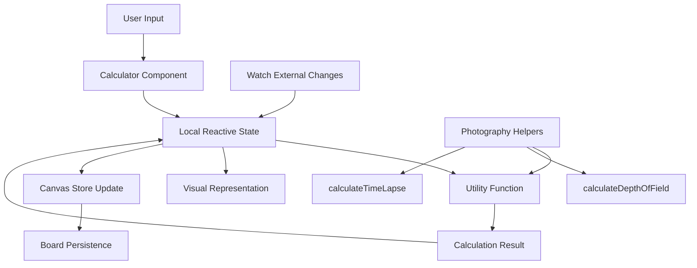
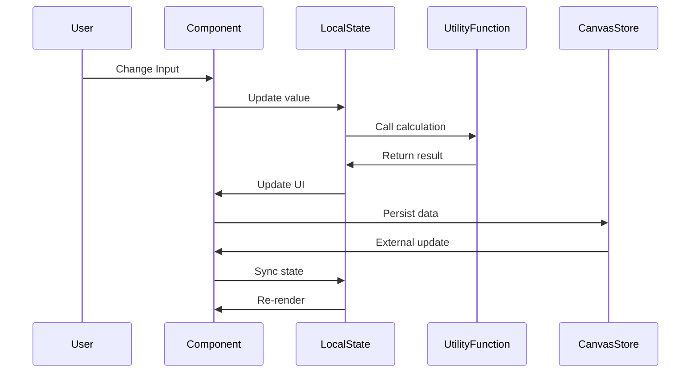
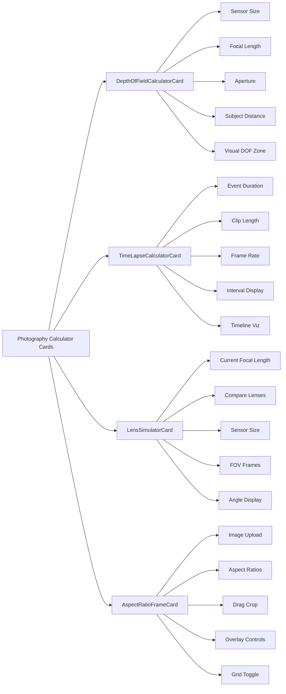

# Photography Calculator Cards

This document describes the calculator card components for photography and cinematography calculations, providing real-time visual feedback and interactive tools for lens selection, crop preview, depth of field analysis, and time-lapse planning.

## Overview

The calculator cards provide professional photography tools with live calculations, visual representations, and interactive interfaces. All calculators support dark mode and provide immediate feedback as parameters change.

## Card Components

### 1. DepthOfFieldCalculatorCard

**Purpose**: Calculates and visualizes depth of field based on camera settings and sensor size.

**File**: `/components/photography/DepthOfFieldCalculatorCard.vue`

**Features**:
- Sensor size selection (Full Frame, APS-C, Micro Four Thirds, Medium Format)
- Focal length input (mm)
- Aperture input (f-stop)
- Subject distance input (meters)
- Real-time DOF calculation using `calculateDepthOfField()` utility
- Visual depth of field representation
- Displays:
  - Near focus distance
  - Far focus distance
  - Total depth of field
  - Hyperfocal distance
- Interactive visual guide showing in-focus and out-of-focus zones
- Contextual tips based on calculated values

**Data Structure** (`DepthOfFieldData`):
```typescript
{
  focalLength: number          // in millimeters
  aperture: number            // f-stop value
  subjectDistance: number     // in meters
  sensorSize: 'full-frame' | 'aps-c' | 'micro-four-thirds' | 'medium-format'
  calculatedDOF: {
    near: number             // meters
    far: number              // meters (Infinity for hyperfocal)
    total: number            // meters
    hyperFocal: number       // meters
  } | null
}
```

**Calculation Integration**:
Uses `calculateDepthOfField()` from `~/utils/photographyHelpers`:
```typescript
const result = calculateDepthOfField(
  focalLength,   // mm
  aperture,      // f-stop
  subjectDistance, // meters
  sensorSize     // sensor type
)
```

**Visual Elements**:
- Color-coded focus zones (green for sharp, red for out-of-focus)
- Subject position marker
- Proportional depth of field visualization
- Real-time updates as values change

**Use Cases**:
- Portrait photography planning
- Landscape photography focus stacking
- Macro photography depth estimation
- Cinematography focus pulling preparation
- Understanding lens and aperture combinations

---

### 2. TimeLapseCalculatorCard

**Purpose**: Calculates shooting intervals and parameters for time-lapse photography.

**File**: `/components/photography/TimeLapseCalculatorCard.vue`

**Features**:
- Event duration input (minutes)
- Desired clip length input (seconds)
- Frame rate selection (24, 25, 30, 60 FPS)
- Real-time interval calculation using `calculateTimeLapse()` utility
- Displays:
  - Shooting interval (seconds between shots)
  - Total frames needed
  - Estimated file size (MB)
  - Speed factor (how much faster than real-time)
  - Storage per minute during shooting
- Interactive timeline visualization showing compression
- Real-time vs. video time comparison bars
- Contextual tips based on interval (short/long recommendations)

**Data Structure** (`TimeLapseCalculatorData`):
```typescript
{
  eventDuration: number        // minutes of real-time event
  clipLength: number          // seconds of final video
  fps: number                 // frames per second (24, 25, 30, 60)
  calculatedInterval: number | null  // seconds between shots
  calculatedFrames: number | null    // total frames to capture
  estimatedFileSize: number | null   // MB estimate
}
```

**Calculation Integration**:
Uses `calculateTimeLapse()` from `~/utils/photographyHelpers`:
```typescript
const result = calculateTimeLapse(
  eventDuration,  // minutes
  clipLength,     // seconds
  fps            // frames per second
)
```

**Visual Elements**:
- Real-time timeline bar with interval markers
- Final video timeline comparison
- Speed factor display
- Storage requirements indicator
- Color-coded gradient bars (blue for real-time, purple for video)

**Calculated Metrics**:
- **Speed Factor**: (Event duration in seconds) / (Clip length in seconds)
- **Storage Per Minute**: (Frames per minute) × (MB per frame)
- **Total Frames**: Clip length × FPS

**Tips Provided**:
- Short interval (< 2s): Camera continuous shooting warning
- Medium interval (2-30s): Standard intervalometer compatible
- Long interval (> 30s): Remote trigger recommendation
- Manual mode and auto-focus disable suggestions

**Use Cases**:
- Sunrise/sunset time-lapses
- Cloud movement capture
- Construction progress documentation
- Plant growth time-lapses
- Event compression (concerts, ceremonies)

---

### 3. LensSimulatorCard

**Purpose**: Visualizes and compares field of view for different focal lengths on various sensor sizes.

**File**: `/components/photography/LensSimulatorCard.vue`

**Features**:
- Sensor size selection (Full Frame, APS-C)
- Current focal length input (8-600mm)
- Multiple comparison focal lengths
- Add/remove focal lengths dynamically
- Crop factor calculation for APS-C
- Real-time field of view calculations
- Visual frame comparison showing relative coverage
- Horizontal and vertical angle of view display
- Lens category identification (ultra-wide, telephoto, etc.)
- Reference frame overlay for comparison

**Data Structure** (`LensSimulatorData`):
```typescript
{
  referenceImageUrl: string
  currentFocalLength: number      // mm (8-600)
  focalLengths: number[]         // array of focal lengths to compare
  sensorSize: 'full-frame' | 'aps-c'
  cropFactor: number             // 1.5 for APS-C, 1.0 for Full Frame
}
```

**Field of View Calculation**:
```typescript
// Based on sensor dimensions and focal length
const horizontalFOV = 2 * Math.atan(sensorWidth / (2 * focalLength)) * (180 / Math.PI)
const verticalFOV = 2 * Math.atan(sensorHeight / (2 * focalLength)) * (180 / Math.PI)
```

**Sensor Dimensions**:
- **Full Frame**: 36mm × 24mm
- **APS-C**: 23.6mm × 15.6mm (1.5x crop factor)

**Lens Categories**:
- **< 24mm**: Ultra-wide angle
- **24-35mm**: Wide angle
- **35-70mm**: Standard / Normal
- **70-135mm**: Portrait / Medium telephoto
- **135-300mm**: Telephoto
- **> 300mm**: Super telephoto

**Visual Elements**:
- Color-coded frames:
  - Blue border: Current focal length
  - Green border: Wider lenses
  - Purple border: Tighter lenses
- Dashed reference overlay showing current focal length on comparison views
- Proportional frame sizing based on FOV
- Visual subject placeholders

**Comparison Features**:
- Side-by-side field of view comparison
- Equivalent focal length display for crop sensors
- "Wider" vs "Tighter" indicators
- Angle of view measurements

**Use Cases**:
- Lens selection for specific shots
- Understanding crop sensor implications
- Planning equipment rentals
- Scouting location coverage needs
- Teaching focal length concepts

---

### 4. AspectRatioFrameCard

**Purpose**: Provides interactive crop preview with various aspect ratios and overlay visualization.

**File**: `/components/photography/AspectRatioFrameCard.vue`

**Features**:
- Image upload functionality
- Multiple aspect ratio presets:
  - 1:1 (Square - Instagram)
  - 4:3 (Standard)
  - 16:9 (Widescreen - YouTube)
  - 2.35:1 (Cinematic)
  - 4:5 (Portrait - Instagram)
  - 9:16 (Vertical - TikTok, Stories)
  - Custom ratio
- Custom aspect ratio input (width × height)
- Draggable crop frame
- Overlay opacity slider (0-100%)
- Overlay color selection (Black, White, Red, Green, Blue)
- Rule of thirds grid toggle
- Real-time crop dimensions display
- Animated crop frame border
- Visual corner handles
- Reset crop functionality

**Data Structure** (`AspectRatioFrameData`):
```typescript
{
  imageUrl: string              // Base64 or URL
  aspectRatio: '1:1' | '4:3' | '16:9' | '2.35:1' | '4:5' | '9:16' | 'custom'
  customRatio?: {
    width: number
    height: number
  }
  cropPosition: {
    x: number                   // pixels from left
    y: number                   // pixels from top
  }
  overlayColor: string          // Hex color
  overlayOpacity: number        // 0-1
}
```

**Aspect Ratio Presets**:
| Ratio | Description | Common Use |
|-------|-------------|------------|
| 1:1 | Square | Instagram posts |
| 4:3 | Standard | Traditional photos |
| 16:9 | Widescreen | YouTube, TV |
| 2.35:1 | Cinematic | Films |
| 4:5 | Portrait | Instagram portrait |
| 9:16 | Vertical | TikTok, Stories |
| Custom | User-defined | Any custom need |

**Interactive Features**:
- **Drag Crop Frame**: Click and drag to reposition crop area
- **Corner Handles**: Visual indicators for frame boundaries
- **Grid Overlay**: Rule of thirds composition guide
- **Live Dimensions**: Real-time width × height display
- **Animated Border**: Marching ants effect on crop frame

**Visual Elements**:
- SVG-based overlay system with masking
- Color-customizable overlay
- Opacity-adjustable darkening
- Rule of thirds composition grid
- Dimension labels
- Aspect ratio display

**Calculation Logic**:
```typescript
// Calculate crop dimensions maintaining aspect ratio
const ratioWidth = customRatio ? customRatio.width : parseRatio(aspectRatio).width
const ratioHeight = customRatio ? customRatio.height : parseRatio(aspectRatio).height

let width = containerWidth * 0.8
let height = width * (ratioHeight / ratioWidth)

// Constrain to container
if (height > containerHeight * 0.8) {
  height = containerHeight * 0.8
  width = height * (ratioWidth / ratioHeight)
}
```

**Use Cases**:
- Social media content preparation
- Multi-platform deliverable planning
- Composition visualization
- Framing decisions during production
- Aspect ratio education and training
- Pre-visualizing crops before shooting

---

## Common Patterns

All calculator cards follow consistent design patterns:

### 1. Composition API with TypeScript

```vue
<script setup lang="ts">
import { ref, computed, watch } from 'vue'
import { useCanvasStore } from '~/stores/canvas'
import type { NoteCard, CalculatorDataType } from '~/types'

const props = defineProps<{
  card: NoteCard
}>()

const canvasStore = useCanvasStore()
const localData = ref<CalculatorDataType>(
  props.card.calculatorData || defaultData
)
</script>
```

### 2. Real-Time Calculation

- Input changes trigger immediate recalculation
- `@input` events for instant feedback
- Computed properties for derived values
- Automatic result updates

### 3. Visual Feedback

- Color-coded results (blue for info, green for success, amber for warnings)
- Progress bars and visual indicators
- SVG-based visualizations
- Proportional representations

### 4. Dark Mode Support

All components use Tailwind CSS with dark mode variants:
- `dark:bg-gray-900` - Dark backgrounds
- `dark:text-white` - Light text on dark
- `dark:border-gray-700` - Subtle borders
- Consistent color schemes across modes

### 5. Responsive Design

- Flexible layouts with Flexbox/Grid
- Overflow handling with scrollable areas
- Touch-friendly controls
- Mobile-optimized inputs

---

## Integration

### Utility Function Usage

Calculator cards leverage utility functions from `/utils/photographyHelpers.ts`:

#### Depth of Field Calculation
```typescript
import { calculateDepthOfField } from '~/utils/photographyHelpers'

const result = calculateDepthOfField(
  focalLength,      // mm
  aperture,         // f-stop
  subjectDistance,  // meters
  sensorSize        // sensor type
)
// Returns: { near, far, total, hyperFocal }
```

#### Time-Lapse Calculation
```typescript
import { calculateTimeLapse } from '~/utils/photographyHelpers'

const result = calculateTimeLapse(
  eventDuration,  // minutes
  clipLength,     // seconds
  fps            // frames per second
)
// Returns: { interval, frames, fileSize }
```

### Canvas Store Updates

All calculators update the canvas store consistently:

```typescript
const updateData = () => {
  canvasStore.updateCard(props.card.id, {
    calculatorDataKey: localData.value
  })
}
```

### Type Definitions

All data structures are defined in `/types/index.ts`:
- `DepthOfFieldData`
- `TimeLapseCalculatorData`
- `LensSimulatorData`
- `AspectRatioFrameData`

---

## Architecture Diagram



---

## Data Flow



---

## Calculation Details

### Depth of Field Algorithm

The DOF calculation uses the thin lens equation:

```typescript
// Circle of confusion (CoC) based on sensor size
const cocMap = {
  'full-frame': 0.029,
  'aps-c': 0.019,
  'micro-four-thirds': 0.015,
  'medium-format': 0.045
}

// Hyperfocal distance
const H = (f * f) / (aperture * coc) + f

// Near and far focus limits
const near = (s * (H - f)) / (H + s - 2 * f)
const far = s >= H ? Infinity : (s * (H - f)) / (H - s)

// Total depth of field
const total = far === Infinity ? Infinity : far - near
```

**Key Principles**:
- Smaller aperture (higher f-number) = greater DOF
- Longer focal length = shallower DOF
- Closer subject distance = shallower DOF
- Smaller sensor = greater DOF (smaller CoC)

### Time-Lapse Calculation

```typescript
// Convert event duration to seconds
const eventDurationSeconds = eventDuration * 60

// Calculate total frames needed
const totalFrames = clipLength * fps

// Calculate shooting interval
const interval = eventDurationSeconds / totalFrames

// Estimate file size (rough: 1MB per 100 frames for 1080p)
const estimatedFileSize = (totalFrames / 100) * 1
```

**Key Relationships**:
- Longer event duration = longer intervals
- Higher FPS = shorter intervals
- Longer clip = more frames needed

### Field of View Calculation

```typescript
// Sensor dimensions
const sensorWidth = sensorSize === 'full-frame' ? 36 : 23.6  // mm
const sensorHeight = sensorSize === 'full-frame' ? 24 : 15.6 // mm

// Field of view angle formula
const horizontalFOV = 2 * Math.atan(sensorWidth / (2 * focalLength)) * (180 / Math.PI)
const verticalFOV = 2 * Math.atan(sensorHeight / (2 * focalLength)) * (180 / Math.PI)
```

**Key Principles**:
- Shorter focal length = wider field of view
- Smaller sensor = narrower field of view (crop factor effect)
- FOV is measured in degrees

---

## Best Practices

### 1. Input Validation

- Set appropriate min/max values on number inputs
- Use step values for precision control
- Provide sensible default values
- Handle edge cases (division by zero, infinity)

### 2. User Experience

- Show loading states during calculations
- Provide immediate visual feedback
- Display units clearly (mm, meters, seconds, degrees)
- Include contextual help and tips
- Use color coding for quick understanding

### 3. Performance

- Use computed properties for derived values
- Debounce expensive calculations if needed
- Optimize SVG rendering
- Use `v-if` vs `v-show` appropriately

### 4. Accessibility

- Label all inputs properly
- Provide keyboard navigation
- Include ARIA attributes where needed
- Ensure sufficient color contrast
- Support screen readers

### 5. Visual Design

- Use consistent spacing and padding
- Maintain visual hierarchy
- Provide clear call-to-action buttons
- Use animation sparingly for feedback
- Ensure dark mode legibility

---

## Testing Considerations

### Unit Tests

- Test calculation functions with known inputs/outputs
- Verify edge cases (infinity, zero, negative)
- Test type conversions (mm to meters, etc.)
- Check default state initialization

### Integration Tests

- Test canvas store synchronization
- Verify watch() triggers
- Test add/remove operations (focal lengths, etc.)
- Check image upload functionality

### E2E Tests

- Test complete calculation workflows
- Verify visual representations update correctly
- Test drag interactions (crop frame)
- Check persistence across page reloads

---

## Future Enhancements

### Potential Features

1. **DepthOfFieldCalculatorCard**
   - Export DOF chart as image
   - Multiple distance calculations simultaneously
   - Focus stacking calculator
   - Bokeh simulation preview

2. **TimeLapseCalculatorCard**
   - Holy Grail time-lapse calculations (exposure ramping)
   - Battery life estimation
   - Card capacity calculation
   - Night-to-day duration planning

3. **LensSimulatorCard**
   - Reference image upload for accurate FOV overlay
   - Perspective distortion visualization
   - Anamorphic lens support
   - Depth compression comparison

4. **AspectRatioFrameCard**
   - Export cropped image
   - Multiple crops on single image
   - Safe area guides (TV broadcast)
   - Social media preview templates

---

## Component Overview



---

## Quick Reference

| Calculator | Primary Function | Key Output | Visual Element |
|-----------|-----------------|------------|----------------|
| **Depth of Field** | Calculate focus range | Near/Far/Total DOF | Color-coded focus zones |
| **Time-Lapse** | Calculate shooting interval | Interval in seconds | Timeline compression |
| **Lens Simulator** | Compare focal lengths | Field of view angles | Proportional frames |
| **Aspect Ratio** | Preview crop frames | Crop dimensions | Interactive overlay |

---

## Related Documentation

- [Photography Helpers Utilities](./utility-functions.md)
- [Photography Planning Cards](./photography-planning-cards.md)
- [Canvas Store Architecture](./architecture.md#canvas-store)
- [Type System](./type-system.md)
- [Component Design Patterns](./component-patterns.md)
