# Photography Canvas Components - Architecture

This document provides detailed architectural diagrams and technical design documentation for the photography canvas components.

## Table of Contents
1. [System Architecture](#system-architecture)
2. [Component Architecture](#component-architecture)
3. [Data Flow](#data-flow)
4. [Class Diagrams](#class-diagrams)
5. [Sequence Diagrams](#sequence-diagrams)
6. [State Management](#state-management)

---

## System Architecture

### High-Level Overview

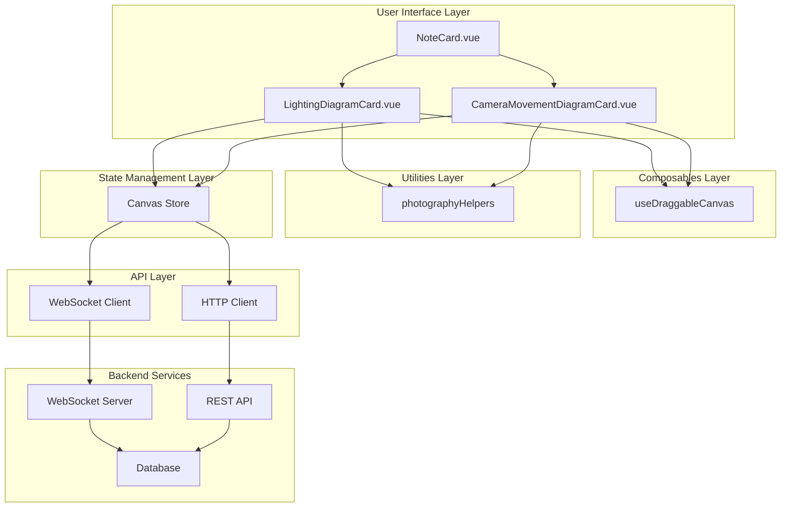
```mermaid
graph TB
    subgraph "User Interface Layer"
        A[LightingDiagramCard.vue]
        B[CameraMovementDiagramCard.vue]
        C[NoteCard.vue]
    end

    subgraph "Composables Layer"
        D[useDraggableCanvas]
    end

    subgraph "Utilities Layer"
        E[photographyHelpers]
    end

    subgraph "State Management Layer"
        F[Canvas Store]
    end

    subgraph "API Layer"
        G[WebSocket Client]
        H[HTTP Client]
    end

    subgraph "Backend Services"
        I[WebSocket Server]
        J[REST API]
        K[Database]
    end

    A --> D
    B --> D
    A --> E
    B --> E
    A --> F
    B --> F
    C --> A
    C --> B
    F --> G
    F --> H
    G --> I
    H --> J
    I --> K
    J --> K
```

### Layer Responsibilities

**User Interface Layer**
- Render canvas and UI controls
- Handle user interactions
- Display properties panels
- Manage local component state

**Composables Layer**
- Provide reusable drag-and-drop logic
- Manage draggable items state
- Calculate positions and offsets
- Handle selection state

**Utilities Layer**
- Generate SVG icons
- Perform calculations (DOF, timelapse, etc.)
- Format data (timecode, file size, currency)
- Process images (EXIF, colors)

**State Management Layer**
- Centralize application state
- Coordinate between components
- Handle persistence
- Manage board data

**API Layer**
- WebSocket for real-time updates
- HTTP for CRUD operations
- Handle connection management
- Manage authentication

**Backend Services**
- Store and retrieve data
- Broadcast updates to clients
- Handle authentication
- Process file uploads

---

## Component Architecture

### LightingDiagramCard Architecture

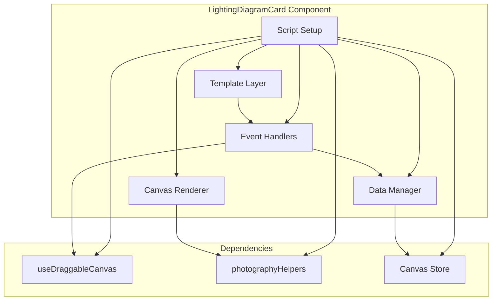
```mermaid
graph TD
    subgraph "LightingDiagramCard Component"
        A[Template Layer]
        B[Script Setup]
        C[Canvas Renderer]
        D[Event Handlers]
        E[Data Manager]
    end

    subgraph "Dependencies"
        F[useDraggableCanvas]
        G[photographyHelpers]
        H[Canvas Store]
    end

    B --> A
    B --> C
    B --> D
    B --> E
    B --> F
    B --> G
    B --> H
    A --> D
    D --> F
    D --> E
    C --> G
    E --> H
```

**Component Breakdown**

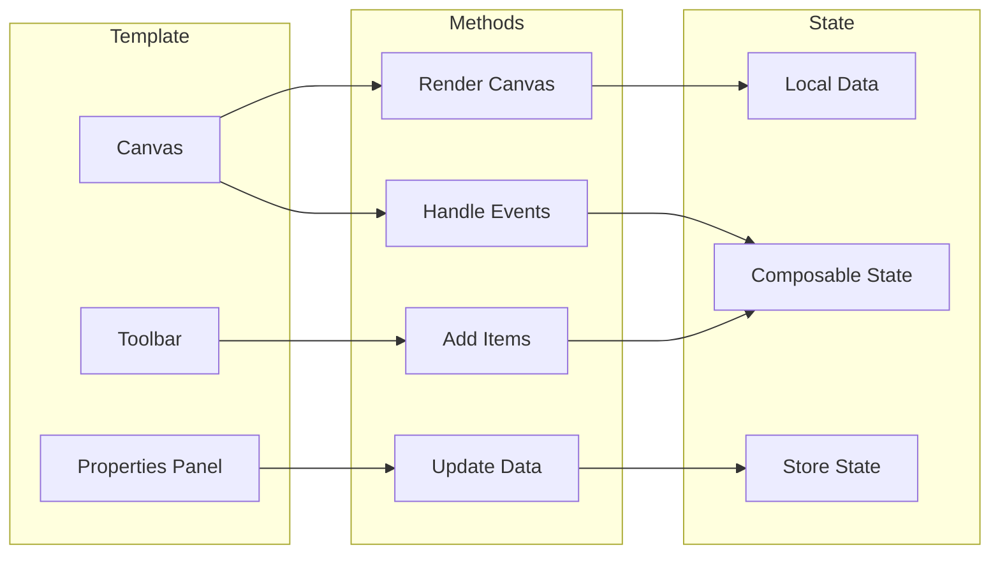
```mermaid
graph LR
    subgraph "Template"
        A1[Toolbar]
        A2[Canvas]
        A3[Properties Panel]
    end

    subgraph "State"
        B1[Local Data]
        B2[Composable State]
        B3[Store State]
    end

    subgraph "Methods"
        C1[Add Items]
        C2[Render Canvas]
        C3[Handle Events]
        C4[Update Data]
    end

    A1 --> C1
    A2 --> C2
    A2 --> C3
    A3 --> C4
    C1 --> B2
    C2 --> B1
    C3 --> B2
    C4 --> B3
```

### CameraMovementDiagramCard Architecture

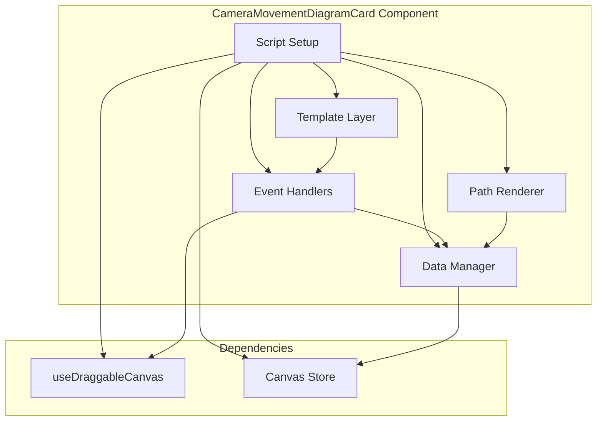
```mermaid
graph TD
    subgraph "CameraMovementDiagramCard Component"
        A[Template Layer]
        B[Script Setup]
        C[Path Renderer]
        D[Event Handlers]
        E[Data Manager]
    end

    subgraph "Dependencies"
        F[useDraggableCanvas]
        G[Canvas Store]
    end

    B --> A
    B --> C
    B --> D
    B --> E
    B --> F
    B --> G
    A --> D
    D --> F
    D --> E
    C --> E
    E --> G
```

---

## Data Flow

### User Interaction Flow

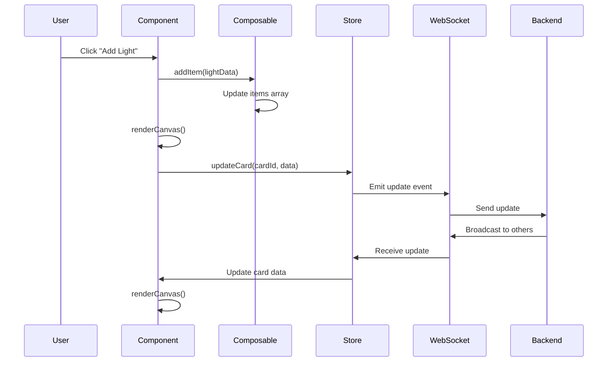
```mermaid
sequenceDiagram
    participant U as User
    participant C as Component
    participant Co as Composable
    participant S as Store
    participant WS as WebSocket
    participant B as Backend

    U->>C: Click "Add Light"
    C->>Co: addItem(lightData)
    Co->>Co: Update items array
    C->>C: renderCanvas()
    C->>S: updateCard(cardId, data)
    S->>WS: Emit update event
    WS->>B: Send update
    B->>WS: Broadcast to others
    WS->>S: Receive update
    S->>C: Update card data
    C->>C: renderCanvas()
```

### Drag and Drop Flow

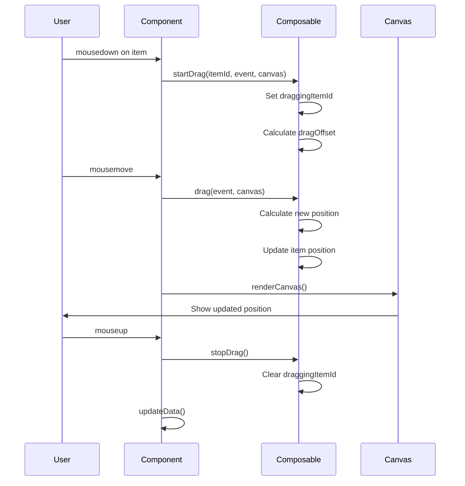
```mermaid
sequenceDiagram
    participant U as User
    participant C as Component
    participant Co as Composable
    participant CV as Canvas

    U->>C: mousedown on item
    C->>Co: startDrag(itemId, event, canvas)
    Co->>Co: Set draggingItemId
    Co->>Co: Calculate dragOffset
    U->>C: mousemove
    C->>Co: drag(event, canvas)
    Co->>Co: Calculate new position
    Co->>Co: Update item position
    C->>CV: renderCanvas()
    CV->>U: Show updated position
    U->>C: mouseup
    C->>Co: stopDrag()
    Co->>Co: Clear draggingItemId
    C->>C: updateData()
```

### Data Persistence Flow

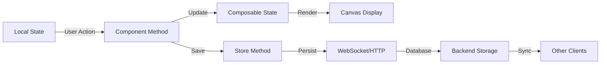
```mermaid
graph LR
    A[Local State] -->|User Action| B[Component Method]
    B -->|Update| C[Composable State]
    C -->|Render| D[Canvas Display]
    B -->|Save| E[Store Method]
    E -->|Persist| F[WebSocket/HTTP]
    F -->|Database| G[Backend Storage]
    G -->|Sync| H[Other Clients]
```

---

## Class Diagrams

### Type Definitions

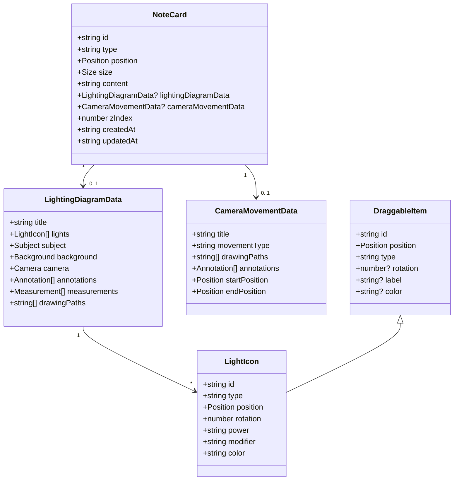
```mermaid
classDiagram
    class NoteCard {
        +string id
        +string type
        +Position position
        +Size size
        +string content
        +LightingDiagramData? lightingDiagramData
        +CameraMovementData? cameraMovementData
        +number zIndex
        +string createdAt
        +string updatedAt
    }

    class LightingDiagramData {
        +string title
        +LightIcon[] lights
        +Subject subject
        +Background background
        +Camera camera
        +Annotation[] annotations
        +Measurement[] measurements
        +string[] drawingPaths
    }

    class LightIcon {
        +string id
        +string type
        +Position position
        +number rotation
        +string power
        +string modifier
        +string color
    }

    class CameraMovementData {
        +string title
        +string movementType
        +string[] drawingPaths
        +Annotation[] annotations
        +Position startPosition
        +Position endPosition
    }

    class DraggableItem {
        +string id
        +Position position
        +string type
        +number? rotation
        +string? label
        +string? color
    }

    NoteCard "1" --> "0..1" LightingDiagramData
    NoteCard "1" --> "0..1" CameraMovementData
    LightingDiagramData "1" --> "*" LightIcon
    DraggableItem <|-- LightIcon
```

### Composable Structure

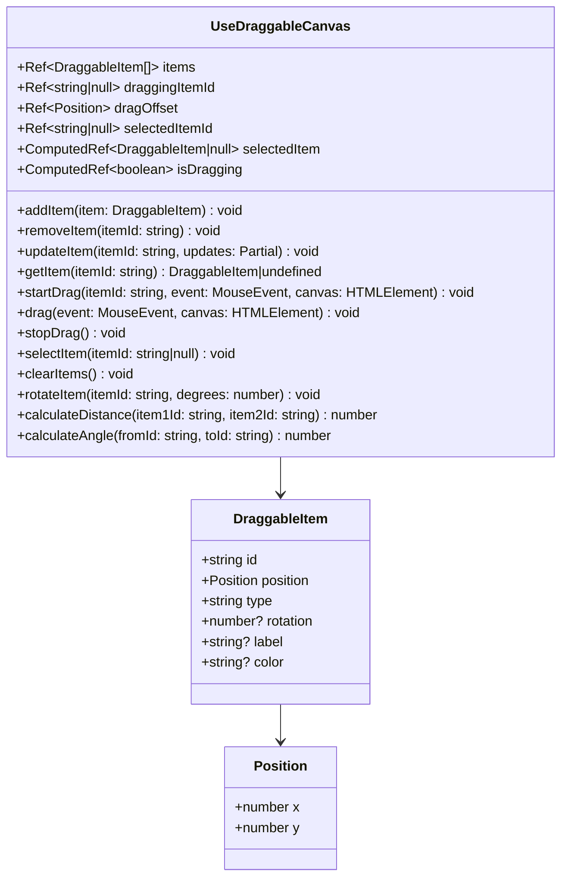
```mermaid
classDiagram
    class UseDraggableCanvas {
        +Ref~DraggableItem[]~ items
        +Ref~string|null~ draggingItemId
        +Ref~Position~ dragOffset
        +Ref~string|null~ selectedItemId
        +ComputedRef~DraggableItem|null~ selectedItem
        +ComputedRef~boolean~ isDragging
        +addItem(item: DraggableItem) void
        +removeItem(itemId: string) void
        +updateItem(itemId: string, updates: Partial) void
        +getItem(itemId: string) DraggableItem|undefined
        +startDrag(itemId: string, event: MouseEvent, canvas: HTMLElement) void
        +drag(event: MouseEvent, canvas: HTMLElement) void
        +stopDrag() void
        +selectItem(itemId: string|null) void
        +clearItems() void
        +rotateItem(itemId: string, degrees: number) void
        +calculateDistance(item1Id: string, item2Id: string) number
        +calculateAngle(fromId: string, toId: string) number
    }

    class Position {
        +number x
        +number y
    }

    class DraggableItem {
        +string id
        +Position position
        +string type
        +number? rotation
        +string? label
        +string? color
    }

    UseDraggableCanvas --> DraggableItem
    DraggableItem --> Position
```

---

## Sequence Diagrams

### Component Initialization

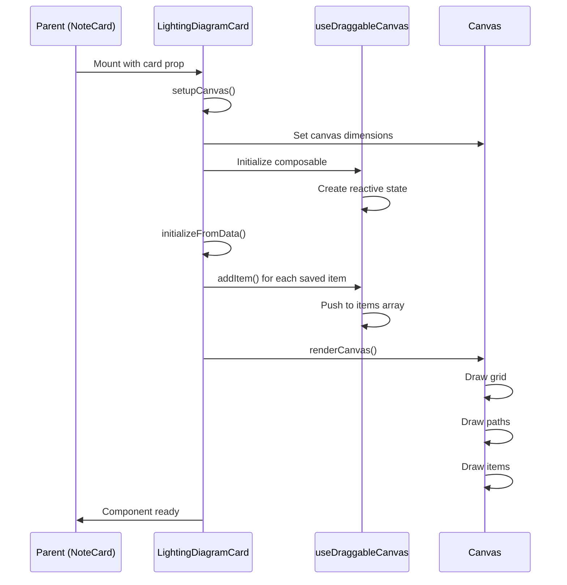
```mermaid
sequenceDiagram
    participant P as Parent (NoteCard)
    participant L as LightingDiagramCard
    participant Co as useDraggableCanvas
    participant CV as Canvas

    P->>L: Mount with card prop
    L->>L: setupCanvas()
    L->>CV: Set canvas dimensions
    L->>Co: Initialize composable
    Co->>Co: Create reactive state
    L->>L: initializeFromData()
    L->>Co: addItem() for each saved item
    Co->>Co: Push to items array
    L->>CV: renderCanvas()
    CV->>CV: Draw grid
    CV->>CV: Draw paths
    CV->>CV: Draw items
    L->>P: Component ready
```

### Adding a Light

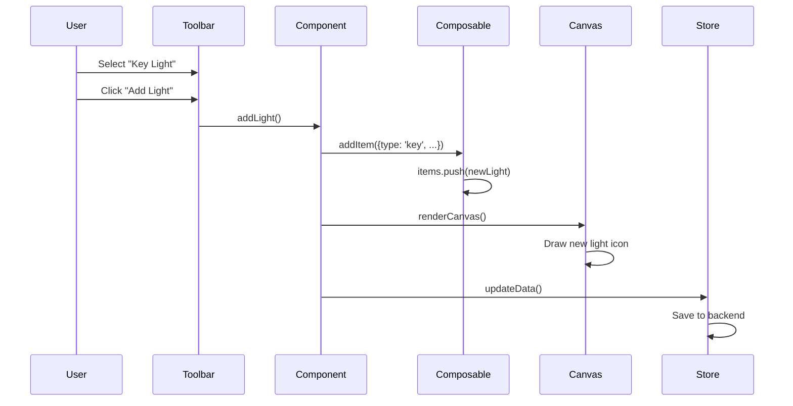
```mermaid
sequenceDiagram
    participant U as User
    participant T as Toolbar
    participant C as Component
    participant Co as Composable
    participant CV as Canvas
    participant S as Store

    U->>T: Select "Key Light"
    U->>T: Click "Add Light"
    T->>C: addLight()
    C->>Co: addItem({type: 'key', ...})
    Co->>Co: items.push(newLight)
    C->>CV: renderCanvas()
    CV->>CV: Draw new light icon
    C->>S: updateData()
    S->>S: Save to backend
```

### Modifying Light Properties

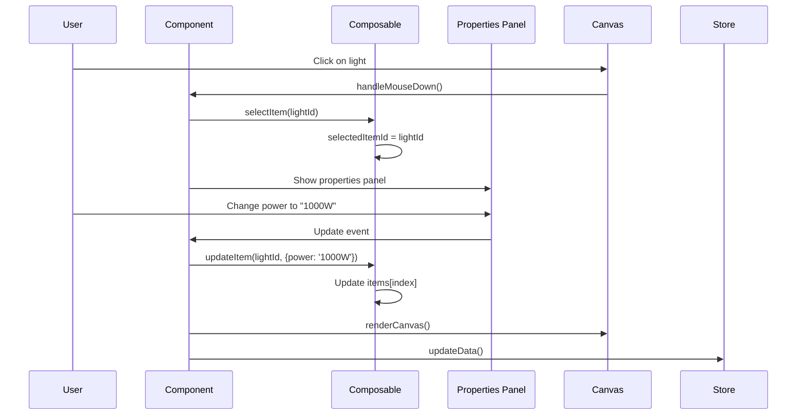
```mermaid
sequenceDiagram
    participant U as User
    participant C as Component
    participant Co as Composable
    participant P as Properties Panel
    participant CV as Canvas
    participant S as Store

    U->>CV: Click on light
    CV->>C: handleMouseDown()
    C->>Co: selectItem(lightId)
    Co->>Co: selectedItemId = lightId
    C->>P: Show properties panel
    U->>P: Change power to "1000W"
    P->>C: Update event
    C->>Co: updateItem(lightId, {power: '1000W'})
    Co->>Co: Update items[index]
    C->>CV: renderCanvas()
    C->>S: updateData()
```

### Drawing Path Flow

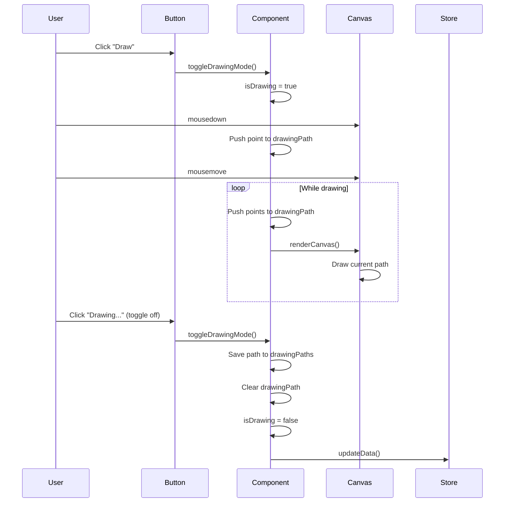
```mermaid
sequenceDiagram
    participant U as User
    participant B as Button
    participant C as Component
    participant CV as Canvas
    participant S as Store

    U->>B: Click "Draw"
    B->>C: toggleDrawingMode()
    C->>C: isDrawing = true
    U->>CV: mousedown
    C->>C: Push point to drawingPath
    U->>CV: mousemove
    loop While drawing
        C->>C: Push points to drawingPath
        C->>CV: renderCanvas()
        CV->>CV: Draw current path
    end
    U->>B: Click "Drawing..." (toggle off)
    B->>C: toggleDrawingMode()
    C->>C: Save path to drawingPaths
    C->>C: Clear drawingPath
    C->>C: isDrawing = false
    C->>S: updateData()
```

---

## State Management

### Component State Structure

```mermaid
graph TD
    subgraph "Component State"
        A[localData: LightingDiagramData]
        B[canvasRef: HTMLCanvasElement]
        C[isDrawing: boolean]
        D[drawingPath: Point[]]
        E[selectedLightType: string]
    end

    subgraph "Composable State"
        F[items: DraggableItem[]]
        G[draggingItemId: string|null]
        H[selectedItemId: string|null]
        I[dragOffset: Position]
    end

    subgraph "Store State"
        J[currentBoard: Board]
        K[cards: NoteCard[]]
        L[viewport: ViewPort]
    end

    A --> J
    F --> K
    K --> A
```

### State Synchronization

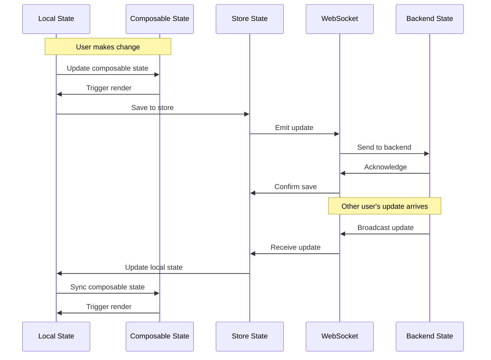
```mermaid
sequenceDiagram
    participant LS as Local State
    participant CS as Composable State
    participant SS as Store State
    participant WS as WebSocket
    participant BS as Backend State

    Note over LS,CS: User makes change
    LS->>CS: Update composable state
    CS->>LS: Trigger render
    LS->>SS: Save to store
    SS->>WS: Emit update
    WS->>BS: Send to backend
    BS->>WS: Acknowledge
    WS->>SS: Confirm save

    Note over WS,BS: Other user's update arrives
    BS->>WS: Broadcast update
    WS->>SS: Receive update
    SS->>LS: Update local state
    LS->>CS: Sync composable state
    CS->>LS: Trigger render
```

### State Flow for Real-time Collaboration

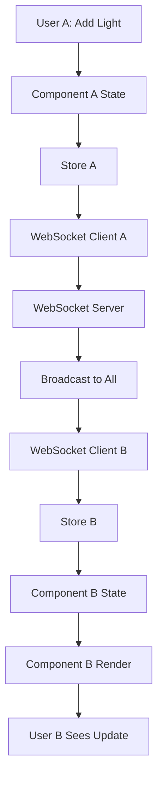
```mermaid
graph TD
    A[User A: Add Light] --> B[Component A State]
    B --> C[Store A]
    C --> D[WebSocket Client A]
    D --> E[WebSocket Server]
    E --> F[Broadcast to All]
    F --> G[WebSocket Client B]
    G --> H[Store B]
    H --> I[Component B State]
    I --> J[Component B Render]
    J --> K[User B Sees Update]
```

---

## Canvas Rendering Pipeline

### Rendering Stages

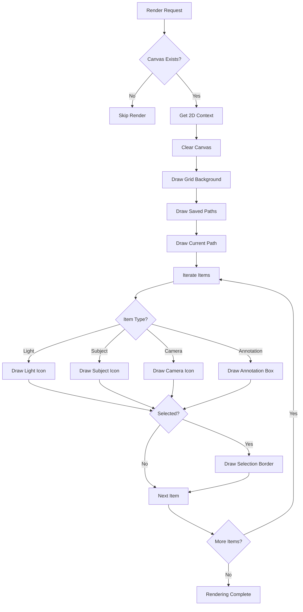
```mermaid
graph TD
    A[Render Request] --> B{Canvas Exists?}
    B -->|No| C[Skip Render]
    B -->|Yes| D[Get 2D Context]
    D --> E[Clear Canvas]
    E --> F[Draw Grid Background]
    F --> G[Draw Saved Paths]
    G --> H[Draw Current Path]
    H --> I[Iterate Items]
    I --> J{Item Type?}
    J -->|Light| K[Draw Light Icon]
    J -->|Subject| L[Draw Subject Icon]
    J -->|Camera| M[Draw Camera Icon]
    J -->|Annotation| N[Draw Annotation Box]
    K --> O{Selected?}
    L --> O
    M --> O
    N --> O
    O -->|Yes| P[Draw Selection Border]
    O -->|No| Q[Next Item]
    P --> Q
    Q --> R{More Items?}
    R -->|Yes| I
    R -->|No| S[Rendering Complete]
```

### SVG Icon Rendering

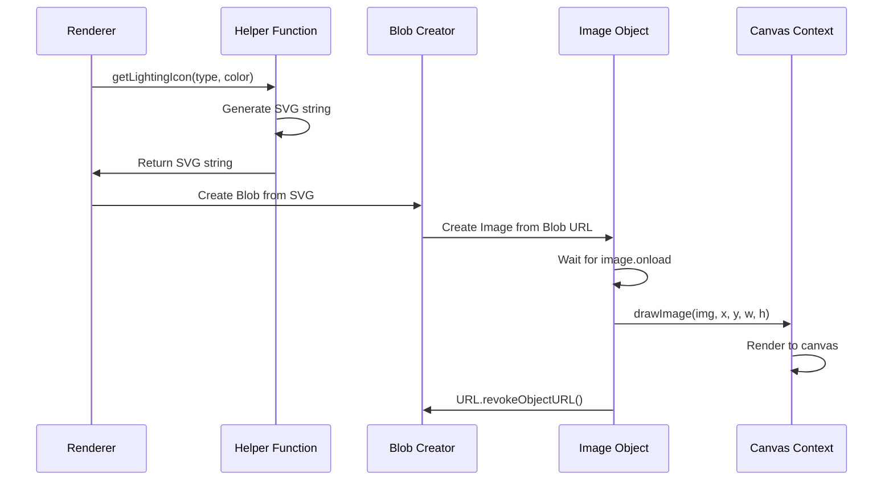
```mermaid
sequenceDiagram
    participant R as Renderer
    participant H as Helper Function
    participant B as Blob Creator
    participant I as Image Object
    participant C as Canvas Context

    R->>H: getLightingIcon(type, color)
    H->>H: Generate SVG string
    H->>R: Return SVG string
    R->>B: Create Blob from SVG
    B->>I: Create Image from Blob URL
    I->>I: Wait for image.onload
    I->>C: drawImage(img, x, y, w, h)
    C->>C: Render to canvas
    I->>B: URL.revokeObjectURL()
```

---

## Performance Architecture

### Optimization Strategies

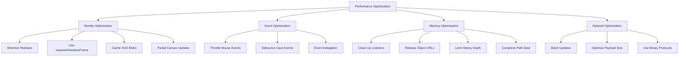
```mermaid
graph TD
    A[Performance Optimization] --> B[Render Optimization]
    A --> C[Event Optimization]
    A --> D[Memory Optimization]
    A --> E[Network Optimization]

    B --> B1[Minimize Redraws]
    B --> B2[Use requestAnimationFrame]
    B --> B3[Cache SVG Blobs]
    B --> B4[Partial Canvas Updates]

    C --> C1[Throttle Mouse Events]
    C --> C2[Debounce Input Events]
    C --> C3[Event Delegation]

    D --> D1[Clean Up Listeners]
    D --> D2[Release Object URLs]
    D --> D3[Limit History Depth]
    D --> D4[Compress Path Data]

    E --> E1[Batch Updates]
    E --> E2[Optimize Payload Size]
    E --> E3[Use Binary Protocols]
```

### Rendering Performance Flow

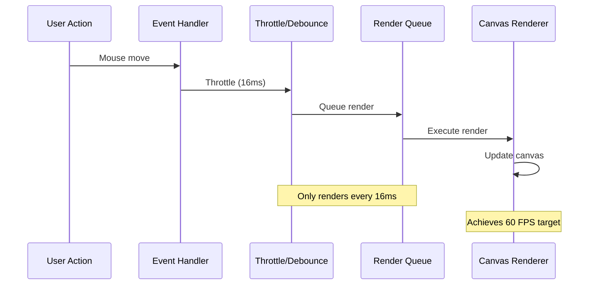
```mermaid
sequenceDiagram
    participant U as User Action
    participant E as Event Handler
    participant T as Throttle/Debounce
    participant R as Render Queue
    participant C as Canvas Renderer

    U->>E: Mouse move
    E->>T: Throttle (16ms)
    T->>R: Queue render
    R->>C: Execute render
    C->>C: Update canvas
    Note over T,R: Only renders every 16ms
    Note over C: Achieves 60 FPS target
```

---

## Error Handling Architecture

### Error Boundaries

```mermaid
graph TD
    A[User Action] --> B{Try Operation}
    B -->|Success| C[Update State]
    B -->|Error| D[Catch Error]
    D --> E{Error Type}
    E -->|Canvas Error| F[Log & Retry]
    E -->|Network Error| G[Queue for Retry]
    E -->|Validation Error| H[Show User Message]
    E -->|Unknown Error| I[Report to Sentry]
    F --> J[Fallback Behavior]
    G --> J
    H --> J
    I --> J
    C --> K[Success State]
    J --> K
```

### Error Recovery Flow

```mermaid
sequenceDiagram
    participant C as Component
    participant S as Store
    participant W as WebSocket
    participant B as Backend

    C->>S: Update card data
    S->>W: Send update
    W->>B: Failed (network error)
    W->>S: Error callback
    S->>S: Queue failed update
    Note over S: Wait for reconnection
    W->>W: Reconnect
    W->>S: Connection restored
    S->>W: Retry queued updates
    W->>B: Send updates
    B->>W: Success
    W->>S: Confirm
    S->>C: Update UI
```

---

## Testing Architecture

### Test Pyramid

```mermaid
graph TD
    A[Testing Strategy] --> B[E2E Tests]
    A --> C[Integration Tests]
    A --> D[Unit Tests]

    B --> B1[User Workflows]
    B --> B2[Multi-user Scenarios]

    C --> C1[Component Integration]
    C --> C2[Store Integration]
    C --> C3[WebSocket Integration]

    D --> D1[Composable Tests]
    D --> D2[Utility Tests]
    D --> D3[Helper Tests]
    D --> D4[Component Logic Tests]
```

### Testing Flow

```mermaid
sequenceDiagram
    participant T as Test Runner
    participant M as Mock Setup
    participant C as Component
    participant A as Assert

    T->>M: Setup mocks
    M->>M: Mock canvas context
    M->>M: Mock store
    M->>M: Mock composables
    T->>C: Mount component
    C->>C: Initialize
    T->>C: Simulate user action
    C->>C: Process action
    T->>A: Assert state
    A->>A: Check items array
    A->>A: Check canvas calls
    A->>A: Check store calls
    A->>T: Test result
```

---

## Deployment Architecture

### Build Pipeline

```mermaid
graph LR
    A[Source Code] --> B[Linting]
    B --> C[Type Check]
    C --> D[Unit Tests]
    D --> E[Build]
    E --> F[Integration Tests]
    F --> G[E2E Tests]
    G --> H{All Pass?}
    H -->|Yes| I[Bundle]
    H -->|No| J[Fail Build]
    I --> K[Deploy to CDN]
    K --> L[Update Backend]
```

### Runtime Architecture

```mermaid
graph TD
    subgraph "Client Browser"
        A[Vue App]
        B[Components]
        C[Canvas Rendering]
    end

    subgraph "CDN"
        D[Static Assets]
        E[JavaScript Bundles]
        F[Images/Icons]
    end

    subgraph "Backend"
        G[WebSocket Server]
        H[REST API]
        I[Database]
    end

    A --> D
    A --> E
    B --> C
    A --> G
    A --> H
    G --> I
    H --> I
```

---

## Security Architecture

### Data Flow Security

```mermaid
graph TD
    A[User Input] --> B{Validate Input}
    B -->|Invalid| C[Reject]
    B -->|Valid| D{Sanitize}
    D --> E{Authorize}
    E -->|Unauthorized| F[Deny]
    E -->|Authorized| G[Process]
    G --> H{Encrypt}
    H --> I[Store/Transmit]
    I --> J[Backend]
```

### Authentication Flow

```mermaid
sequenceDiagram
    participant U as User
    participant C as Component
    participant A as Auth Service
    participant W as WebSocket
    participant B as Backend

    U->>C: Load component
    C->>A: Check auth token
    A->>A: Validate token
    alt Token valid
        A->>C: Return user info
        C->>W: Connect with token
        W->>B: Authenticate
        B->>W: Connection established
        W->>C: Ready
    else Token invalid
        A->>C: Redirect to login
    end
```

---

## Monitoring Architecture

### Metrics Collection

```mermaid
graph TD
    A[Application Events] --> B{Event Type}
    B -->|Render| C[Performance Metrics]
    B -->|Error| D[Error Tracking]
    B -->|User Action| E[Analytics]

    C --> F[Render Time]
    C --> G[FPS]
    C --> H[Memory Usage]

    D --> I[Error Type]
    D --> J[Stack Trace]
    D --> K[User Context]

    E --> L[Feature Usage]
    E --> M[User Flow]
    E --> N[Conversion]

    F --> O[Monitoring Dashboard]
    G --> O
    H --> O
    I --> O
    J --> O
    K --> O
    L --> O
    M --> O
    N --> O
```

---

## Scalability Architecture

### Horizontal Scaling

```mermaid
graph TD
    A[Load Balancer] --> B[Web Server 1]
    A --> C[Web Server 2]
    A --> D[Web Server N]

    B --> E[WebSocket Server 1]
    C --> F[WebSocket Server 2]
    D --> G[WebSocket Server N]

    E --> H[Redis Pub/Sub]
    F --> H
    G --> H

    H --> I[Database Primary]
    I --> J[Database Replica 1]
    I --> K[Database Replica N]
```

### Performance at Scale

```mermaid
graph LR
    A[1 User] -->|Baseline| B[60 FPS]
    C[10 Users] -->|Optimized| D[60 FPS]
    E[100 Users] -->|Load Balanced| F[60 FPS]
    G[1000 Users] -->|Distributed| H[60 FPS]
```

---

## Summary

This architecture document provides a comprehensive view of the photography canvas components from multiple perspectives:

**Architectural Layers**
- User interface components
- Composable logic layer
- Utility functions
- State management
- API communication
- Backend services

**Design Patterns**
- Composition API pattern
- Composable pattern
- Store pattern
- Event delegation
- Observer pattern (WebSocket)

**Quality Attributes**
- Performance: 60 FPS rendering
- Scalability: Horizontal scaling support
- Security: Authentication and validation
- Reliability: Error handling and recovery
- Maintainability: SOLID principles
- Testability: Comprehensive test coverage

**Key Architectural Decisions**
1. Canvas API for rendering (performance)
2. Composables for reusability (DRY)
3. Centralized store for state (consistency)
4. WebSocket for real-time sync (collaboration)
5. Modular components (SoC)

---

**Related Documentation**
- [Photography Canvas Components](photography-canvas-components.md)
- [Quick Start Guide](photography-canvas-quick-start.md)
- [Components Overview](photography-components-overview.md)

---

**Last Updated**: 2026-01-07
**Version**: 1.0.0
**Maintainer**: Development Team
