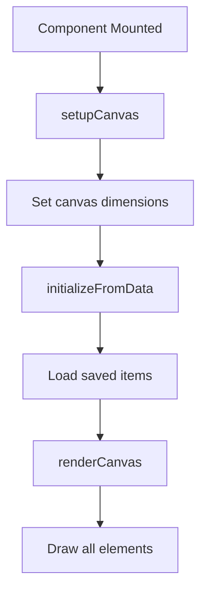
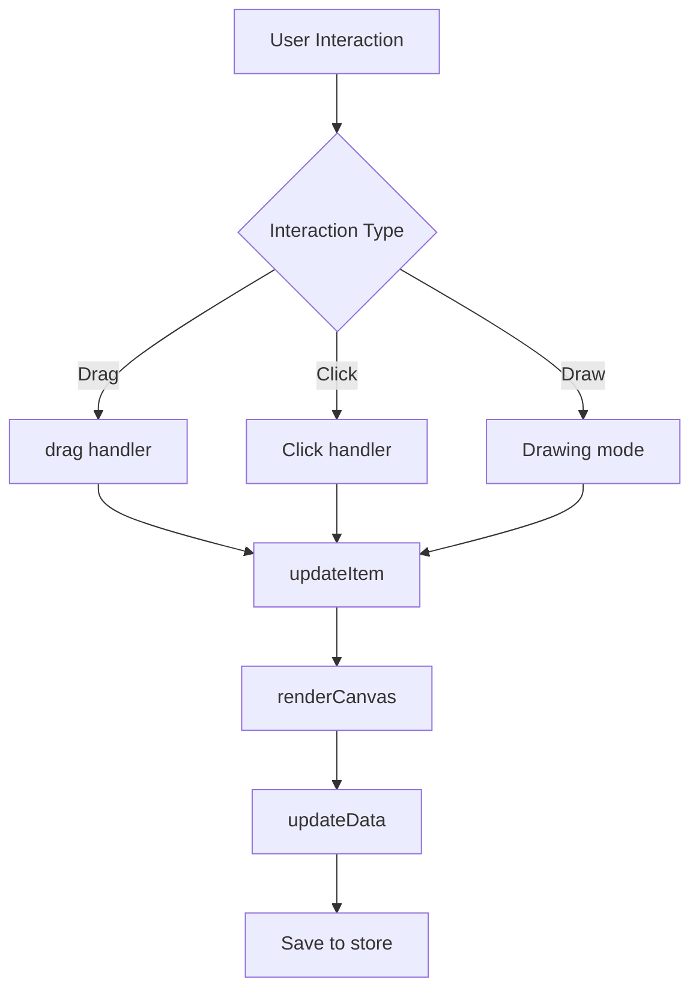
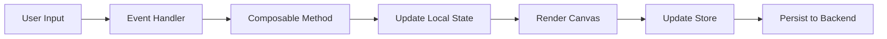

# Photography Canvas Components

This document provides detailed information about the advanced canvas-based photography card components in the Mila Note application.

## Overview

The photography canvas components provide interactive, visual tools for planning and documenting photography and videography projects. These components leverage the `useDraggableCanvas` composable for drag-and-drop functionality and HTML5 Canvas API for rendering.

## Components

### 1. LightingDiagramCard.vue

A full-featured canvas editor for creating lighting diagrams used in photography and videography planning.

#### Location
`/components/photography/LightingDiagramCard.vue`

#### Purpose
Allows photographers and videographers to visually plan lighting setups by:
- Placing and positioning various light types
- Adding subject and camera positions
- Drawing custom paths and annotations
- Documenting light properties (power, modifiers, color)

#### Features

**Light Types**
The component supports seven standard light types:
- **Key Light**: Primary light source
- **Fill Light**: Reduces shadows created by key light
- **Back Light**: Separates subject from background
- **Rim Light**: Creates edge lighting effect
- **Hair Light**: Highlights hair and adds separation
- **Background Light**: Illuminates the background
- **Practical Light**: Visible light sources in the scene

**Interactive Elements**
- **Lights**: Draggable light icons with customizable properties
- **Subject**: Person or product placeholder with icon selection
- **Camera**: Camera icon with rotation control
- **Annotations**: Text notes for additional information
- **Drawing Tools**: Freehand drawing for custom paths

**Properties Panel**
When a light is selected, you can configure:
- Power (e.g., "500W", "1000W")
- Modifier (e.g., "Softbox", "Umbrella", "Beauty Dish")
- Color (color picker for gels)
- Rotation angle

#### Data Structure

```typescript
interface LightingDiagramData {
  title: string
  lights: LightIcon[]
  subject: { x: number; y: number; icon: 'person' | 'product' | 'custom' }
  background: { x: number; y: number }
  camera: { x: number; y: number; rotation: number }
  annotations: { id: string; text: string; position: { x: number; y: number } }[]
  measurements: { id: string; from: { x: number; y: number }; to: { x: number; y: number }; distance: string }[]
  drawingPaths: string[]
}

interface LightIcon {
  id: string
  type: 'key' | 'fill' | 'back' | 'rim' | 'hair' | 'background' | 'practical'
  position: { x: number; y: number }
  rotation: number
  power: string
  modifier: string
  color: string
}
```

#### Usage Example

```vue
<template>
  <LightingDiagramCard :card="card" />
</template>

<script setup>
const card = {
  id: 'card-1',
  type: 'lighting-diagram',
  lightingDiagramData: {
    title: 'Studio Portrait Setup',
    lights: [],
    subject: { x: 400, y: 300, icon: 'person' },
    camera: { x: 400, y: 500, rotation: 0 },
    annotations: [],
    measurements: [],
    drawingPaths: []
  }
}
</script>
```

#### Workflow

1. **Add Lights**: Select light type from dropdown and click "Add Light"
2. **Position Elements**: Drag lights, subject, and camera to desired positions
3. **Configure Properties**: Click on a light to select it and modify its properties
4. **Add Annotations**: Click "Note" to add text annotations
5. **Draw Paths**: Toggle drawing mode to sketch custom paths
6. **Clear Canvas**: Remove all elements with the "Clear" button

#### Canvas Rendering

The component uses HTML5 Canvas API with SVG icon rendering:
- Grid background (20px × 20px)
- SVG icons from `photographyHelpers` utility
- Selection indicators (blue border)
- Real-time rendering during drag operations

#### Architecture Principles

**Separation of Concerns (SoC)**
- Canvas rendering logic is isolated in `renderCanvas()` method
- Data persistence is handled separately in `updateData()` method
- User interactions are managed through dedicated event handlers

**Single Responsibility Principle (SRP)**
- Each method has a single, well-defined purpose
- Helper functions like `getItemLabel()` and `drawSVG()` handle specific tasks
- Composable pattern separates drag-and-drop logic

**Don't Repeat Yourself (DRY)**
- Reuses `useDraggableCanvas` composable for common functionality
- SVG icons are generated via utility functions
- Shared data structures defined in types

---

### 2. CameraMovementDiagramCard.vue

A specialized canvas editor for documenting camera movements and creating shot diagrams.

#### Location
`/components/photography/CameraMovementDiagramCard.vue`

#### Purpose
Enables filmmakers to visually plan and document camera movements:
- Draw camera movement paths
- Annotate movements with notes
- Mark start and end positions
- Specify movement types

#### Features

**Movement Types**
Seven standard camera movements:
- **Dolly**: Moving forward/backward on tracks
- **Pan**: Horizontal rotation
- **Tilt**: Vertical rotation
- **Crane**: Vertical movement
- **Steadicam**: Smooth, fluid movement
- **Handheld**: Organic, natural movement
- **Slider**: Linear movement on rails

**Path Drawing Modes**
- **Solid Line**: Standard continuous line
- **Dashed Line**: Broken line for alternative paths
- **Arrow**: Directional path with arrowhead

**Drawing Controls**
- Color picker for path colors
- Line width selector (thin, medium, thick)
- Real-time path preview

**Markers**
- **Start Marker**: Green circle with "S" label
- **End Marker**: Red circle with "E" label
- Both are draggable and editable

#### Data Structure

```typescript
interface CameraMovementData {
  title: string
  movementType: 'dolly' | 'pan' | 'tilt' | 'crane' | 'steadicam' | 'handheld' | 'slider'
  drawingPaths: string[]
  annotations: { id: string; text: string; position: { x: number; y: number } }[]
  startPosition: { x: number; y: number }
  endPosition: { x: number; y: number }
}
```

#### Usage Example

```vue
<template>
  <CameraMovementDiagramCard :card="card" />
</template>

<script setup>
const card = {
  id: 'card-2',
  type: 'camera-movement',
  cameraMovementData: {
    title: 'Opening Shot',
    movementType: 'dolly',
    drawingPaths: [],
    annotations: [],
    startPosition: { x: 0, y: 0 },
    endPosition: { x: 0, y: 0 }
  }
}
</script>
```

#### Workflow

1. **Select Movement Type**: Choose from dropdown (dolly, pan, tilt, etc.)
2. **Add Markers**: Click "Start" and "End" to mark key positions
3. **Draw Path**: Toggle drawing mode and draw camera movement path
4. **Customize Path**: Select line style, color, and width
5. **Add Annotations**: Add notes at specific points
6. **Clear Canvas**: Remove all paths and annotations

#### Canvas Rendering

**Path Rendering**
Paths are stored as JSON with metadata:
```json
{
  "points": [{ "x": 100, "y": 200 }, { "x": 150, "y": 250 }],
  "style": "arrow",
  "color": "#000000",
  "width": 4
}
```

**Drawing Algorithm**
- Solid: Basic line with rounded caps
- Dashed: Uses `setLineDash([10, 5])`
- Arrow: Line with triangular arrowhead at end

**Markers**
- Start: Green circle (#10B981) with white "S"
- End: Red circle (#EF4444) with white "E"
- Annotations: Yellow background (#FFFBEB) with orange border

#### Architecture Principles

**Keep It Simple, Stupid (KISS)**
- Straightforward path drawing logic
- Clear visual indicators for movement types
- Simple marker system

**You Aren't Gonna Need It (YAGNI)**
- Implements only essential camera movement features
- No over-engineering of path calculations
- Focused functionality without unnecessary complexity

**Principle of Least Astonishment (POLA)**
- Intuitive color coding (green=start, red=end)
- Standard drawing tools behavior
- Predictable marker placement

---

## Shared Dependencies

### useDraggableCanvas Composable

Both components use the `useDraggableCanvas` composable which provides:

**Core Functionality**
- `items`: Reactive array of draggable items
- `selectedItem`: Currently selected item
- `addItem()`: Add new draggable item
- `removeItem()`: Remove item by ID
- `updateItem()`: Update item properties
- `startDrag()`: Initialize drag operation
- `drag()`: Handle drag movement
- `stopDrag()`: Finalize drag operation
- `selectItem()`: Select/deselect items
- `clearItems()`: Remove all items

**Location**: `/composables/useDraggableCanvas.ts`

### Photography Helpers

Utility functions in `/utils/photographyHelpers.ts`:

**Icon Generators**
- `getLightingIcon(type, color)`: Returns SVG string for light icons
- `getCameraIcon(rotation)`: Returns SVG string for camera icon
- `getSubjectIcon(type)`: Returns SVG string for subject icon

**Additional Utilities**
- `calculateDepthOfField()`: DOF calculations
- `calculateTimeLapse()`: Timelapse parameters
- `formatTimecode()`: Convert seconds to timecode
- Color and EXIF extraction functions

---

## Component Lifecycle

### Mounting Phase



### Update Phase



### Data Flow



---

## Best Practices

### Performance Optimization

**Canvas Rendering**
- Use `requestAnimationFrame` for smooth animations
- Minimize full canvas redraws
- Cache SVG icon blobs when possible

**Event Handling**
- Debounce mouse move events during drawing
- Only update store on meaningful changes
- Use computed properties for derived state

### Accessibility

**Keyboard Navigation**
- Add keyboard shortcuts for common actions
- Support arrow keys for precise positioning
- Enable tab navigation through toolbar

**Screen Readers**
- Add ARIA labels to interactive elements
- Provide text alternatives for canvas content
- Announce state changes

### Testing Considerations

**Unit Tests**
- Test composable methods independently
- Mock canvas context for rendering tests
- Verify data persistence logic

**Integration Tests**
- Test drag-and-drop workflows
- Verify canvas rendering output
- Test state synchronization

**E2E Tests**
- Complete user workflows
- Multi-user collaboration scenarios
- Canvas export functionality

---

## Troubleshooting

### Common Issues

**Canvas Not Rendering**
- Check if `canvasRef` is properly bound
- Verify canvas dimensions are set
- Ensure `renderCanvas()` is called after setup

**Items Not Dragging**
- Confirm mouse events are properly bound
- Check if drag offset is calculated correctly
- Verify canvas element is passed to drag handlers

**Data Not Persisting**
- Ensure `updateData()` is called after changes
- Verify store update method is working
- Check if card ID is valid

### Debug Tips

**Enable Canvas Debug Info**
```javascript
// Add to renderCanvas()
ctx.fillStyle = 'red'
ctx.font = '12px monospace'
ctx.fillText(`Items: ${items.value.length}`, 10, 20)
```

**Log Drag Operations**
```javascript
const drag = (event, canvas) => {
  console.log('Dragging:', draggingItemId.value, event.clientX, event.clientY)
  // ... rest of drag logic
}
```

**Monitor State Changes**
```javascript
watch(() => items.value, (newItems) => {
  console.log('Items updated:', newItems)
}, { deep: true })
```

---

## Future Enhancements

### Planned Features

**LightingDiagramCard**
- Measurement tools for distance between elements
- Light intensity falloff visualization
- Export as PNG/SVG
- Pre-configured lighting setups (3-point, Rembrandt, etc.)
- Collaborative real-time editing

**CameraMovementDiagramCard**
- Bezier curve paths for smooth movements
- Timeline integration for movement duration
- Path animation preview
- Multiple camera angles in single diagram
- Export to production notes format

### Community Contributions

We welcome contributions! Areas of interest:
- Additional light types and modifiers
- More camera movement presets
- Mobile touch support
- Undo/redo functionality
- Layer management for complex diagrams

---

## References

### Related Documentation
- [Architecture Overview](/docs/architecture.md)
- [Board Management](/docs/board-management.md)
- [WebSocket Implementation](/docs/websocket-implementation.md)

### External Resources
- [HTML5 Canvas API](https://developer.mozilla.org/en-US/docs/Web/API/Canvas_API)
- [Vue 3 Composition API](https://vuejs.org/guide/extras/composition-api-faq.html)
- [Photography Lighting Techniques](https://en.wikipedia.org/wiki/Photographic_lighting)
- [Cinematography Camera Movements](https://en.wikipedia.org/wiki/Camera_dolly)

---

**Last Updated**: 2026-01-07
**Version**: 1.0.0
**Maintainer**: Development Team
