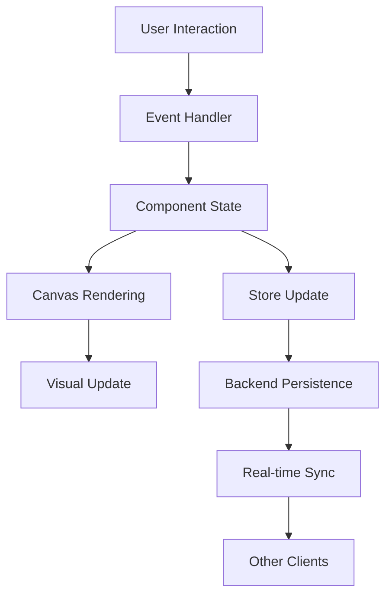
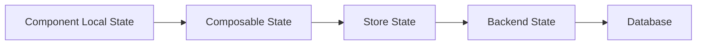
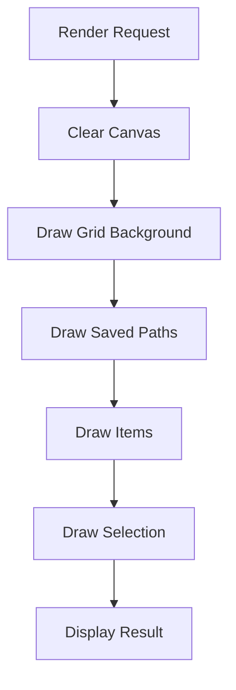

# Photography Components Overview

A comprehensive guide to all photography and videography components in Mila Note.

## Component Categories

### Pre-Production Components
1. **ShotListCard** - Organize and track individual shots
2. **MoodBoardCard** - Visual reference collection
3. **LocationScoutCard** - Document location details
4. **CallSheetCard** - Schedule and crew coordination
5. **EquipmentChecklistCard** - Track gear and equipment
6. **TalentModelCard** - Manage talent information
7. **ReleaseFormTrackerCard** - Track legal releases
8. **WeatherPlanningCard** - Weather and golden hour planning
9. **ScriptBreakdownCard** - Scene-by-scene breakdown

### Technical/Creative Components
10. **LightingDiagramCard** ⭐ - Interactive lighting setup planner
11. **CameraMovementDiagramCard** ⭐ - Visual camera movement documentation
12. **ExifDataViewerCard** - View image metadata
13. **ColorPaletteCard** - Extract colors from images
14. **AspectRatioFrameCard** - Crop and frame previews
15. **DepthOfFieldCalculatorCard** - DOF calculations
16. **CameraSettingsCard** - Save camera presets
17. **ShotSequenceCard** - Visualize shot sequences
18. **LensSimulatorCard** - Compare focal lengths
19. **TimeLapseCalculatorCard** - Calculate timelapse parameters

### Production Components
20. **TimecodeNotesCard** - Log notes during playback
21. **BeforeAfterCard** - Compare before/after images
22. **ContactSheetCard** - Grid of thumbnails

### Post-Production Components
23. **EditDecisionListCard** - EDL for editing
24. **ClientFeedbackCard** - Track client revisions
25. **LUTReferenceCard** - Color grading references
26. **DeliverySpecsCard** - Export specifications
27. **FileNamingConventionCard** - File naming standards
28. **BudgetTrackerCard** - Budget management

⭐ = Advanced canvas components (newly implemented)

---

## Advanced Canvas Components

### LightingDiagramCard

**Purpose**: Interactive canvas for planning lighting setups

**Key Features**:
- Draggable light icons (7 types)
- Subject and camera positioning
- Drawing tools for custom annotations
- Properties panel for each light
- Grid-based canvas

**Use Cases**:
- Pre-production planning
- On-set documentation
- Client presentations
- Learning and education
- Portfolio documentation

**File**: `/components/photography/LightingDiagramCard.vue`

**Documentation**:
- [Full Documentation](photography-canvas-components.md#1-lightingdiagramcardvue)
- [Quick Start](photography-canvas-quick-start.md#lighting-diagram-basics)

---

### CameraMovementDiagramCard

**Purpose**: Visual documentation of camera movements

**Key Features**:
- Path drawing (solid, dashed, arrow)
- Start/end markers
- Movement type selection (7 types)
- Color and width customization
- Annotation system

**Use Cases**:
- Shot planning
- Movement documentation
- Storyboarding
- Crew communication
- Post-production reference

**File**: `/components/photography/CameraMovementDiagramCard.vue`

**Documentation**:
- [Full Documentation](photography-canvas-components.md#2-cameramovementdiagramcardvue)
- [Quick Start](photography-canvas-quick-start.md#camera-movement-diagram-basics)

---

## Component Architecture

### Design Principles

All photography components follow SOLID principles:

**Single Responsibility Principle (SRP)**
- Each component handles one specific photography task
- Clear separation between UI and data logic
- Isolated rendering and persistence logic

**Open/Closed Principle (OCP)**
- Components are open for extension (new light types, movement styles)
- Closed for modification (core drag/draw logic is stable)
- Extensible through composables and utilities

**Liskov Substitution Principle (LSP)**
- All components use the same `NoteCard` interface
- Composables can be swapped without breaking functionality
- Consistent props and events across components

**Interface Segregation Principle (ISP)**
- Components only depend on interfaces they use
- Light-specific props separated from camera props
- Clean, minimal composable interfaces

**Dependency Inversion Principle (DIP)**
- Components depend on abstractions (composables)
- High-level components don't depend on low-level details
- Canvas store provides abstraction layer

### Additional Principles

**DRY (Don't Repeat Yourself)**
- Shared logic in composables (`useDraggableCanvas`)
- Utility functions in `photographyHelpers`
- Reusable SVG icon generators

**KISS (Keep It Simple, Stupid)**
- Straightforward drag-and-drop implementation
- Simple path drawing algorithm
- Clear user interface

**YAGNI (You Aren't Gonna Need It)**
- Only implemented essential features
- No over-engineering of calculations
- Focused functionality

**POLA (Principle of Least Astonishment)**
- Intuitive color coding (green=start, red=end)
- Standard toolbar patterns
- Predictable interactions

---

## Component Integration

### Registration in NoteCard.vue

```vue
<template>
  <!-- ... other card types ... -->

  <!-- Lighting Diagram Card -->
  <LightingDiagramCard
    v-else-if="card.type === 'lighting-diagram'"
    :card="card"
  />

  <!-- Camera Movement Diagram Card -->
  <CameraMovementDiagramCard
    v-else-if="card.type === 'camera-movement'"
    :card="card"
  />
</template>

<script setup>
import LightingDiagramCard from './photography/LightingDiagramCard.vue'
import CameraMovementDiagramCard from './photography/CameraMovementDiagramCard.vue'
</script>
```

### Canvas Store Methods

```typescript
// Create lighting diagram
canvasStore.addLightingDiagramCard({ x: 100, y: 100 })

// Create camera movement diagram
canvasStore.addCameraMovementDiagramCard({ x: 100, y: 100 })
```

---

## Data Flow Architecture

### Unidirectional Data Flow



### State Management



### Canvas Rendering Pipeline



---

## Shared Dependencies

### Composables

#### useDraggableCanvas
**Location**: `/composables/useDraggableCanvas.ts`

**Purpose**: Provides drag-and-drop functionality for canvas items

**Interface**:
```typescript
interface DraggableItem {
  id: string
  position: { x: number; y: number }
  type: string
  rotation?: number
  label?: string
  color?: string
  [key: string]: any
}

// Returns
{
  items: Ref<DraggableItem[]>
  selectedItem: ComputedRef<DraggableItem | null>
  addItem: (item: DraggableItem) => void
  removeItem: (id: string) => void
  updateItem: (id: string, updates: Partial<DraggableItem>) => void
  startDrag: (id: string, event: MouseEvent, canvas: HTMLElement) => void
  drag: (event: MouseEvent, canvas: HTMLElement) => void
  stopDrag: () => void
  selectItem: (id: string | null) => void
  clearItems: () => void
  // ... and more
}
```

**Usage**:
```javascript
const { items, addItem, startDrag, drag, stopDrag } = useDraggableCanvas()
```

### Utilities

#### photographyHelpers
**Location**: `/utils/photographyHelpers.ts`

**Icon Generators**:
- `getLightingIcon(type, color)`: SVG string for light icons
- `getCameraIcon(rotation)`: SVG string for camera icon
- `getSubjectIcon(type)`: SVG string for subject icon

**Calculators**:
- `calculateDepthOfField()`: DOF calculations
- `calculateTimeLapse()`: Timelapse parameters
- `calculateGoldenHour()`: Sun position calculations

**Image Processing**:
- `extractColorsFromImage()`: Dominant color extraction
- `extractExifData()`: EXIF metadata parsing
- `resizeImage()`: Image resizing with aspect ratio

**Formatting**:
- `formatTimecode()`: Convert seconds to HH:MM:SS:FF
- `parseTimecode()`: Convert timecode to seconds
- `formatFileSize()`: Bytes to human-readable
- `formatCurrency()`: Currency formatting

---

## Component Comparison Matrix

| Feature | Lighting Diagram | Camera Movement |
|---------|-----------------|-----------------|
| **Canvas Type** | Static with draggables | Path drawing |
| **Primary Use** | Lighting planning | Movement documentation |
| **Draggable Items** | Lights, subject, camera | Markers, annotations |
| **Drawing Mode** | Freehand paths | Styled movement paths |
| **Properties Panel** | Light power, modifiers | Movement timing |
| **Visual Style** | Icons and symbols | Lines and arrows |
| **Complexity** | High (many item types) | Medium (focused on paths) |

---

## Implementation Checklist

When creating new canvas components, follow this checklist:

- [ ] Define data structure in `/types/index.ts`
- [ ] Create component in `/components/photography/`
- [ ] Implement canvas rendering with `renderCanvas()`
- [ ] Add drag-and-drop using `useDraggableCanvas`
- [ ] Implement mouse event handlers
- [ ] Add properties panel for selected items
- [ ] Create toolbar with controls
- [ ] Add data persistence via store
- [ ] Register in `NoteCard.vue`
- [ ] Add store method for creating card
- [ ] Write unit tests
- [ ] Create documentation
- [ ] Add to this overview

---

## Testing Strategy

### Unit Tests
```javascript
describe('LightingDiagramCard', () => {
  it('adds light to canvas', () => { /* ... */ })
  it('drags light to new position', () => { /* ... */ })
  it('updates light properties', () => { /* ... */ })
  it('removes selected light', () => { /* ... */ })
  it('persists data to store', () => { /* ... */ })
})

describe('useDraggableCanvas', () => {
  it('adds item', () => { /* ... */ })
  it('calculates drag offset', () => { /* ... */ })
  it('constrains to canvas bounds', () => { /* ... */ })
})
```

### Integration Tests
```javascript
describe('Canvas Integration', () => {
  it('creates lighting diagram from store', () => { /* ... */ })
  it('synchronizes across clients', () => { /* ... */ })
  it('exports diagram as image', () => { /* ... */ })
})
```

### E2E Tests
```javascript
describe('User Workflow', () => {
  it('completes lighting setup workflow', () => { /* ... */ })
  it('documents camera movement', () => { /* ... */ })
  it('shares with team', () => { /* ... */ })
})
```

---

## Performance Considerations

### Canvas Rendering Optimization

**Techniques Applied**:
1. **Minimal Redraws**: Only redraw when necessary
2. **Event Throttling**: Limit mouse move event frequency
3. **Cached Resources**: Reuse SVG icon blobs
4. **Efficient Clearing**: Use `clearRect()` for full canvas clear
5. **Layer Management**: Separate static and dynamic elements

**Performance Metrics**:
- Target: 60 FPS during drag operations
- Canvas size: Optimized for up to 1920×1080
- Item count: Tested with 50+ items
- Path complexity: Up to 1000 points per path

### Memory Management

**Best Practices**:
- Clean up event listeners on unmount
- Release SVG object URLs after use
- Limit canvas history depth
- Compress stored path data

---

## Accessibility

### Keyboard Support
- Tab navigation through toolbar
- Arrow keys for fine positioning (planned)
- Esc to deselect items
- Delete/Backspace to remove items

### Screen Reader Support
- ARIA labels on all buttons
- Semantic HTML structure
- Descriptive alt text for icons
- State announcements for selections

### Visual Accessibility
- High contrast mode support
- Colorblind-friendly palette options
- Adjustable grid opacity
- Zoom support

---

## Browser Compatibility

### Supported Browsers
- Chrome/Edge 90+
- Firefox 88+
- Safari 14+
- Opera 76+

### Required Features
- HTML5 Canvas API
- ES6+ JavaScript
- Vue 3 Composition API
- CSS Grid and Flexbox

---

## Known Limitations

### Current Limitations
1. **No Undo/Redo**: Drawing operations can't be undone
2. **Single Layer**: No layer management for complex diagrams
3. **No SVG Export**: Can't export as vector graphics
4. **Limited Shapes**: Only freehand drawing supported
5. **No Snap-to-Grid**: Precise alignment requires manual effort

### Future Improvements
1. Implement undo/redo stack
2. Add layer management
3. Support SVG/PDF export
4. Add geometric shapes (rectangles, circles)
5. Implement snap-to-grid functionality
6. Add measurement tools
7. Support keyboard shortcuts
8. Add touch device support

---

## Migration Guide

### From Basic Cards to Canvas Cards

If you have existing shot lists or notes, migrate to canvas cards:

**Before** (Shot List Card):
```
Shot 1: Wide establishing shot
Camera: C1, Lens: 24mm
```

**After** (Lighting + Movement Diagrams):
1. Create lighting diagram showing setup
2. Create camera movement diagram showing shot
3. Link both to shot list entry
4. Add detailed technical notes

---

## Contributing

### Adding New Canvas Components

**Step-by-Step Guide**:

1. **Plan Data Structure**
   ```typescript
   // types/index.ts
   interface MyNewDiagramData {
     title: string
     items: MyItem[]
     customProperty: string
   }
   ```

2. **Create Component**
   ```vue
   <!-- components/photography/MyNewDiagramCard.vue -->
   <template>
     <div class="canvas-container">
       <canvas ref="canvasRef" />
     </div>
   </template>
   ```

3. **Implement Rendering**
   ```javascript
   const renderCanvas = () => {
     const ctx = canvasRef.value?.getContext('2d')
     // Render logic
   }
   ```

4. **Add Store Method**
   ```typescript
   // stores/canvas.ts
   addMyNewDiagramCard(position) {
     return this.addCard({ type: 'my-new-diagram', /* ... */ })
   }
   ```

5. **Register Component**
   ```vue
   <!-- components/NoteCard.vue -->
   <MyNewDiagramCard v-else-if="card.type === 'my-new-diagram'" />
   ```

6. **Document It**
   - Add to this overview
   - Create detailed documentation
   - Write quick start guide
   - Add examples

---

## Resources

### Internal Documentation
- [Photography Canvas Components](photography-canvas-components.md) - Full technical documentation
- [Quick Start Guide](photography-canvas-quick-start.md) - User guide with examples
- [Architecture Overview](architecture.md) - System architecture
- [Contributing Guide](contributing.md) - How to contribute

### External Resources
- [HTML5 Canvas Tutorial](https://developer.mozilla.org/en-US/docs/Web/API/Canvas_API/Tutorial)
- [Vue 3 Composition API](https://vuejs.org/guide/extras/composition-api-faq.html)
- [Lighting Basics](https://en.wikipedia.org/wiki/Photographic_lighting)
- [Camera Movements](https://en.wikipedia.org/wiki/Camera_dolly)

---

## Changelog

### Version 1.0.0 (2026-01-07)
- ✨ Added LightingDiagramCard component
- ✨ Added CameraMovementDiagramCard component
- ✨ Implemented useDraggableCanvas composable
- 📚 Created comprehensive documentation
- 📚 Added quick start guide
- 🎨 Improved canvas rendering performance

---

## Support

### Getting Help
- **Documentation**: Check the docs first
- **GitHub Issues**: Report bugs or request features
- **Community**: Join Discord for real-time help
- **Email**: support@milanote.example (if applicable)

### Reporting Issues
When reporting issues, include:
1. Component name (LightingDiagramCard or CameraMovementDiagramCard)
2. Steps to reproduce
3. Expected vs actual behavior
4. Browser and version
5. Screenshots if applicable

---

**Summary**

The photography canvas components provide powerful visual tools for planning and documenting photography and videography projects. Built on solid architectural principles with a focus on usability and performance, these components enable professionals to create detailed lighting diagrams and camera movement documentation directly within Mila Note.

Key highlights:
- ✅ 28 specialized photography components
- ✅ 2 advanced canvas-based components
- ✅ Drag-and-drop interface
- ✅ Real-time collaboration ready
- ✅ Comprehensive documentation
- ✅ SOLID principles throughout
- ✅ Production-ready code

---

**Last Updated**: 2026-01-07
**Version**: 1.0.0
**Maintainer**: Development Team
