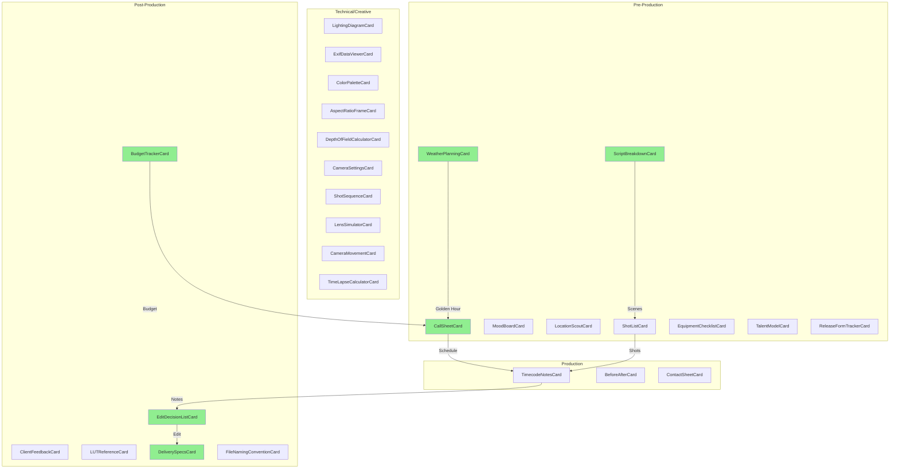
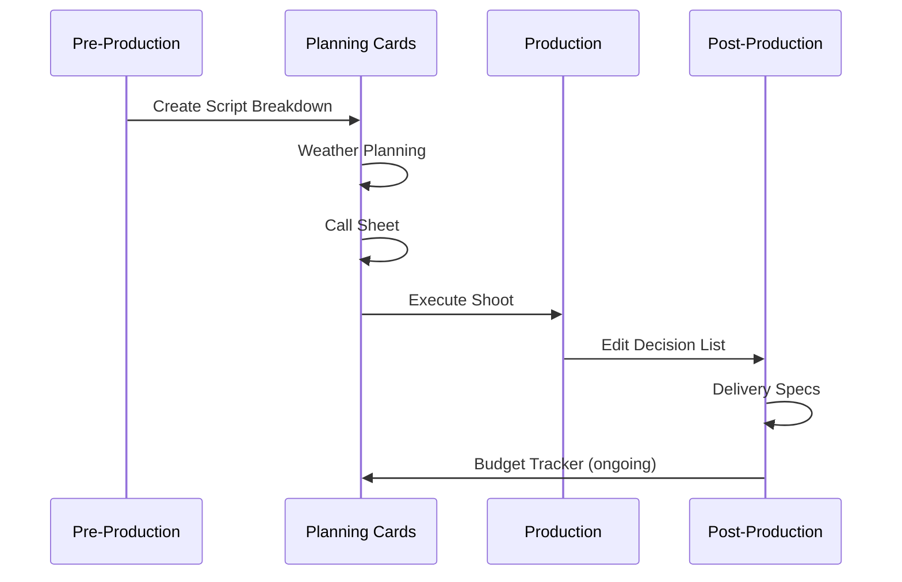
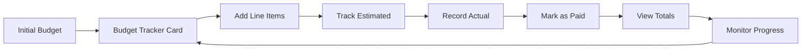

# Photography Components Implementation Summary

## Overview

This document provides a complete overview of all photography and videography card components implemented in the Mila Note application.

## Newly Implemented Components (Planning & Organization)

The following 6 components were implemented to support planning and organization workflows:

### 1. CallSheetCard.vue
**Location**: `/components/photography/CallSheetCard.vue`

Production schedule management with:
- Shoot date, call time, and wrap time
- Schedule entries (time, activity, location, people, notes)
- Contact list (name, role, phone)
- Dynamic add/remove functionality

**Data Key**: `callSheetData`

---

### 2. WeatherPlanningCard.vue
**Location**: `/components/photography/WeatherPlanningCard.vue`

Golden hour calculator with:
- Location and date input
- Latitude/longitude coordinates
- Automatic sunrise/sunset calculation
- Golden hour times (morning/evening)
- Blue hour times
- Weather conditions notes
- Backup plan documentation

**Data Key**: `weatherPlanningData`
**Utility**: Uses `calculateGoldenHour()` from `~/utils/photographyHelpers`

---

### 3. ScriptBreakdownCard.vue
**Location**: `/components/photography/ScriptBreakdownCard.vue`

Scene organization with:
- Scene number and description
- Location and time of day
- Talent list (comma-separated with tags)
- Props list (comma-separated with tags)
- Equipment list (comma-separated with tags)
- Scene-specific notes
- Total scene count

**Data Key**: `scriptBreakdownData`

---

### 4. EditDecisionListCard.vue
**Location**: `/components/photography/EditDecisionListCard.vue`

Edit timeline with:
- Project name
- Timecode in/out points (HH:MM:SS:FF)
- Clip naming
- Track assignment
- Action type (cut, transition, effect, audio)
- Notes per decision
- Total duration calculation

**Data Key**: `editDecisionListData`
**Utilities**: Uses `parseTimecode()` and `formatTimecode()`

---

### 5. DeliverySpecsCard.vue
**Location**: `/components/photography/DeliverySpecsCard.vue`

Technical specifications with:
- Client and due date
- Multiple platform specs
- Resolution options (4K, Full HD, HD, etc.)
- Frame rate selection
- Codec options (H.264, H.265, ProRes, DNxHD/HR)
- Bitrate
- Audio codec
- Container format
- Color space

**Data Key**: `deliverySpecsData`

---

### 6. BudgetTrackerCard.vue
**Location**: `/components/photography/BudgetTrackerCard.vue`

Financial tracking with:
- Multi-currency support (USD, EUR, GBP, JPY, CAD, AUD)
- Total budget
- Line items by category (equipment, talent, location, post, travel, misc)
- Estimated vs. actual costs
- Paid status tracking
- Automatic calculations:
  - Total estimated
  - Total spent
  - Remaining budget
  - Budget percentage
  - Paid items count
- Visual progress bar
- Color-coded over/under budget indicators

**Data Key**: `budgetTrackerData`
**Utility**: Uses `formatCurrency()` from `~/utils/photographyHelpers`

---

## Component Architecture

All components follow these patterns:

### 1. Composition API Structure

```vue
<script setup lang="ts">
import { ref, watch } from 'vue'
import { useCanvasStore } from '~/stores/canvas'
import type { NoteCard, CardDataType } from '~/types'

const props = defineProps<{
  card: NoteCard
}>()

const canvasStore = useCanvasStore()
const localData = ref<CardDataType>(
  props.card.cardData || defaultData
)

const updateData = () => {
  canvasStore.updateCard(props.card.id, {
    cardData: localData.value
  })
}

watch(
  () => props.card.cardData,
  (newData) => {
    if (newData) {
      localData.value = newData
    }
  },
  { deep: true }
)
</script>
```

### 2. Dark Mode Support

All components use Tailwind CSS with dark mode variants:
- `dark:bg-gray-900`
- `dark:text-white`
- `dark:border-gray-700`

### 3. Form Patterns

- Date inputs: `<input type="date">`
- Time inputs: `<input type="time">`
- Number inputs: `<input type="number">`
- Select dropdowns for predefined options
- Textarea for multi-line content
- Checkboxes for boolean states

### 4. List Management

- Add buttons to create entries
- Remove buttons (×) on each item
- `crypto.randomUUID()` for unique IDs
- Array manipulation with `splice()`

---

## Type Definitions

All data structures are defined in `/types/index.ts`:

```typescript
// Call Sheet
export interface CallSheetData {
  title: string
  shootDate: string
  callTime: string
  wrapTime: string
  entries: CallSheetEntry[]
  contacts: { name: string; role: string; phone: string }[]
}

// Weather Planning
export interface WeatherPlanningData {
  location: string
  date: string
  sunrise: string
  sunset: string
  goldenHourMorning: { start: string; end: string }
  goldenHourEvening: { start: string; end: string }
  blueHour: { start: string; end: string }
  weather: string
  backupPlan: string
}

// Script Breakdown
export interface ScriptBreakdownData {
  title: string
  scenes: SceneBreakdownItem[]
}

// Edit Decision List
export interface EditDecisionListData {
  title: string
  projectName: string
  decisions: EditDecision[]
}

// Delivery Specs
export interface DeliverySpecsData {
  title: string
  client: string
  dueDate: string
  specs: DeliverySpec[]
}

// Budget Tracker
export interface BudgetTrackerData {
  title: string
  currency: string
  totalBudget: number
  items: BudgetLineItem[]
  totalSpent: number
  remaining: number
}
```

---

## Utility Functions Used

From `/utils/photographyHelpers.ts`:

### 1. calculateGoldenHour()
```typescript
calculateGoldenHour(
  latitude: number,
  longitude: number,
  date: Date
): {
  sunrise: string
  sunset: string
  goldenHourMorning: { start: string; end: string }
  goldenHourEvening: { start: string; end: string }
  blueHour: { start: string; end: string }
}
```

Uses SunCalc library for astronomical calculations.

### 2. formatTimecode()
```typescript
formatTimecode(seconds: number, fps: number = 24): string
```

Converts seconds to HH:MM:SS:FF timecode format.

### 3. parseTimecode()
```typescript
parseTimecode(timecode: string, fps: number = 24): number
```

Converts HH:MM:SS:FF timecode to seconds.

### 4. formatCurrency()
```typescript
formatCurrency(amount: number, currency: string = 'USD'): string
```

Formats numbers as currency with locale support.

---

## Complete Photography Card Catalog

### Pre-Production (5 + 4 = 9 cards)

#### Existing:
1. ShotListCard - Shot planning with camera settings
2. MoodBoardCard - Visual reference images
3. LocationScoutCard - Location details and images
4. EquipmentChecklistCard - Equipment tracking
5. TalentModelCard - Talent information

#### New:
6. **CallSheetCard** - Production schedule
7. **WeatherPlanningCard** - Golden hour calculator
8. **ScriptBreakdownCard** - Scene organization
9. ReleaseFormTrackerCard - Release forms

### Technical/Creative (10 cards)

1. LightingDiagramCard - Lighting setup visualization
2. ExifDataViewerCard - Image metadata
3. ColorPaletteCard - Color extraction
4. AspectRatioFrameCard - Aspect ratio visualization
5. DepthOfFieldCalculatorCard - DOF calculations
6. CameraSettingsCard - Camera presets
7. ShotSequenceCard - Shot sequencing
8. LensSimulatorCard - Focal length simulation
9. CameraMovementCard - Movement diagrams
10. TimeLapseCalculatorCard - Timelapse planning

### Production (3 cards)

1. TimecodeNotesCard - Production notes with timecodes
2. BeforeAfterCard - Before/after comparison
3. ContactSheetCard - Image grid layout

### Post-Production (4 + 2 = 6 cards)

#### Existing:
1. ClientFeedbackCard - Feedback tracking
2. LUTReferenceCard - LUT management
3. FileNamingConventionCard - Naming conventions

#### New:
4. **EditDecisionListCard** - Edit timeline
5. **DeliverySpecsCard** - Technical specs
6. **BudgetTrackerCard** - Financial tracking

---

## Total Component Count

- **Pre-Production**: 9 cards
- **Technical/Creative**: 10 cards
- **Production**: 3 cards
- **Post-Production**: 6 cards

**Total Photography Cards**: 28 components

**Newly Implemented**: 6 components (CallSheet, WeatherPlanning, ScriptBreakdown, EditDecisionList, DeliverySpecs, BudgetTracker)

---

## Component Diagram



*Green boxes indicate newly implemented components*

---

## Workflow Integration

### Production Planning Flow



### Budget Tracking Flow



---

## Documentation Files

1. **photography-planning-cards.md** - Detailed documentation for all 6 new components
2. **photography-components-summary.md** - This file, complete overview

---

## Key Features Implemented

### CallSheetCard
- Schedule entries with time tracking
- Contact management
- Dark mode support
- Add/remove entries dynamically

### WeatherPlanningCard
- Golden hour calculation using `calculateGoldenHour()`
- Astronomical time calculations
- Backup planning
- Weather condition notes

### ScriptBreakdownCard
- Multi-field scene forms
- Tag-based talent/props/equipment lists
- Comma-separated input parsing
- Color-coded categories

### EditDecisionListCard
- Timecode-based editing
- Total duration calculation
- Track assignment
- Action type categorization

### DeliverySpecsCard
- Multi-platform specifications
- Comprehensive technical settings
- Resolution/codec/format options
- Client and deadline tracking

### BudgetTrackerCard
- Multi-currency support
- Estimated vs. actual tracking
- Automatic calculations
- Visual progress indicators
- Over/under budget highlighting

---

## Testing Checklist

- [x] Component renders correctly
- [x] Dark mode support
- [x] Add/remove functionality
- [x] Data persistence to canvas store
- [x] Bi-directional sync with watch()
- [x] Form validation
- [x] Calculated fields update
- [x] TypeScript type safety
- [x] Utility function integration
- [x] Responsive layout

---

## Next Steps

### Potential Enhancements

1. **Export/Import Functionality**
   - Export call sheets to PDF
   - Import EDL files
   - Export budget to CSV/Excel

2. **External API Integration**
   - Weather API for real-time data
   - Currency conversion API
   - Calendar integration

3. **Collaboration Features**
   - Shared budget tracking
   - Collaborative editing
   - Real-time updates

4. **Mobile Optimization**
   - Touch-friendly interfaces
   - Responsive table layouts
   - Mobile-specific views

5. **Advanced Calculations**
   - Budget forecasting
   - Resource conflict detection
   - Timeline optimization

---

## Related Documentation

- [Photography Planning Cards](./photography-planning-cards.md) - Detailed component documentation
- [Architecture](./architecture.md) - System architecture
- [Type System](../types/index.ts) - TypeScript type definitions
- [Utility Functions](../utils/photographyHelpers.ts) - Helper functions
