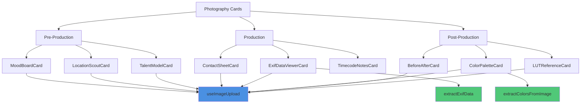
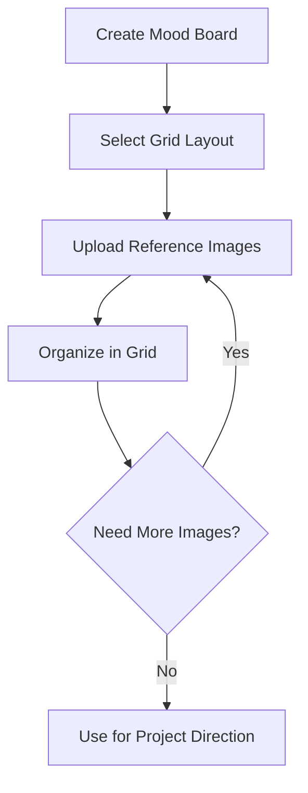
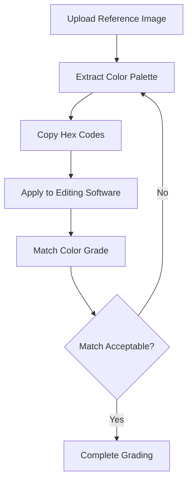
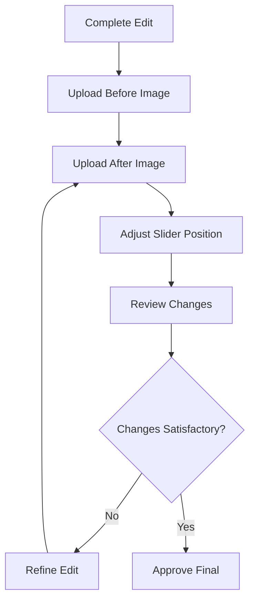
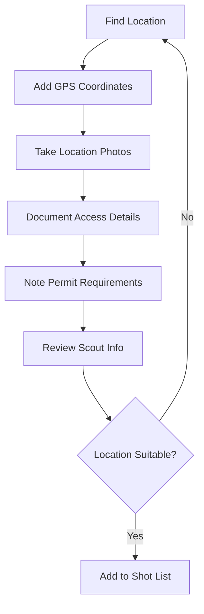
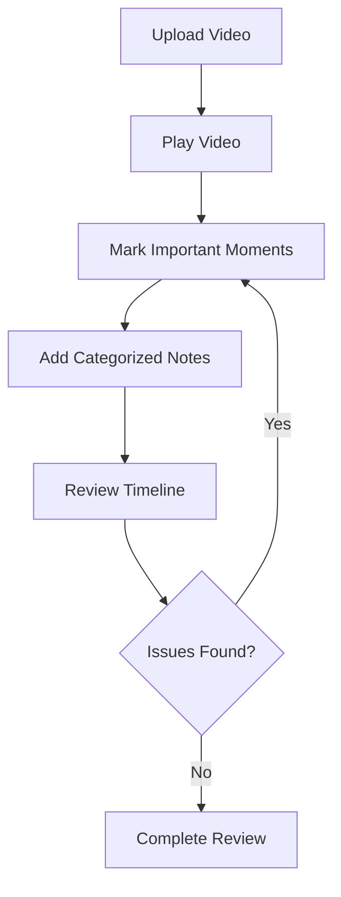
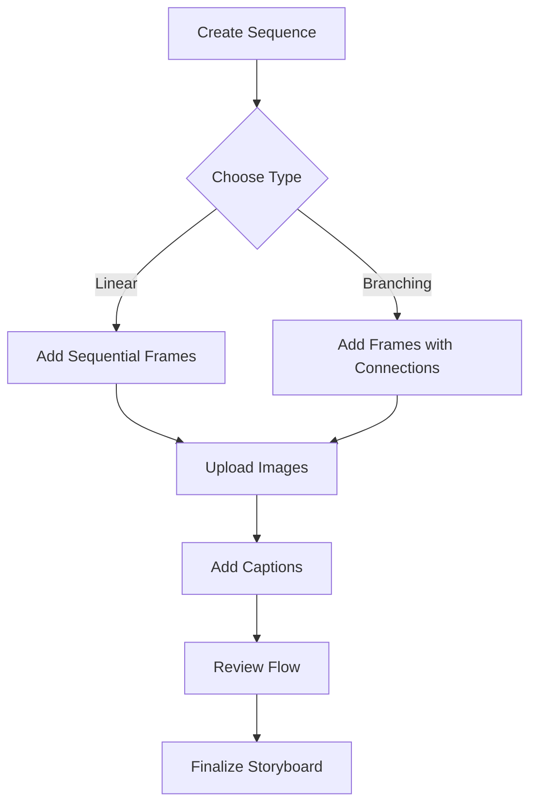
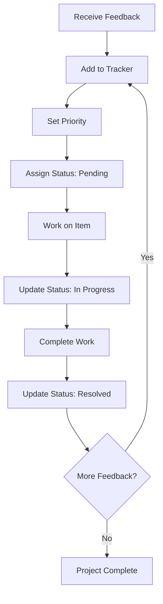

# Photography and Videography Components

This document describes the specialized card components for photography and videography workflows in Mila Note.

## Overview

The photography components provide professional tools for managing photo and video production workflows. These components are organized into three main categories:

1. **Pre-Production**: Planning and preparation tools
2. **Production**: On-set and shooting tools
3. **Post-Production**: Editing and delivery tools

## Image-Based Card Components

### MoodBoardCard

Grid layout for organizing multiple reference images in customizable grid patterns.

#### Features

- **Multiple Grid Layouts**: 2x2, 3x3, or 4x4 grid configurations
- **Multi-Image Upload**: Upload multiple images at once
- **Dynamic Grid**: Grid automatically adapts to selected layout
- **Empty Slots**: Visual placeholders for empty grid positions
- **Image Management**: Remove individual images with hover controls
- **Responsive Design**: Grid adapts to card size

#### Data Structure

```typescript
interface MoodBoardData {
  title: string
  images: string[]              // Base64 image data URLs
  layout: '2x2' | '3x3' | '4x4'
}
```

#### Usage

1. Select grid layout (2x2, 3x3, or 4x4)
2. Click "+ Add Image" to upload multiple images
3. Images fill grid from left to right, top to bottom
4. Hover over images to reveal remove button
5. Change layout to reorganize images

### ContactSheetCard

Thumbnail grid viewer for reviewing multiple images in a contact sheet format.

#### Features

- **Thumbnail Sizes**: Small, medium, or large thumbnails
- **Column Control**: 2-6 columns for flexible layouts
- **Filename Display**: Optional filename overlays
- **Batch Upload**: Upload multiple images simultaneously
- **Sequential Naming**: Auto-generated sequential filenames (IMG_0001, etc.)
- **Hover Preview**: Remove button appears on hover

#### Data Structure

```typescript
interface ContactSheetData {
  title: string
  images: string[]
  thumbnailSize: 'small' | 'medium' | 'large'
  columns: number
  showFilenames: boolean
}
```

#### Usage

1. Configure thumbnail size and column count
2. Toggle filename display on/off
3. Upload images using "+ Add" button
4. Images display in grid with consistent aspect ratio
5. Hover to remove individual images

### TalentModelCard

Profile card with contact info, portfolio gallery, and talent details.

#### Features

- **Profile Information**: Name, role, contact details
- **Portfolio Gallery**: 3-column grid of portfolio images
- **Contact Fields**: Email and phone with type validation
- **Measurements**: Text area for size/measurement details
- **Social Media**: Dynamic list of social media profiles
- **Notes Section**: General notes about talent
- **Organized Sections**: Collapsible sections for different data types

#### Data Structure

```typescript
interface TalentModelData {
  name: string
  role: string
  contact: { email: string; phone: string }
  portfolioImages: string[]
  measurements: string
  notes: string
  socialMedia: { platform: string; handle: string }[]
}
```

#### Usage

1. Enter talent name and role
2. Add contact information
3. Upload portfolio images
4. Add measurements and physical details
5. Add social media profiles with "+ Add" button
6. Include general notes about talent availability, rates, etc.

### ExifDataViewerCard

Display images with extracted EXIF metadata from camera.

#### Features

- **EXIF Extraction**: Uses exifreader to parse metadata
- **Two Display Modes**:
  - **Compact**: Grid of key settings (6 boxes)
  - **Detailed**: Organized sections with all data
- **Camera Information**: Model, lens, focal length
- **Exposure Settings**: Aperture, shutter speed, ISO
- **Additional Data**: White balance, flash, date taken, GPS
- **Mode Toggle**: Switch between compact and detailed views

#### Data Structure

```typescript
interface ExifData {
  camera: string
  lens: string
  focalLength: string
  aperture: string
  shutterSpeed: string
  iso: string
  exposureCompensation: string
  whiteBalance: string
  flashUsed: boolean
  dateTaken: string
  gpsLocation?: { lat: number; lng: number }
}

interface ExifDataViewerData {
  imageUrl: string
  exifData: ExifData | null
  displayMode: 'compact' | 'detailed'
}
```

#### Usage

1. Upload an image with EXIF data
2. Wait for automatic EXIF extraction
3. View metadata in compact or detailed mode
4. Use for shot logging and settings reference

#### Integration

Uses `extractExifData()` from `~/utils/photographyHelpers`:

```typescript
const exif = await extractExifData(imageUrl)
```

### ColorPaletteCard

Extract and display dominant colors from an image with hex codes and percentages.

#### Features

- **Color Extraction**: Analyzes image to find dominant colors
- **Palette Sizes**: Extract 5, 8, or 12 colors
- **Visual Color Bar**: Proportional color bar showing dominance
- **Color Details**: Hex codes, RGB values, and percentages
- **Copy to Clipboard**: One-click copy of hex codes
- **Hover Effects**: Color bars expand on hover
- **Real-time Analysis**: Extracts colors automatically on upload

#### Data Structure

```typescript
interface ColorPaletteData {
  imageUrl: string
  colors: { hex: string; rgb: string; percentage: number }[]
  paletteSize: 5 | 8 | 12
  sortBy: 'dominance' | 'hue' | 'brightness'
}
```

#### Usage

1. Upload an image
2. Select palette size (5, 8, or 12 colors)
3. View extracted colors with percentages
4. Hover over color bar to see percentage
5. Click "Copy" to copy hex code to clipboard

#### Integration

Uses `extractColorsFromImage()` from `~/utils/photographyHelpers`:

```typescript
const colors = await extractColorsFromImage(imageUrl, count)
```

### BeforeAfterCard

Interactive image comparison slider for before/after shots.

#### Features

- **Slider Control**: Drag slider to compare images
- **Precise Position**: Shows slider position percentage
- **Manual Control**: Range slider for fine adjustment
- **Custom Labels**: Editable before/after labels
- **Touch Support**: Works with mouse and touch events
- **Visual Handle**: White slider bar with arrow icon
- **Label Overlays**: Semi-transparent labels on images

#### Data Structure

```typescript
interface BeforeAfterData {
  beforeImageUrl: string
  afterImageUrl: string
  sliderPosition: number        // 0-100
  labels: { before: string; after: string }
}
```

#### Usage

1. Upload "Before" image
2. Upload "After" image
3. Drag slider or use range control to compare
4. Customize labels for context
5. Use for retouching, grading, or effects comparison

#### Implementation

- Uses CSS clipping for before image reveal
- Mouse/touch event handlers for drag interaction
- Maintains aspect ratio for both images

### LocationScoutCard

Comprehensive location scouting card with maps, images, and logistical notes.

#### Features

- **GPS Coordinates**: Latitude/longitude with Google Maps link
- **Location Photos**: Multi-image gallery of location
- **Detailed Notes**: General location information
- **Accessibility Info**: Parking, load-in, stairs, etc.
- **Permits Section**: Required permits and restrictions
- **External Links**: Direct link to Google Maps
- **Organized Sections**: Collapsible borders for each data type

#### Data Structure

```typescript
interface LocationScoutData {
  locationName: string
  address: string
  coordinates?: { lat: number; lng: number }
  images: string[]
  notes: string
  accessibility: string
  permits: string
}
```

#### Usage

1. Enter location name and address
2. Add GPS coordinates (optional)
3. Upload location photos
4. Document accessibility details
5. Note permit requirements and restrictions
6. Click "Open in Google Maps" to view location

### LUTReferenceCard

Gallery of LUT (Look-Up Table) presets with preview images and settings.

#### Features

- **LUT Gallery**: Grid of LUT previews
- **Category System**: Cinematic, Vintage, Modern, B&W, Custom
- **Preview Images**: Upload reference images for each LUT
- **Adjustable Settings**: Contrast, saturation, temperature sliders
- **Hover Upload**: Hover to upload/change preview image
- **Notes Field**: Description and usage notes per LUT
- **Visual Feedback**: Settings displayed with sliders

#### Data Structure

```typescript
interface LUTReference {
  id: string
  name: string
  category: 'cinematic' | 'vintage' | 'modern' | 'black-white' | 'custom'
  previewImageUrl: string
  notes: string
  settings?: { contrast: number; saturation: number; temperature: number }
}

interface LUTReferenceData {
  title: string
  luts: LUTReference[]
}
```

#### Usage

1. Click "+ Add LUT" to create new entry
2. Upload preview image (hover over preview area)
3. Enter LUT name and select category
4. Adjust contrast, saturation, temperature settings
5. Add notes about LUT usage and characteristics
6. Use as reference during color grading

## Production Card Components

### TimecodeNotesCard

A video player with timestamped notes for logging and reviewing footage.

#### Features

- **Embedded Video Player**: HTML5 video player with standard controls
- **Timecode Display**: Real-time timecode display in HH:MM:SS:FF format
- **Quick Add Notes**: Add notes at current playback position with one click
- **Categorized Notes**: Label notes as Good, Issue, Retake, or Favorite
- **Click to Seek**: Click any timecode to jump to that position in the video
- **Sorted Timeline**: Notes automatically sorted by timecode
- **Category Filtering**: View statistics by note category

#### Data Structure

```typescript
interface TimecodeNote {
  id: string
  timecode: string          // Format: HH:MM:SS:FF
  note: string
  category: 'good' | 'issue' | 'retake' | 'favorite'
  color: string
}

interface TimecodeNotesData {
  title: string
  videoUrl: string
  notes: TimecodeNote[]
}
```

#### Usage

1. Add a video URL (supports any HTML5-compatible video format)
2. Play the video and click "Add Note Here" at important moments
3. Add descriptions and categorize each note
4. Click any timecode to seek to that position
5. Review notes sorted by timeline

#### Helper Functions

Uses `formatTimecode()` and `parseTimecode()` from `~/utils/photographyHelpers`:

- `formatTimecode(seconds, fps)`: Converts seconds to HH:MM:SS:FF format
- `parseTimecode(timecode, fps)`: Converts HH:MM:SS:FF to seconds

### ShotSequenceCard

A visual storyboard showing frames in sequence with arrows indicating shot flow.

#### Features

- **Grid Layout**: Responsive grid showing multiple frames
- **Image Upload**: Upload images for each frame
- **Order Tracking**: Numbered badges show sequence order
- **Two Sequence Types**:
  - **Linear**: Simple sequential flow with automatic arrows
  - **Branching**: Custom connections between any frames
- **Arrow Labels**: Add text labels to branching connections
- **Visual Flow**: SVG arrows drawn between connected frames
- **Drag and Drop**: Reorder frames by changing order numbers

#### Data Structure

```typescript
interface ShotSequenceFrame {
  id: string
  imageUrl?: string
  caption: string
  order: number
  arrow?: {
    to: string      // Target frame ID
    label: string   // Arrow label text
  }
}

interface ShotSequenceData {
  title: string
  frames: ShotSequenceFrame[]
  sequenceType: 'linear' | 'branching'
}
```

#### Usage

**Linear Sequence:**
1. Set sequence type to "Linear"
2. Add frames with "+ Add Frame" button
3. Upload images and add captions
4. Frames automatically connect in order

**Branching Sequence:**
1. Set sequence type to "Branching"
2. Add multiple frames
3. For each frame, select target frame from dropdown
4. Add optional labels to arrows
5. Custom arrows drawn based on connections

#### Visual Elements

- **Order Badge**: Blue circle with frame number
- **Image Area**: Aspect ratio maintained (16:9)
- **Caption Field**: Text description below image
- **Arrow Controls**: Dropdown and label input for branching
- **SVG Overlay**: Curved arrows with labels for branching mode

### ClientFeedbackCard

Revision tracking system with status, priority, and comments for managing client feedback.

#### Features

- **Feedback List**: Organized list of all feedback items
- **Status Tracking**: Pending, In Progress, Resolved
- **Priority Levels**: High, Medium, Low with color coding
- **Author and Timestamp**: Track who provided feedback and when
- **Comments**: Multi-line text area for detailed feedback
- **Attachments**: Optional URL field for reference files
- **Filtering**: Filter by status and priority
- **Statistics**: Real-time counts of items by status and priority
- **Version Tracking**: Project version field

#### Data Structure

```typescript
interface FeedbackItem {
  id: string
  timestamp: string
  author: string
  comment: string
  status: 'pending' | 'in-progress' | 'resolved'
  priority: 'low' | 'medium' | 'high'
  attachmentUrl?: string
}

interface ClientFeedbackData {
  title: string
  version: string
  feedback: FeedbackItem[]
}
```

#### Usage

1. Set project version (e.g., "v1.0.0")
2. Add feedback items with "+ Add Feedback"
3. Fill in author name and timestamp
4. Set status and priority using dropdowns
5. Write detailed comments
6. Add attachment URLs if needed
7. Filter by status/priority to focus on specific items

#### Color Coding

**Status:**
- Pending: Gray
- In Progress: Blue
- Resolved: Green

**Priority:**
- Low: Green
- Medium: Yellow
- High: Red (with red border)

#### Statistics

Footer displays:
- Total items by status (Pending, In Progress, Resolved)
- Total items by priority (High, Medium, Low)
- Filtered item count vs total count

## Component Architecture

All photography components follow consistent patterns:

### Component Overview



### Component Dependencies

**Composables:**
- `useImageUpload` - Handles file uploads and base64 conversion
- `useCanvasStore` - State management and data persistence

**Utilities:**
- `extractExifData()` - EXIF metadata extraction from images
- `extractColorsFromImage()` - Dominant color extraction from images

**Types:**
- All data structures defined in `~/types/index.ts`
- Type-safe props and data handling

### Common Structure

```vue
<template>
  <div class="h-full w-full flex flex-col bg-white dark:bg-gray-900 p-4 overflow-auto">
    <!-- Header with title and actions -->
    <div class="flex items-center justify-between mb-4">
      <input v-model="localData.title" @blur="updateData" />
      <button @click="addItem">+ Add</button>
    </div>

    <!-- Main content area -->
    <div class="flex-1 overflow-auto">
      <!-- Component-specific content -->
    </div>

    <!-- Footer with stats -->
    <div class="mt-4 pt-4 border-t">
      <!-- Statistics and info -->
    </div>
  </div>
</template>

<script setup lang="ts">
import { ref, watch, computed } from 'vue'
import { useCanvasStore } from '~/stores/canvas'
import type { NoteCard, ComponentData } from '~/types'

const props = defineProps<{ card: NoteCard }>()
const canvasStore = useCanvasStore()

const localData = ref<ComponentData>(
  props.card.componentData || defaultData
)

const updateData = () => {
  canvasStore.updateCard(props.card.id, {
    componentData: localData.value
  })
}

watch(
  () => props.card.componentData,
  (newData) => {
    if (newData) localData.value = newData
  },
  { deep: true }
)
</script>
```

### Design Principles

Following SOLID, DRY, KISS, YAGNI, POLA, and SoC principles:

1. **Single Responsibility**: Each component handles one specific workflow
2. **DRY**: Shared patterns across all components
3. **KISS**: Simple, intuitive interfaces
4. **YAGNI**: Only features needed for the specific use case
5. **POLA**: Predictable behavior matching existing components
6. **SoC**: Clear separation between UI, state, and data

### Dark Mode Support

All components fully support dark mode with appropriate color schemes:
- `dark:bg-gray-900` for backgrounds
- `dark:text-white` for text
- `dark:border-gray-700` for borders

### Responsive Design

Components use Tailwind CSS for responsive layouts:
- Mobile-first approach
- Grid layouts adapt to screen size
- Scrollable content areas

## Integration

### Adding New Cards

To add these cards to the canvas:

```typescript
// In toolbar or card creation menu
const cardTypes = [
  // ... existing types
  { type: 'timecode-notes', label: 'Timecode Notes', icon: '🎬' },
  { type: 'shot-sequence', label: 'Shot Sequence', icon: '🎞️' },
  { type: 'client-feedback', label: 'Client Feedback', icon: '💬' }
]
```

### Type Definitions

All types are defined in `/types/index.ts`:
- `TimecodeNotesData`
- `ShotSequenceData`
- `ClientFeedbackData`

### Canvas Store Integration

Components interact with the canvas store:

```typescript
// Update card data
canvasStore.updateCard(cardId, {
  timecodeNotesData: data
})

// Access card data
const data = card.timecodeNotesData
```

## Workflow Diagrams

### Image-Based Workflows

#### Mood Board Creation



#### Color Grading Reference



#### Before/After Comparison



#### Location Scouting Process



### Video Review Workflow



### Shot Sequence Planning



### Feedback Management



## Best Practices

### Image-Based Cards

#### MoodBoardCard

1. **Choose appropriate layout** - Use 2x2 for key references, 3x3 for comprehensive boards, 4x4 for detailed inspiration
2. **Curate images carefully** - Quality over quantity, select images that represent the desired aesthetic
3. **Update regularly** - Refine board as project direction evolves
4. **Use consistent aspect ratios** - Helps maintain visual harmony

#### ContactSheetCard

1. **Consistent thumbnail sizes** - Use same size for entire batch
2. **Enable filenames** when reviewing specific shots
3. **Use columns strategically** - More columns for quick overview, fewer for detailed review
4. **Organize batches** - Group related images together

#### TalentModelCard

1. **Keep contact info current** - Verify email and phone regularly
2. **Upload diverse portfolio shots** - Show range of looks and styles
3. **Update measurements** - Keep physical details current
4. **Link social media** - Include relevant platforms for casting reference

#### ExifDataViewerCard

1. **Use compact mode** for quick reference during shoots
2. **Switch to detailed mode** for technical analysis
3. **Compare settings** across multiple images
4. **Document successful settings** for future reference

#### ColorPaletteCard

1. **Use appropriate palette size** - 5 for primary colors, 8-12 for detailed analysis
2. **Copy hex codes** for exact color matching in editing software
3. **Compare palettes** from multiple reference images
4. **Use for color grading consistency** across projects

#### BeforeAfterCard

1. **Use consistent lighting** for accurate comparisons
2. **Label clearly** - Specify what changed (e.g., "RAW" vs "Graded")
3. **Set slider at 50%** initially for balanced view
4. **Upload high-quality images** for detail visibility

#### LocationScoutCard

1. **Add GPS immediately** - Ensures accurate location tracking
2. **Take comprehensive photos** - Multiple angles, lighting conditions
3. **Document access times** - Note operating hours or restrictions
4. **Update permit status** - Mark as pending/approved/denied

#### LUTReferenceCard

1. **Use consistent test image** across all LUTs for fair comparison
2. **Adjust settings incrementally** - Fine-tune contrast/saturation/temperature
3. **Add descriptive notes** - When to use, what it's best for
4. **Organize by category** - Makes finding the right look easier

### TimecodeNotesCard

1. **Add notes in real-time** during video review
2. **Use consistent categories** for easier filtering
3. **Include frame references** in note descriptions
4. **Review sorted notes** to check coverage

### ShotSequenceCard

1. **Use descriptive captions** that explain the shot
2. **Number frames logically** (1, 2, 3 or 10, 20, 30 for flexibility)
3. **Add arrow labels** to explain transitions
4. **Upload reference images** even if rough sketches

### ClientFeedbackCard

1. **Set correct priority** based on impact
2. **Update status immediately** when starting work
3. **Add attachment URLs** for visual references
4. **Use version numbers** to track iterations
5. **Filter strategically** to focus on urgent items

## Utility Functions

### Photography Helpers

Located in `/utils/photographyHelpers.ts`:

#### Timecode Functions

```typescript
// Convert seconds to timecode
formatTimecode(seconds: number, fps: number = 24): string
// Returns: "00:01:30:12"

// Convert timecode to seconds
parseTimecode(timecode: string, fps: number = 24): number
// Returns: 90.5

// Validate timecode format
validateTimecode(timecode: string): boolean
// Returns: true if format is HH:MM:SS:FF
```

#### Other Available Utilities

- `extractColorsFromImage()`: Extract dominant colors
- `extractExifData()`: Read camera EXIF data
- `calculateDepthOfField()`: DOF calculations
- `calculateTimeLapse()`: Timelapse planning
- `calculateGoldenHour()`: Golden hour times

## Testing

### Component Testing

Test each component's key features:

```typescript
describe('TimecodeNotesCard', () => {
  it('should format timecode correctly', () => {
    expect(formatTimecode(90, 24)).toBe('00:01:30:00')
  })

  it('should add notes at current time', () => {
    // Test note creation with current timecode
  })

  it('should seek video when clicking timecode', () => {
    // Test video seeking functionality
  })
})
```

### Integration Testing

Verify components work with the canvas:

```typescript
describe('Photography Components Integration', () => {
  it('should save data to canvas store', () => {
    // Test data persistence
  })

  it('should load data from card props', () => {
    // Test data loading
  })
})
```

## Future Enhancements

### Planned Features

1. **TimecodeNotesCard**:
   - Export notes to CSV or PDF
   - Keyboard shortcuts for adding notes
   - Waveform visualization
   - Note thumbnails at timecode positions

2. **ShotSequenceCard**:
   - Drag-and-drop reordering
   - Multiple arrow styles
   - Frame duration indicators
   - Shot transition previews

3. **ClientFeedbackCard**:
   - Email notifications
   - Due date tracking
   - Assignee fields
   - Comment threading
   - File upload support

### Enhancement Priorities

- Export functionality across all components
- Keyboard shortcuts for power users
- Better mobile experience
- Collaborative features with real-time sync

## Related Documentation

- [Architecture Overview](./architecture.md)
- [API Documentation](./api.md)
- [Contributing Guide](./contributing.md)
- [WebSocket Implementation](./websocket-implementation.md)

## Support

For issues or questions about photography components:
1. Check this documentation
2. Review component source code in `/components/photography/`
3. Check utility functions in `/utils/photographyHelpers.ts`
4. Refer to type definitions in `/types/index.ts`
