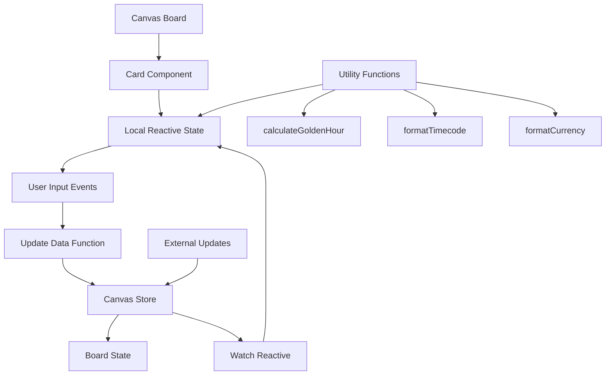
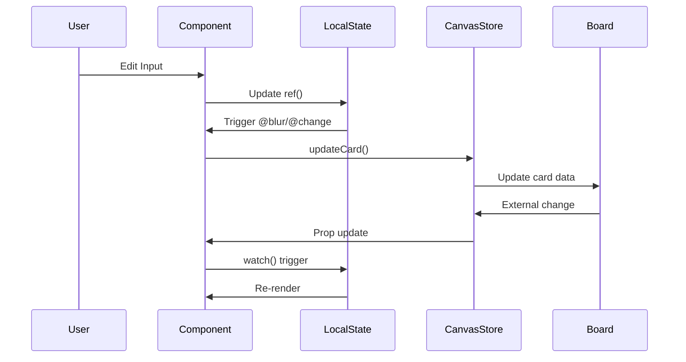

# Photography Planning and Organization Cards

This document describes the planning and organization card components for photography and videography production workflows.

## Overview

The planning and organization cards help manage production schedules, weather conditions, scene breakdowns, editing workflows, delivery specifications, and budget tracking throughout the entire production lifecycle.

## Card Components

### 1. CallSheetCard

**Purpose**: Manages production schedule entries and crew contacts for shoot days.

**File**: `/components/photography/CallSheetCard.vue`

**Features**:
- Shoot date, call time, and wrap time tracking
- Schedule entries with time, activity, location, people, and notes
- Contact list with name, role, and phone number
- Add/remove entries and contacts dynamically

**Data Structure** (`CallSheetData`):
```typescript
{
  title: string
  shootDate: string        // ISO date format
  callTime: string         // HH:MM format
  wrapTime: string         // HH:MM format
  entries: CallSheetEntry[]
  contacts: { name: string; role: string; phone: string }[]
}
```

**Use Cases**:
- Daily production scheduling
- Crew call sheets
- On-set coordination
- Contact management

---

### 2. WeatherPlanningCard

**Purpose**: Calculates golden hour and blue hour times for optimal outdoor shooting conditions.

**File**: `/components/photography/WeatherPlanningCard.vue`

**Features**:
- Location and date input
- Latitude/longitude coordinates
- Automatic golden hour calculation using `calculateGoldenHour` utility
- Displays sunrise, sunset, golden hour (morning/evening), and blue hour times
- Weather conditions notes
- Backup plan documentation

**Data Structure** (`WeatherPlanningData`):
```typescript
{
  location: string
  date: string             // ISO date format
  sunrise: string
  sunset: string
  goldenHourMorning: { start: string; end: string }
  goldenHourEvening: { start: string; end: string }
  blueHour: { start: string; end: string }
  weather: string
  backupPlan: string
}
```

**Integration**:
- Uses `calculateGoldenHour()` from `~/utils/photographyHelpers`
- Requires `SunCalc` library for astronomical calculations

**Use Cases**:
- Outdoor portrait sessions
- Landscape photography planning
- Film production scheduling
- Natural light optimization

---

### 3. ScriptBreakdownCard

**Purpose**: Organizes scenes with detailed multi-field forms for production planning.

**File**: `/components/photography/ScriptBreakdownCard.vue`

**Features**:
- Scene number and description
- Location and time of day selection
- Talent list (comma-separated input with tag display)
- Props list (comma-separated input with tag display)
- Equipment list (comma-separated input with tag display)
- Scene-specific notes
- Total scene count display

**Data Structure** (`ScriptBreakdownData`):
```typescript
{
  title: string
  scenes: SceneBreakdownItem[]
}

interface SceneBreakdownItem {
  id: string
  sceneNumber: string
  description: string
  location: string
  timeOfDay: string        // Day, Night, Dawn, Dusk, Golden Hour
  talent: string[]
  props: string[]
  equipment: string[]
  notes: string
}
```

**UI Patterns**:
- Expandable scene cards
- Tag-based display for talent, props, and equipment
- Color-coded categories (blue for talent, green for props, purple for equipment)

**Use Cases**:
- Film and video production planning
- Commercial shoots
- Scene organization
- Production resource allocation

---

### 4. EditDecisionListCard

**Purpose**: Creates an edit timeline with in/out points for post-production workflows.

**File**: `/components/photography/EditDecisionListCard.vue`

**Features**:
- Project name tracking
- Timecode-based in/out points (HH:MM:SS:FF format)
- Clip naming
- Track assignment
- Action type selection (cut, transition, effect, audio)
- Notes for each decision
- Total duration calculation

**Data Structure** (`EditDecisionListData`):
```typescript
{
  title: string
  projectName: string
  decisions: EditDecision[]
}

interface EditDecision {
  id: string
  inPoint: string          // HH:MM:SS:FF timecode
  outPoint: string         // HH:MM:SS:FF timecode
  clipName: string
  track: number
  action: 'cut' | 'transition' | 'effect' | 'audio'
  notes: string
}
```

**Timecode Utilities**:
- `parseTimecode()` - Converts HH:MM:SS:FF to seconds
- `formatTimecode()` - Converts seconds to HH:MM:SS:FF
- Automatic total duration calculation

**Use Cases**:
- Non-linear editing planning
- EDL documentation
- Collaborative editing workflows
- Client approval documentation

---

### 5. DeliverySpecsCard

**Purpose**: Manages technical specifications for multiple delivery platforms.

**File**: `/components/photography/DeliverySpecsCard.vue`

**Features**:
- Client and due date tracking
- Multiple platform specifications
- Comprehensive technical settings:
  - Resolution (4K, Full HD, HD, Vertical HD, Square, Custom)
  - Frame rate (23.976 to 60 fps)
  - Codec (H.264, H.265, ProRes, DNxHD/HR)
  - Bitrate
  - Audio codec (AAC, PCM, MP3, AC3)
  - Container format (MP4, MOV, AVI, MKV, MXF)
  - Color space (Rec. 709, Rec. 2020, sRGB, DCI-P3, Adobe RGB)

**Data Structure** (`DeliverySpecsData`):
```typescript
{
  title: string
  client: string
  dueDate: string
  specs: DeliverySpec[]
}

interface DeliverySpec {
  id: string
  platform: string         // e.g., YouTube, Instagram, Broadcast
  resolution: string
  frameRate: string
  codec: string
  bitrate: string
  audioCodec: string
  containerFormat: string
  colorSpace: string
}
```

**Use Cases**:
- Multi-platform content delivery
- Client specification management
- Technical requirement documentation
- Export presets planning

---

### 6. BudgetTrackerCard

**Purpose**: Tracks production finances with categories, estimates, actuals, and totals.

**File**: `/components/photography/BudgetTrackerCard.vue`

**Features**:
- Multi-currency support (USD, EUR, GBP, JPY, CAD, AUD)
- Total budget tracking
- Line items with categories:
  - Equipment
  - Talent
  - Location
  - Post-production
  - Travel
  - Miscellaneous
- Estimated vs. actual cost tracking
- Paid status checkbox
- Automatic calculations:
  - Total estimated
  - Total spent
  - Remaining budget
  - Budget percentage used
  - Paid items count
- Visual progress bar with color-coded status
- Per-item difference calculation (over/under budget)

**Data Structure** (`BudgetTrackerData`):
```typescript
{
  title: string
  currency: string
  totalBudget: number
  items: BudgetLineItem[]
  totalSpent: number
  remaining: number
}

interface BudgetLineItem {
  id: string
  category: 'equipment' | 'talent' | 'location' | 'post' | 'travel' | 'misc'
  description: string
  estimated: number
  actual: number
  paid: boolean
  notes: string
}
```

**Calculations**:
- **Total Estimated**: Sum of all estimated amounts
- **Total Spent**: Sum of all actual amounts
- **Remaining**: Total budget - Total spent
- **Budget Percentage**: (Total spent / Total budget) × 100
- **Difference**: Actual - Estimated (per item)

**Color Coding**:
- Green: Under budget or low usage (< 80%)
- Yellow: Approaching budget (80-99%)
- Red: Over budget (≥ 100%)

**Use Cases**:
- Production budget management
- Cost tracking and reporting
- Invoice management
- Financial planning and forecasting

---

## Common Patterns

All planning and organization cards follow consistent patterns:

### 1. Composition API with TypeScript

```vue
<script setup lang="ts">
import { ref, watch } from 'vue'
import { useCanvasStore } from '~/stores/canvas'
import type { NoteCard, CardDataType } from '~/types'

const props = defineProps<{
  card: NoteCard
}>()

const canvasStore = useCanvasStore()
const localData = ref<CardDataType>(
  props.card.cardData || defaultData
)
</script>
```

### 2. Dark Mode Support

All components use Tailwind CSS classes with dark mode variants:
- `dark:bg-gray-900` - Dark backgrounds
- `dark:text-white` - Dark text
- `dark:border-gray-700` - Dark borders

### 3. State Management

- Local reactive state with `ref()`
- Canvas store updates via `canvasStore.updateCard()`
- Bi-directional sync with `watch()` for external changes
- `@blur` and `@change` events trigger updates

### 4. Form Inputs

- Date pickers: `<input type="date">`
- Time pickers: `<input type="time">`
- Number inputs: `<input type="number">`
- Select dropdowns for predefined options
- Textarea for multi-line text
- Checkboxes for boolean states

### 5. Dynamic Lists

- Add button to create new entries
- Remove button (×) on each item
- `crypto.randomUUID()` for unique IDs
- Array `splice()` for removal

---

## Integration

### Canvas Store Updates

All cards update the canvas store using a consistent pattern:

```typescript
const updateData = () => {
  canvasStore.updateCard(props.card.id, {
    cardDataKey: localData.value
  })
}
```

### Type Definitions

All data structures are defined in `/types/index.ts` with proper TypeScript interfaces.

### Utility Functions

Planning cards use utility functions from `/utils/photographyHelpers.ts`:
- `calculateGoldenHour()` - Astronomical calculations
- `formatTimecode()` - Timecode formatting
- `parseTimecode()` - Timecode parsing
- `formatCurrency()` - Currency formatting

---

## Architecture Diagram



---

## Data Flow



---

## Best Practices

### 1. Component Design

- Keep components focused on single responsibility
- Use computed properties for derived values
- Minimize direct DOM manipulation
- Leverage Vue's reactivity system

### 2. Performance

- Use `@blur` instead of `@input` for text fields to reduce updates
- Implement proper key attributes for v-for loops
- Use `v-show` for frequently toggled elements
- Debounce expensive calculations

### 3. Accessibility

- Provide proper labels for form inputs
- Use semantic HTML elements
- Include title attributes for icon buttons
- Ensure keyboard navigation works

### 4. User Experience

- Show visual feedback for actions (hover states, color changes)
- Display calculated totals and summaries
- Use placeholders to guide input
- Implement clear add/remove buttons

### 5. Data Validation

- Set appropriate input types and constraints
- Use min/max for numeric inputs
- Validate timecode format
- Handle empty/null states gracefully

---

## Testing Considerations

### Unit Tests

- Test data transformations (comma-separated to arrays)
- Verify calculation logic (budget totals, timecode parsing)
- Check default state initialization

### Integration Tests

- Test canvas store updates
- Verify bi-directional sync with watch()
- Test add/remove operations

### E2E Tests

- Test complete user workflows
- Verify data persistence
- Test dark mode toggle
- Check responsive behavior

---

## Future Enhancements

### Potential Features

1. **CallSheetCard**
   - Export to PDF/email
   - Weather API integration
   - Map integration for locations

2. **WeatherPlanningCard**
   - Real-time weather API
   - Historical weather data
   - Multiple location comparison

3. **ScriptBreakdownCard**
   - Import from script files
   - Resource conflict detection
   - Scheduling optimization

4. **EditDecisionListCard**
   - Import/export EDL format
   - Video preview integration
   - Collaborative editing markers

5. **DeliverySpecsCard**
   - Export preset templates
   - Validation against platform specs
   - Automatic bitrate calculation

6. **BudgetTrackerCard**
   - Invoice attachment upload
   - Category-based reporting
   - Expense approval workflow
   - Export to accounting software

---

## Related Documentation

- [Photography Card Types](./photography-card-types.md)
- [Utility Functions](./utility-functions.md)
- [Canvas Store](./architecture.md#canvas-store)
- [Type Definitions](./type-system.md)
